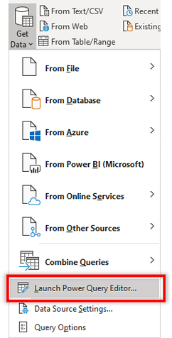
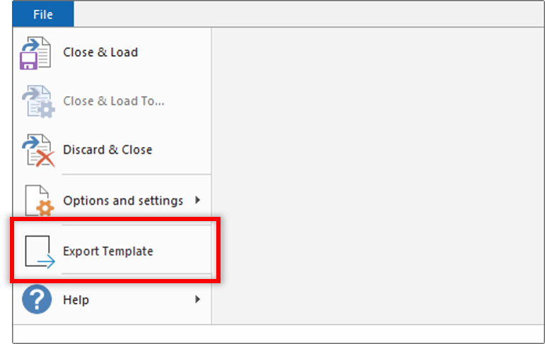

# Create Power Platform dataflows from queries in Microsoft Excel (Preview)

You can easily create Power Platform dataflows from queries in  Excel workbooks so that you can take advantage of cloud-powered dataflows refreshing and processing the data at regular intervals instead of doing the these operations manually in Excel. 

This article walks you through how to export queries from Excel into a Power Query template that can then be imported into Power Platform dataflow to create a dataflow. 

>[!Note]
> The preview feature for creating Power Query templates from queries feature is only available to Office Insiders. For more information on the Office insider program, see [Office Insider](https://insider.office.com).

## Overview
Working with large datasets or long-running queries can be cumbersome every time you have to manually trigger a data refresh Excel because it takes resources from your PC to do this and it you have to wait until the computation is done to get the latest data. Moving these operations to a Power Platform dataflows is an effective way to free up your computer's resources and to have the latest data easily available for you to consume in Excel.

It only takes two quick steps to do this:
1. Exporting queries in Excel to a Power Template
2. Creating a new Power Platform dataflow from a Power Query template

## Exporting queries in Excel to a Power Template
The first step is creating a Power Query template with your queries in Excel. To get started, launch the Power Query editor from within the Get Data dropdown in the Data tab.

Once Power Query loads, you will find the option to export the queries into a template in the File menu. 

The template requires basic information such as a name and a description before it can be saved locally on your computer. 

## Creating a new Power Platform dataflow from a Power Query template
Go to the Dataflows section under the Data tab in the [Power Apps maker portal](https://make.powerapps.com). Here you can select the option *Import template* in the toolbar to get started from the Power Query template you created from Microsoft Excel:

The dataflow name will prepopulate with the template name provided. Once you're done with the dataflow creation screen, click *Next* and  you will see your queries from Excel in the query editor. 

>[!Note]
> For more information on how to configure and create Power Platform dataflows, see [Create and use dataflows](dataflows/create-use.md).

From this point on, you will go through the normal dataflow creation and configuration process so you can further transform your data, set refresh schedules on the dataflow, and any other dataflow operation possible.