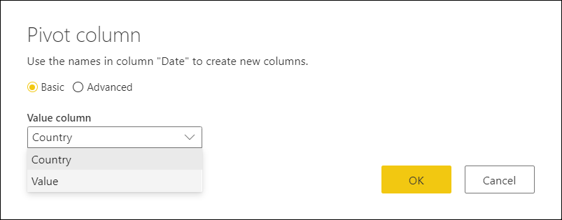
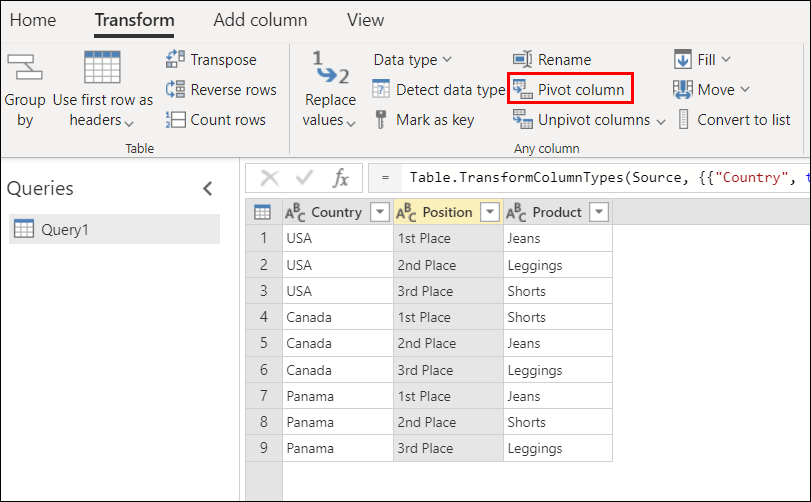

# Pivot Columns
In Power Query, you can create a table that contains an aggregate value for each unique value in a column. Power Query groups each unique value, performs an aggregate calculation for each value, and pivots the column into a new table. 

Imagine a table like the following:

That has a values by Country and Date as a simple table. We want to transform that table into the following one with the date column pivoted:

## To Pivot a Column
To make this happen, we select the column that we want to pivot, then go to the Transform tab and select the **Pivot column** option from the *Any column* group:

After clicking the Pivot column icon, you'll be prompted with a new window called the 'Pivot column' window. This window will look like this:

From the Value column dropdown we select the column that we want to be aggregated which in this case is the Value column. By default, Power Query will try to do a sum as the aggregation, but we can select the Advanced option to see other available aggregations: 

From the available options, we have:
- Don't aggregate
- Count (all)
- Count (not blank)
- Minimum
- Maximum
- Median
- Sum
- Average

## About the don't aggregate option
The Pivot columns operation acts similarly to the operation that you see in a Pivot table from Excel. However, in Power Query we have an option called **Don't aggregate** which is particularly important for certain scenarios.

### Pivot a column with no aggregation
The don't aggregate option is especially helpful in cases when you're trying to pivot columns with text as values. For example, imagine a table like the following where we have Country, Position and Product as fields:

What we want to do with this table is to Pivot the Position column so we can have its values as new columns and as values we'll have the values from the Product column. We select the Position column and hit the Pivot column icon to Pivot that column:

We select the Product column as the value column and from the Advanced section inside the Pivot columns window we select the **don't aggregate** option:

The result of this operation will yield our expected result:

### Errors when using the don't aggregate option
The way that the don't aggregate option works is that it grabs a single value for the pivot operation to be placed as the value for the intersection of the column and row pair. If, for example, we have a table like the following:

And we wanted to pivot that table using the Date column and the values from the Value column, which would make our table have just the Country values on rows and the Dates as columns, we would hit an error at every single cell value because there are multiple rows for every combination of Country and Date. The outcome of the Pivot column operation will yield the following results:

Notice how the error message at the details window shows us the message "Expression.Error: There were too many elements in the enumeration to complete the operation." because the don't aggregate operation only expects a single value for the Country and Date combination.
