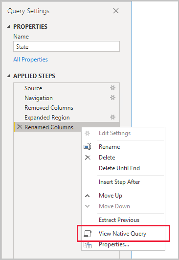
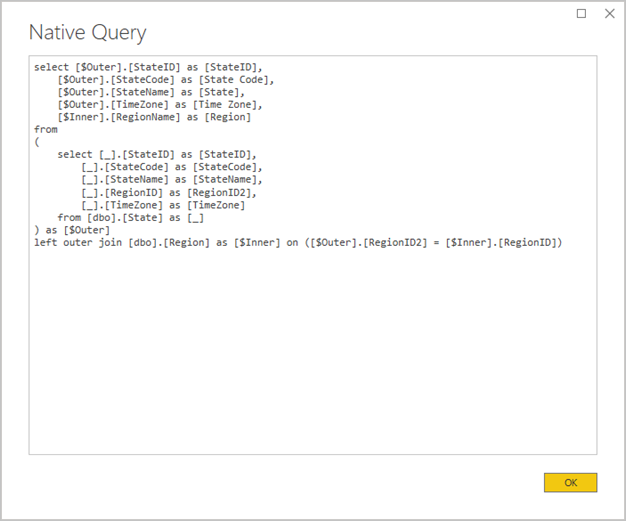
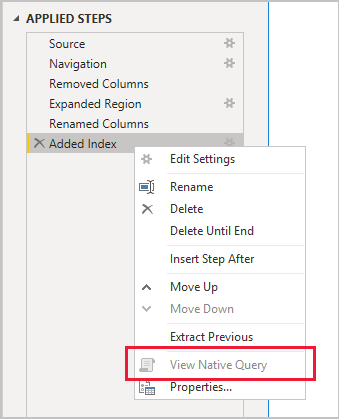

# Power Query query folding

This article targets data modelers developing models in Power Pivot or Power BI Desktop. It describes what Power Query query folding is, and why it's important in your data model designs. This article also describes the data sources and transformations that can achieve query folding, and how to determine that your Power Query queries can be folded—whether fully or partially.

_Query folding_ is the ability for a Power Query query to generate a single query statement to retrieve and transform source data. The Power Query mashup engine strives to achieve query folding whenever possible for reasons of efficiency.

Query folding is an important topic for data modeling for several reasons:

- **Import model tables:** Data refresh will take place efficiently for Import model tables (Power Pivot or Power BI Desktop), in terms of resource utilization and refresh duration.
- **DirectQuery and Dual storage mode tables:** Each DirectQuery and Dual storage mode table (Power BI only) must be based on a Power Query query that can be folded.
- **Incremental refresh:** Incremental data refresh (Power BI only) will be efficient, in terms of resource utilization and refresh duration. In fact, the Power BI **Incremental Refresh** configuration window will notify you of a warning should it determine that query folding for the table can't be achieved. If it can't be achieved, the goal of incremental refresh is defeated. The mashup engine would then be required to retrieve all source rows, and then apply filters to determine incremental changes.

Query folding may occur for an entire Power Query query, or for a subset of its steps. When query folding cannot be achieved—either partially or fully—the Power Query mashup engine must compensate by processing data transformations itself. This process can involve retrieving source query results, which for large datasets is very resource intensive and slow.

We recommend that you strive to achieve efficiency in your model designs by ensuring query folding occurs whenever possible.

## Sources that support folding

Most data sources that have the concept of a query language support query folding. These data sources can include relational databases, OData feeds (including SharePoint lists), Exchange, and Active Directory. However, data sources like flat files, blobs, and web typically do not.

## Transformations that can achieve folding

Relational data source transformations that can be query folded are those that can be written as a single SELECT statement. A SELECT statement can be constructed with appropriate WHERE, GROUP BY, and JOIN clauses. It can also contain column expressions (calculations) that use common built-in functions supported by SQL databases.

Generally, the following list describes transformations that can be query folded.

- Removing columns.
- Renaming columns (SELECT column aliases).
- Filtering rows, with static values or Power Query parameters (WHERE clause predicates).
- Grouping and summarizing (GROUP BY clause).
- Expanding record columns (source foreign key columns) to achieve a join of two source tables (JOIN clause).
- Non-fuzzy merging of fold-able queries based on the same source (JOIN clause).
- Appending fold-able queries based on the same source (UNION ALL operator).
- Adding custom columns with _simple logic_ (SELECT column expressions). Simple logic implies uncomplicated operations, possibly including the use of M functions that have equivalent functions in the SQL data source, like mathematic or text manipulation functions. For example, the following expressions return the year component of the **OrderDate** column value (to return a numeric value).

    ```powerquery-m
    Date.Year([OrderDate])
    ```

- Pivoting and unpivoting (PIVOT and UNPIVOT operators).

## Transformations that prevent folding

Generally, the following list describes transformations that prevent query folding. This list isn't intended to be an exhaustive list.

- Merging queries based on different sources.
- Appending (union-ing) queries based on different sources.
- Adding custom columns with _complex logic_. Complex logic implies the use of M functions that have no equivalent functions in the data source. For example, the following expressions format the **OrderDate** column value (to return a text value).

    ```powerquery-m
    Date.ToText([OrderDate], "yyyy")
    ```

- Adding index columns.

Note that when a Power Query query encompasses multiple data sources, incompatibility of data source privacy levels can prevent query folding from taking place. For more information, see the [Power BI Desktop privacy levels](/power-bi/desktop-privacy-levels) article.

## Determine when a query can be folded

In the Power Query Editor window, it's possible to determine when a Power Query query can be folded. In the **Query Settings** pane, when you right-click the last applied step, if the **View Native Query** option is enabled (not greyed out), then the entire query can be folded.



>[!Note]
> The **View Native Query** option is only available for certain relational DB/SQL generating connectors. It doesn't work for OData based connectors, for example, even though there is folding occurring on the backend. The Query Diagnostics feature is the best way to see what folding has occurred for non-SQL connectors (although the steps that fold aren't explicitly called out&mdash;you just see the resulting URL that was generated).

To view the folded query, you select the **View Native Query** option. You're then be presented with the native query that Power Query will use to source data.



If the **View Native Query** option isn't enabled (greyed out), this is evidence that not all query steps can be folded. However, it could mean that a subset of steps can still be folded. Working backwards from the last step, you can check each step to see if the **View Native Query** option is enabled. If so, then you've learned where, in the sequence of steps, that query folding could no longer be achieved.



## Next steps

For more information about query folding and related articles, check out the following resources:

- [Overview of query evaluation and query folding in Power Query](query-folding-basics.md)
- [Query folding guidance in Power BI Desktop](/power-bi/guidance/power-query-folding)
- [Query folding examples](query-folding-examples.md)
- [Query folding indicators](step-folding-indicators.md)
- [Query plan for Power Query](query-plan.md)
- [Query folding on native queries](native-query-folding.md)
