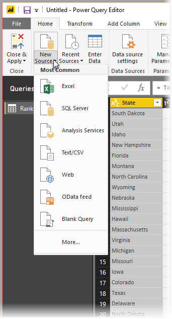
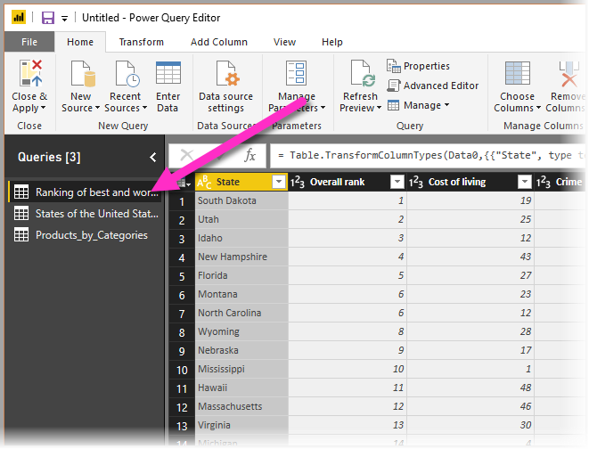
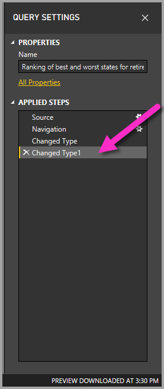
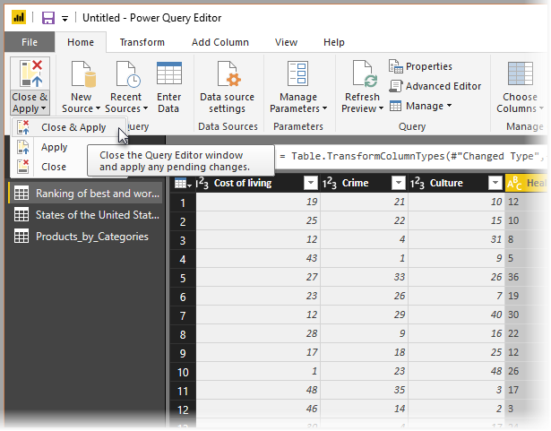

# Quickstart: Using Power Query in Power BI Desktop

With Power Query in Power BI, you can connect to many different data sources, transform the data into the shape you want, and quickly be ready to create reports and insights. When using Power BI Desktop, Power Query functionality is provided in Power Query Editor.

Let's get acquainted with Power Query Editor.

If you're not signed up for Power BI, you can [sign up for a free trial](https://app.powerbi.com/signupredirect?pbi_source=web) before you begin. Also, you can [download Power BI Desktop](https://go.microsoft.com/fwlink/?LinkId=521662&clcid=0x409) for free.

## Using Power Query Editor

Power Query is available in Power BI Desktop through Power Query Editor. To open Power Query Editor, select **Edit Queries** from the Power BI Desktop **Home** tab.  
<!--Funny. This command doesn't appear on the Home tab in my Power BI Desktop ribbon. Could the UI have been updated since this screenshot?-->

With no data connections, Power Query Editor appears as a blank pane, ready for data.  

As soon as a query is loaded, the Power Query Editor view becomes more interesting. If you connect to the following Web data source, Power Query Editor loads information about the data, which you can then begin to shape.

[*https://www.bankrate.com/finance/retirement/best-places-retire-how-state-ranks.aspx*](https://www.bankrate.com/finance/retirement/best-places-retire-how-state-ranks.aspx)

The following image shows how Power Query Editor appears after a data connection is established.
<!--Because you have those nice callouts, suggest making it clear what they correspond to.-->

| No. | Description |
|---------|-------------|
| **1** | On the ribbon, many buttons are now active so you can interact with the data in the query. |
| **2**   | In the **Queries** pane, queries are listed and available for selection, viewing, and shaping. |
| **3**   | In the center pane, data from the selected query is displayed and available for shaping. |
| **4**   | In the **Query Settings** pane, the properties and applied steps for the selected query<!--Edit okay? This seems to be a pane rather than a window.--> are listed. |

The following sections describe each of these four areas&mdash;the ribbon, the **Queries** pane, the data view<!--This has various names. I think "data view in the center pane" says it all (see below).-->, and the **Query Settings** pane.

## The query ribbon

The ribbon in Power Query Editor consists of five tabs&mdash;**Home**, **Transform**, **Add Column**, **View**, and **Help**.

The **Home** tab contains the common query tasks, including the first step in any query, which is **Get Data**.<!--There is no **Get Data** button in the screenshot nor in the Power BI Desktop version I just loaded.--> The following image shows the **Home** ribbon.  

To connect to data and begin the query building process, select the **Get Data** button.<!--Should this be **New Source** instead?--> A menu appears, providing the most common data sources.  

You use the **Transform** tab to access common data transformation tasks, such as adding or removing columns, changing data types, splitting columns, and other data-driven operations. The following image shows the **Transform** tab.  

Use the **Add Column** tab to perform additional tasks associated with adding a column, formatting column data, and adding custom columns. The following image shows the **Add Column** tab.  

Use the **View** tab to turn on or off the display of<!--Writing Style Guide doesn't like "toggle" as a verb.--> certain panes or windows, and to display the advanced editor. The following image shows the **View** tab.  

<!--Suggest formatting the following as a note to make it stand out a bit. -->
>[!NOTE]
>Many of the tasks available from the ribbon are also available by right-clicking to select a column, or other data, in the center pane.

## The **Queries** pane

The **Queries** pane displays the number of active queries in addition to the name of the query. When you select a query from the left pane, its data is displayed in the center pane, where you can shape and transform the data to meet your needs. The following image shows the left pane with multiple queries.  

## The data view in the center pane

In the center (data) pane, data from the selected query is displayed. This is where much of the work in Power Query<!--Edit okay? I didn't know what this meant.--> is accomplished.

In the following image, the Web data connection established earlier is displayed, the **Overall score** column is selected, and its column heading has been right-clicked to show the available shortcut menu items. Note that many of these shortcut menu items are the same as the buttons on the ribbon tabs.  

When you select a shortcut menu item (or a ribbon button), Power Query applies the step to the data and saves it as part of the query itself. The steps are recorded in the **Query Settings** pane in sequential order, as described in the next section.  

## The Query Settings pane

The **Query Settings** pane is where all steps associated with a query are displayed. For example, in the following image, the **Applied steps** section reflects the fact that the data type of the **Overall score** column has changed.

As you apply additional shaping steps to the query, they're captured in the **Applied Steps** section.

It's important to know that the underlying data is *not* changed; rather, Power Query Editor adjusts and shapes its view of the data, and any interaction it has with the underlying data is based on that shaped and modified view.<!--Suggested, but if you don't like, be sure not to use the possessive "Power Query Editor's".-->

In the **Query Settings** pane, you can rename steps, delete steps, or reorder the steps as you see fit. To do so, right-click to select the step in the **Applied Steps** section, and choose the action you want. All query steps are carried out in the order in which they appear in the **Applied Steps** pane.

## The advanced editor

If you want to see the code that Power Query Editor is creating with each step, or want to create your own shaping code, you can use the advanced editor. To open the advanced editor, select the **View** tab on the ribbon, and then select **Advanced Editor**. A window appears, showing the existing query code.

You can directly edit the code in the **Advanced Editor** window. To close the window, select the **Done** or **Cancel** button.<!--You sure this is worth saying?-->  

## Saving your work

When your query is where you want it, you can have Power Query Editor apply the changes to the data model in Power BI Desktop and then close Power Query Editor. To do that, on the Power Query Editor **File** menu, select **Close & Apply**.  

As it applies the changes in your query, Power BI Desktop displays the status of the operation.  

<!--I'm not sure why you wouldn't want to save it? Also you don't need to repeat "where you want it." Suggest deleting, but if you don't want to, you'll want to fix that dangling modifier.-->
<!--
After you have your query where you want it, or if you just want to make sure your work is saved, Power BI Desktop can save your work in a .pbix file.
-->

To save your work as a .pbix file in Power BI Desktop, select **File** > **Save** (or **File** > **Save As**), as shown in the following image.  

## Next step

In this quickstart, you learned how to use Power Query Editor in Power BI Desktop and how to connect to data sources. To learn more, continue with the tutorial on shaping and transforming data with Power Query.

> [!div class="nextstepaction"]
> [Power Query tutorial](power-query-tutorial-shape-combine.md)
