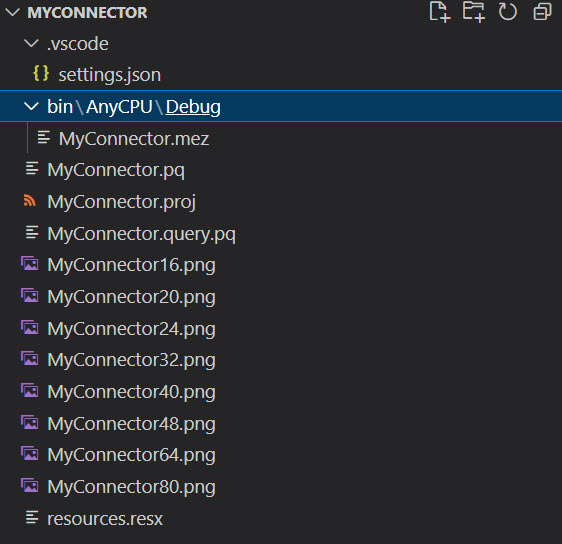
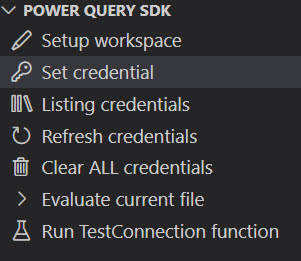
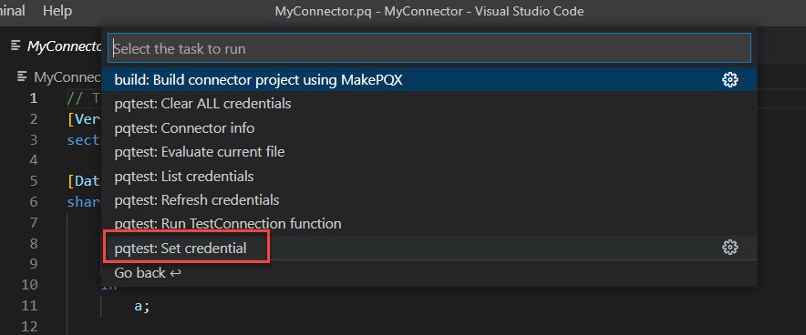

# Using the Power Query SDK

This article focuses on the experience available for the Power Query SDK found in Visual Studio Code. You can learn more on how to install the Power Query SDK for Visual Studio from the article on [Installing the SDK](/powerquery-docs/InstallingSDK.md).

## Create a new project

>[!TIP]
>Before creating an extension project, it is recommended that you create a new folder where you'll store your extension project. During the creation of a new project, if no folder is selected, the Power Query SDK will help you locate or create a new folder before creating your extension project.

Once in Visual Studio Code, In the main *Explorer* pane of Visual Studio Code, you will be able to see a section with the name **Power Query SDK**. This section will have only one button that reads *Create an extension project*. Click this button.

This button will open an input field at the top of the Visual Studio Code interface where you can enter the name of your new extension project and hit Enter.

After a few seconds, your Visual Studio Code window should open the main *.pq file for your extension project that contains your connector logic. The Power Query SDK will automatically run some necessary tasks to complete the setup of your workspace and you can check this in the Output console in Visual Studio Code.

The Power Query SDK automatically creates the following set of files:

* A **settings.json** file that dictates specific settings to work with at your workspace level
* It builds the extension as a **.mez** file and stores it in a new *bin\AnyCPU\Debug* folder
* A set of connector icons as png files
* A **resources.resx** that serves as the main storage for strings to be used in the extension
* A .pq file which holds the main logic of your extension or connector
* A .query.pq file which main purpose is to be used as a way to create test queries that you can later evaluate
* A .proj file which holds information about the extension project

Once a extension project is recognized by the Power Query SDK, the section for the Power Query SDK will change its appearance and will now display a list of tasks that you can run against your new extension project.

## Credentials

>[!IMPORTANT] 
>Before you can evaluate any queries of your data connector, it is required to have a credential set.

The Power Query SDK offers multiple tasks through its user interface to allow you to set, list and delete credentials from your extension project.

### Set credential

The Power Query SDK is primarily driven by tasks which can be triggered via multiple entry points. Setting a credential can be done in two ways and this is true for most tasks.

1. Through the entry in the Power Query SDK section in the Explorer pane

 
2. Through the Terminal by selecting the "Run Task..." option and selecting the group of tasks for powerquery

When you run this task, Visual Studio Code will guide you through a series of prompts to allow you to set the credential. These series of prompts are predictable and will always consist of the same stages:

1. Choose the data source kind
2. Choose the connector file
3. Choose the authentication method

 For the existing extension project, the [authentication method](HandlingAuthentication.md) available is anonymous and once the authentication is set a message box confirming that a credential has been generated successfully should be shown at the bottom right corner of the window.

### List credentials

Similar to setting a credential, the task to list credentials has two entry points in the same places: Power Query SDK section in the Explorer pane and inside the Terminal menu.

When this task is executed, it showcases the available credentials inside of the output terminal.

### Clear ALL credentials

Similar to the previous two tasks, the task to list credentials has two entry points in the same places: Power Query SDK section in the Explorer pane and inside the Terminal menu.

This task serves as a way to clear all credentials from your current session in the event that you need to set a new credential to evaluate your queries.

The informational messages for this task are also shown in the output console.

## Evaluate a query and the results panel

## Bring a legacy extension project to the new SDK

## Setup workspace

What it is 
what you can add to it

## Build a extension file

## Run TestConnection function

## Feedback and bugs

Do you have any feedback, suggestions or bugs that you'd like to report? Visit our [official public repository on GitHub](https://github.com/microsoft/vscode-powerquery-sdk).

You can use the [Power BI Community forum](https://community.powerbi.com/t5/Power-Query/bd-p/power-bi-services) to post general questions around Power Query, the M language and custom connector development.