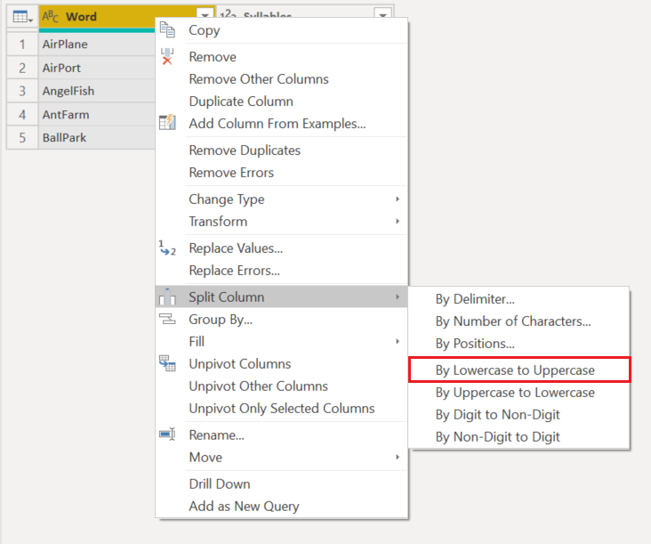

# Split Columns: By Lowercase to Uppercase

In Power Query, you can create a split a column through different functions.
In this case, the column(s) selected can be split by every instance of the last Lowercase to the next first Uppercase.

## Where to find the Split Columns: By Lowercase to Uppercase
We can find the Split Columns: By Lowercase to Uppercase option in 3 places:
1. **Home tab** - under the Split column dropdown menu inside the Transform group 

2. **Transform tab** - under the Split column dropdown menu inside the Text column group

3. **Right click a column** - inside the split columns option

## Split Columns By Lowercase to Uppercase 

Our initial table will be the one below with one column for "Word" and an extra column named "Syllables". We will only focus on the first column.

This column holds 2 values in each row:
1. **FirstWord** - The first half of the compound word
2. **SecondWord** - The second half of the compound word

We want to split this column into the 2 columns described before. 
To do this, we simply select the column and select the option to split the column by Lowercase to Uppercase.

This singular column will split into multiple columns given every instance of the last Lowercase letter to the next Uppercase letter. In this case, it only splits it into two.

Our final table is will be as such:

