# Tutorial: Shape and combine data using Power Query

With **Power Query**, you can connect to many different types of data sources, then shape the data to meet your needs, enabling you to create visual reports using **Power BI Desktopu** that you can share with others. *Shaping* data means transforming the data – such as renaming columns or tables, changing text to numbers, removing rows, setting the first row as headers, and so on. *Combining* data means connecting to two or more data sources, shaping them as needed, then consolidating them into one useful query.

In this tutorial, you'll learn to:

> [!div class="checklist"]
> * Shape data using **Power Query Editor**
> * Connect to a data source
> * Connect to another data source
> * Combine those data sources, and create a data model to use in reports

This tutorial demonstrates how to shape a query using **Power Query Editor**, technology that's incorporated into **Power BI Desktop**, and learn some common data tasks.

It’s useful to know that the **Power Query Editor** in Power BI Desktop makes ample use of right-click menus, as well as the ribbon. Most of what you can select in the **Transform** ribbon is also available by right-clicking an item (such as a column) and choosing from the menu that appears.

If you're not signed up for Power BI, you can [sign up for a free trial](https://app.powerbi.com/signupredirect?pbi_source=web) before you begin. Also, Power BI Desktop is [free to download](https://go.microsoft.com/fwlink/?LinkId=521662&clcid=0x409). 

## Shape data
When you shape data in the **Power Query Editor**, you’re providing step-by-step instructions (that Power Query Editor carries out for you) to adjust the data as Power Query Editor loads and presents it. The original data source is not affected; only this particular view of the data is adjusted, or *shaped*.

The steps you specify (such as rename a table, transform a data type, or delete columns) are recorded by Power Query Editor, and each time this query connects to the data source those steps are carried out so that the data is always shaped the way you specify. This process occurs whenever you use the Power Query Editor feature of Power BI Desktop, or for anyone who uses your shared query, such as on the **Power BI** service. Those steps are captured, sequentially, in the **Query Settings** pane, under **Applied Steps**.

The following image shows the **Query Settings** pane for a query that has been shaped – we’ll go through each of those steps in the next few paragraphs.

Using the retirement data from the [Using Power Query in Power BI Desktop](power-query-quickstart-using-power-bi.md) quickstart article, which we found by connecting to a Web data source, let’s shape that data to fit our needs.

For starters, let's add a custom column to calculate rank based on all data being equal factors and compare this to the existing column _Rank_.  Here's the **Add Column** ribbon, with an arrow pointing toward the **Custom Column** button, which lets you add a custom column.

In the **Custom Column** dialog, in **New column name**, enter _New Rank_, and in **Custom column formula**, enter the following:

    ([Cost of living] + [Weather] + [Health care quality] + [Crime] + [Tax] + [Culture] + [Senior] + [#"Well-being"]) / 8

Make sure the status message reads _'No syntax errors have been detected.'_ and click **OK**.

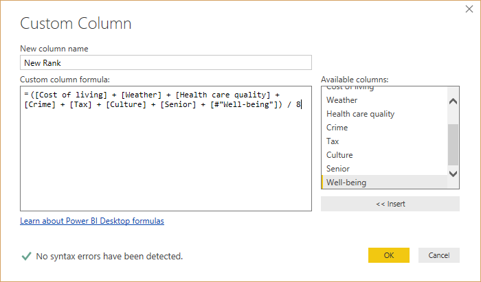

To keep column data consistent, lets transform the new column values to whole numbers. Just right-click the column header, and select **Change Type \> Whole Number** to change them. 

If you need to choose more than one column, first select a column then hold down **SHIFT**, select additional adjacent columns, and then right-click a column header to change all selected columns. You can also use the **CTRL** key to choose non-adjacent columns.

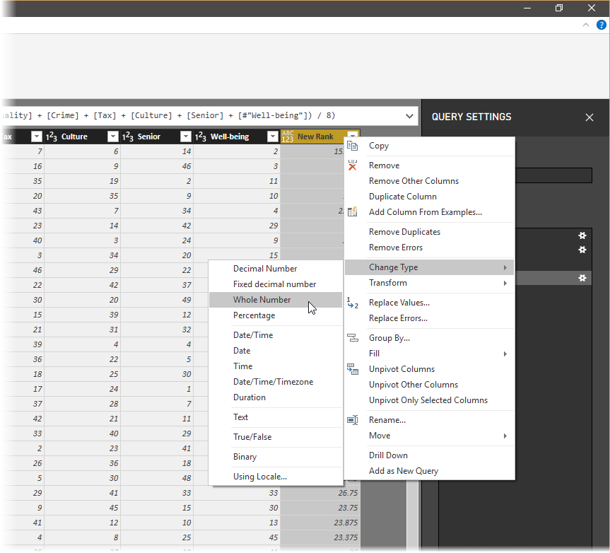

You can also *transform* column data types from the **Transform** ribbon. Here’s the **Transform** ribbon, with an arrow pointing toward the **Data Type** button, which lets you transform the current data type to another.

Note that in **Query Settings**, the **Applied Steps** reflect any shaping steps applied to the data. If I want to remove any step from the shaping process, I simply select the **X** to the left of the step. In the following image, **Applied Steps** reflects the steps so far: connecting to the website (**Source**); selecting the table (**Navigation**); and while loading the table, Power Query Editor automatically changed text-based number columns from *Text* to *Whole Number* (**Changed Type**). The last two steps show our previous actions with **Added Custom** and **Changed Type1**. 

Before we can work with this query, we need to make a few changes to get its data where we want it:

* *Adjust the rankings by removing a column* - we have decided **Cost of living** is a non-factor in our results. After removing this column, we find the issue that the data remains unchanged, though it's easy to fix using Power BI Desktop, and doing so demonstrates a cool feature of **Applied Steps** in Query.
* *Fix a few errors* – since we removed a column, we need to readjust our calculations in the **New Rank** column. This involves changing a formula.
* *Sort the data* - based on the **New Rank** and **Rank** columns. 
* *Replace data* - we will highlight how to replace a specific value and the need of inserting an **Applied Step**.
* *Change the table name* – that **Table 0** is not a useful descriptor, but changing it is simple.

To remove the **Cost of living** column, simply select the column and choose the **Home** tab from the ribbon, then **Remove Columns** as shown in the following figure.

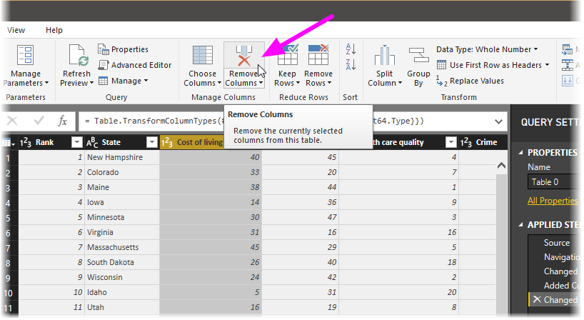

Notice the _New Rank_ values have not changed; this is due to the ordering of the steps. Since Power Query Editor records the steps sequentially, yet independently of each other, you can move each **Applied Step** up or down in the sequence. Just right-click any step, and Power Query Editor provides a menu that lets you do the following: **Rename**, **Delete**, **Delete** **Until End** (remove the current step, and all subsequent steps too), **Move Up**, or **Move Down**. Go ahead and move up the last step _Removed Columns_ to just above the _Added Custom_ step.

Next, select the _Added Custom_ step. Notice the data now shows _Error_ which we will need to address. 

There are a few ways to get more information about each error. You can select the cell (without clicking on the word **Error**), or click the word **Error** directly. If you select the cell *without* clicking directly on the word **Error**, Power Query Editor displays the error information on the bottom of the window.

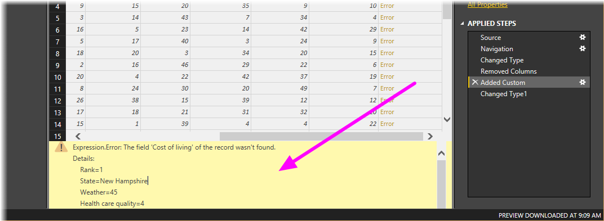

If you click the word *Error* directly, Query creates an **Applied Step** in the **Query Settings** pane and displays information about the error. We do not want to go this route, so select **Cancel**.

To fix the errors, select the _New Rank_ column, then display the column's data formula by opening the **View** ribbon and selecting the **Formula Bar** checkbox. 

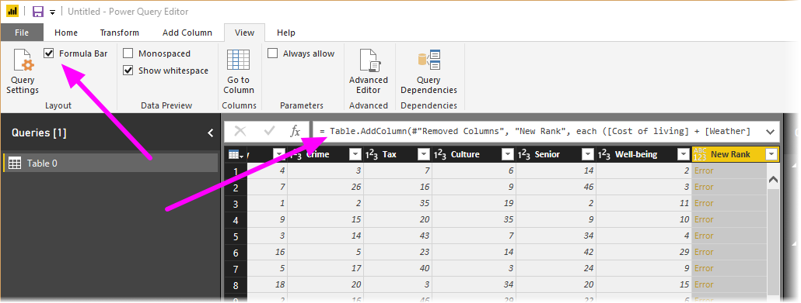

Now you can remove the _Cost of living_ parameter and decrement the divisor, by changing the formula to the following: 

    Table.AddColumn(#"Removed Columns", "New Rank", each ([Weather] + [Health care quality] + [Crime] + [Tax] + [Culture] + [Senior] + [#"Well-being"]) / 7)

Select the green checkmark to the left of the formula box or press **Enter**, and the data should be replaced by revised values and the **Added Custom** step should now complete *with no errors*.

> [!NOTE]
> You can also **Remove Errors** (using the ribbon or the right-click menu), which removes any rows that have errors. In this case it would’ve removed all the rows from our data, and we didn’t want to do that – we like all our data, and want to keep it in the table.

Now we need to sort the data based on the **New Rank** column. First select the last applied step, **Changed Type1** to get to the most recent data. Then, select drop-down located next to the **New Rank** column header and select **Sort Ascending**.

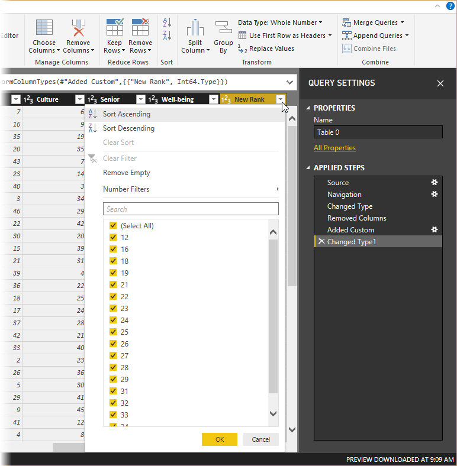

Notice the data is now sorted according to **New Rank**.  However, if you look in the **Rank** column, you will notice the data is not sorted properly in cases where the **New Rank** value is a tie. To fix this, select the **New Rank** column and change the formula in the **Formula Bar** to the following:

    = Table.Sort(#"Changed Type1",{{"New Rank", Order.Ascending},{"Rank", Order.Ascending}})

Select the green checkmark to the left of the formula box or press **Enter**, and the rows should now be ordered in accordance with both _New Rank_ and _Rank_.

In addition, you can select an **Applied Step** anywhere in the list, and continue shaping the data at that point in the sequence. Power Query Editor will automatically insert a new step directly after the currently selected **Applied Step**. Let's give that a try.

First, select the **Applied Step** prior to adding the custom column; this would be the _Removed Columns_ step. Here we will replace the value of the _Weather_ ranking in Arizona. Right-click the appropriate cell that contains Arizona's _Weather_ ranking and select *Replace Values...* from the menu that appears. Note which **Applied Step** is currently selected (the step prior to the _Added Custom_ step).

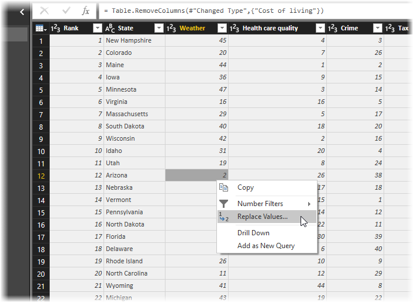

Since we're inserting a step, Power Query Editor warns us about the danger of doing so - subsequent steps could cause the query to break. We need to be careful, and thoughtful! Since this is a tutorial, and we're highlighting a really cool feature of Power Query Editor to demonstrate how you can create, delete, insert, and reorder steps, we'll push ahead and select **Insert**.

Change the value to _51_ and the data for Arizona is replaced. When you create a new Applied Step, Power Query Editor names it based on the action - in this case, **Replaced Value**. When you have more than one step with the same name in your query, Power Query Editor adds a number (in sequence) to each subsequent **Applied Step** to differentiate between them.

Now select the last **Applied Step**, _Sorted Rows_, and notice the data has changed regarding Arizona's new ranking.  This is because we inserted the _Replaced Value_ step in the right place, before the _Added Custom_ step.

Okay that was a little involved, but it was a good example of how powerful and versatile Power Query Editor can be.

Lastly, we want to change the name of that table to something descriptive. When we get to creating reports, it’s especially useful to have descriptive table names, especially when we connect to multiple data sources, and they’re all listed in the **Fields** pane of the **Report** view.

Changing the table name is easy: in the **Query Settings** pane, under **Properties**, simply type in the new name of the table, as shown in the following image, and hit **Enter**. Let’s call this table *RetirementStats*.

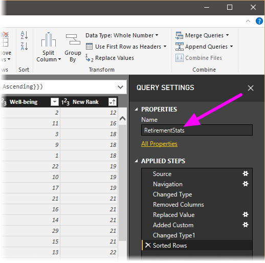

Okay, we’ve shaped that data to the extent we need to. Next let’s connect to another data source, and combine data.

## Combine data
That data about various states is interesting, and will be useful for building additional analysis efforts and queries. But there’s one problem: most data out there uses a two-letter abbreviation for state codes, not the full name of the state. We need some way to associate state names with their abbreviations.

We’re in luck: there’s another public data source that does just that, but it needs a fair amount of shaping before we can connect it to our retirement table. Here’s the Web resource for state abbreviations:

<http://en.wikipedia.org/wiki/List_of_U.S._state_abbreviations>

From the **Home** ribbon in Power Query Editor, we select **New Source \> Web** and type the address, select **Connect**, and the Navigator shows what it found on that Web page.

 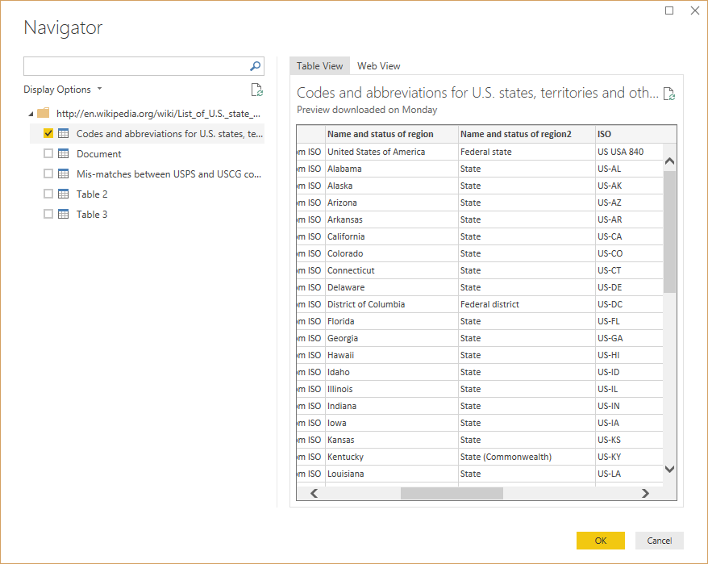

We select **Codes and abbreviations...** because that includes the data we want, but it’s going to take quite a bit of shaping to pare that table’s data down to what we want.

> [!TIP]
> Is there a faster or easier way to accomplish the steps below? Yes, we could create a *relationship* between the two tables, and shape the data based on that relationship. The following steps are still good to learn for working with tables, just know that relationships can help you quickly use data from multiple tables.
> 
> 

To get this data into shape, we take the following steps:

* Remove the top row – it's a result of the way that Web page’s table was created, and we don’t need it. From the **Home** ribbon, select **Reduce Rows \> Remove Rows \> Remove Top Rows**.

The **Remove Top Rows** window appears, letting you specify how many rows you want to remove.

>[!NOTE]
>If Power BI accidentally imports the table headers as a row in your data table, you can select **Use First Row As Headers** from the **Home** tab, or from the **Transform** tab in the ribbon, to fix your table.

* Remove the bottom 26 rows – they’re all the territories, which we don’t need to include. From the **Home** ribbon, select **Reduce Rows \> Remove Rows \> Remove Bottom Rows**.

* Since the RetirementStats table doesn't have information for Washington DC, we need to filter it from our list. Select the drop-down arrow beside the Region Status column, then clear the checkbox beside **Federal district**.

* Remove a few unneeded columns – we only need the mapping of state to its official two-letter abbreviation, so we can remove the following columns: **Column1**, **Column3**, **Column4**, and then **Column6** through **Column11**. First select **Column1**, then hold down the **CTRL** key and select the other columns to be removed (this lets you select multiple, non-contiguous columns). From the Home tab on the ribbon, select **Remove Columns \> Remove Columns**.

>[!NOTE]
>This is a good time to point out that the *sequence* of applied steps in Power Query Editor is important, and can affect how the data is shaped. It’s also important to consider how one step may impact another subsequent step; if you remove a step from the Applied Steps, subsequent steps may not behave as originally intended, because of the impact of the query’s sequence of steps.

>[!NOTE]
>When you resize the Power Query Editor window to make the width smaller, some ribbon items are condensed to make the best use of visible space. When you increase the width of the Power Query Editor window, the ribbon items expand to make the most use of the increased ribbon area.

* Rename the columns, and the table itself – as usual, there are a few ways to rename a column; first select the column, then either select **Rename** from the **Transform** tab on the ribbon, or right-click and select **Rename…** from the menu that appears. The following image has arrows pointing to both options; you only need to choose one.

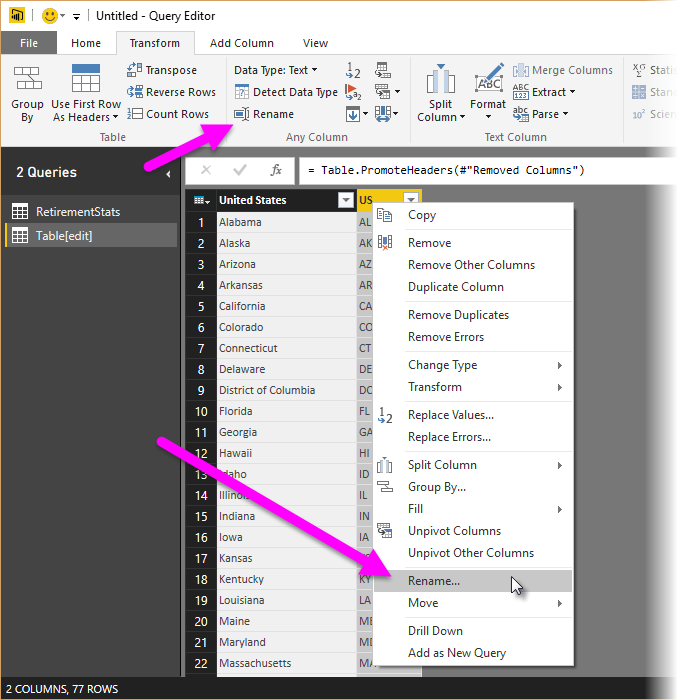

Let’s rename them to *State Name* and *State Code*. To rename the table, just type the name into the **Name** box in the **Query Settings** pane. Let’s call this table *StateCodes*.

Now that we’ve shaped the StateCodes table the way we want, let’s combine these two tables, or queries, into one; since the tables we now have are a result of the queries we applied to the data, they’re often referred to as *queries*.

There are two primary ways of combining queries – *merging* and *appending*.

When you have one or more columns that you’d like to add to another query, you **merge** the queries. When you have additional rows of data that you’d like to add to an existing query, you **append** the query.

In this case, we want to merge queries. To get started, from the left pane of Power Query Editor we select the query *into which* we want the other query to merge, which in this case is *RetirementStats*. Then select **Combine \> Merge Queries** from the **Home** tab on the ribbon.

You may be prompted to set the privacy levels, to ensure the data is combined without including or transferring data you didn't want transferred.

Next the **Merge** window appears, prompting us to select which table we’d like merged into the selected table, and then, the matching columns to use for the merge. Select State from the *RetirementStats* table (query), then select the *StateCodes* query (easy in this case, since there’s only one other query – when you connect to many data sources, there are many queries to choose from). When we select the correct matching columns – **State** from *RetirementStats*, and **State Name** from *StateCodes* – the **Merge** window looks like the following, and the **OK** button is enabled.

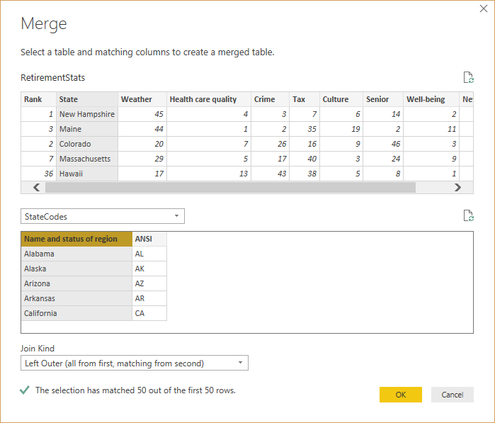

A **NewColumn** is created at the end of the query, which is the contents of the table (query) that was merged with the existing query. All columns from the merged query are condensed into the **NewColumn**, but you can select to **Expand** the table, and include whichever columns you want.

To Expand the merged table, and select which columns to include, select the expand icon (). The **Expand** window appears.

In this case, we only want the **State Code** column, so we select only that column and then select **OK**. We clear the checkbox from Use original column name as prefix because we don’t need or want that; if we leave that selected, the merged column would be named **NewColumn.State Code** (the original column name, or **NewColumn**, then a dot, then the name of the column being brought into the query).

>[!NOTE]
>Want to play around with how to bring in that **NewColumn** table? You can experiment a bit, and if you don’t like the results, just delete that step from the **Applied Steps** list in the **Query Settings** pane; your query returns to the state prior to applying that **Expand** step. It’s like a free do-over, which you can do as many times as you like until the expand process looks the way you want it.

We now have a single query (table) that combined two data sources, each of which has been shaped to meet our needs. This query can serve as a basis for lots of additional, interesting data connections – such as housing cost statistics, demographics, or job opportunities in any state.

To apply changes and close Power Query Editor, select **Close & Apply** from the **Home** ribbon tab. The transformed dataset appears in Power BI Desktop, ready to be used for creating reports.

## Next steps
There are all sorts of things you can do with Power Query. If you're ready to create your own custom connector, check the following article.

> [!div class="nextstepaction"]
> [Creating your first connector: Hello World](CreatingFirstConnector.md)

