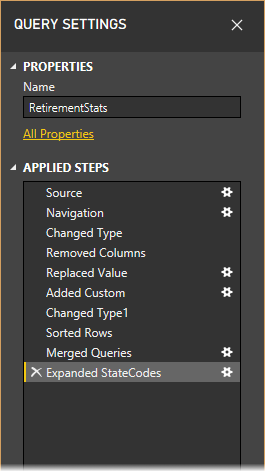
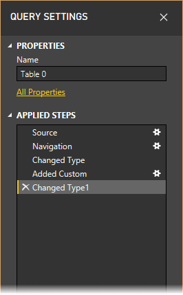
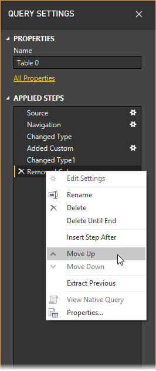
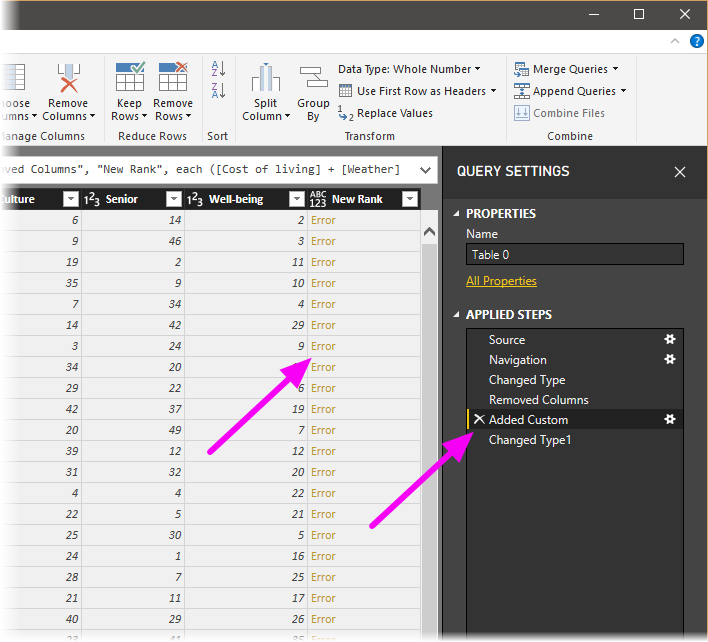
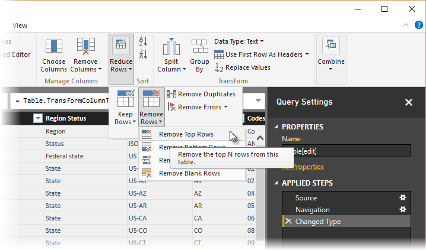

# Tutorial: Shape and combine data using Power Query

With Power Query, you can connect to many different types of data sources, shape the data to meet your needs, and then create visual reports using Power BI Desktop that you can share with others. *Shaping* data means transforming the data&mdash;such as renaming columns or tables, changing text to numbers, removing rows, or setting the first row as headers.<!--You don't need both "such as" and "and so on." --> *Combining* data means connecting to two or more data sources, shaping them as needed, and then consolidating them into one useful query.

In this tutorial, you'll learn to:

> [!div class="checklist"]
> * Shape data with Power Query Editor.
> * Connect to a data source.
> * Connect to another data source.
> * Combine those data sources, and create a data model to use in reports.

This tutorial demonstrates how to shape a query by using Power Query Editor&mdash;a technology that's incorporated into Power BI Desktop&mdash;and learn some common data tasks.

If you're not signed up for Power BI, you can [sign up for a free trial](https://app.powerbi.com/signupredirect?pbi_source=web) before you begin. Also, you can [download Power BI Desktop for free](https://go.microsoft.com/fwlink/?LinkId=521662). 

>[!TIP]
> In Power Query Editor in Power BI Desktop, you can use shortcut menus in addition to the ribbon. Most of what you can select on the **Transform** tab of the ribbon is also available by right-clicking to select an item (such as a column), and choosing a command from the shortcut menu that appears.

## Shape data

When you shape data in Power Query Editor, you're providing step-by-step instructions (which Power Query Editor carries out for you) to adjust the data as Power Query Editor loads and presents it. The original data source isn't affected; only this particular view of the data is adjusted, or *shaped*.

The steps you specify (such as rename a table, transform a data type, or delete columns) are recorded by Power Query Editor. Each time this query connects to the data source, those steps are carried out so that the data will always be shaped the way you specify. This process occurs whenever you use the Power Query Editor feature of Power BI Desktop, or for anyone who uses your shared query, such as in the Power BI service. Those steps are captured sequentially in the **Query Settings** pane, under **Applied Steps**.

The following image shows the **Query Settings** pane for a query that has been shaped. You'll go through each of these steps in the next few paragraphs.



Using the retirement data from the [Using Power Query in Power BI Desktop](power-query-quickstart-using-power-bi.md) quickstart article, which you found by connecting to a Web data source, you can shape that data to fit your needs.

For starters, you can add a custom column to calculate rank based on giving equal weight to all retirement factors<!--Edit okay? I found this confusing. I also wonder what the point of this is beyond creating a new column - can you explain it here?-->, and compare this to the existing column named **Rank**.  On the **Add Column** tab, select the **Custom Column** button, as shown in the following image.


In the **Custom Column** dialog box, for **New column name**, enter **New Rank**. Copy the following formula, and paste it into the **Custom column formula** box:

```
([Cost of living] + [Weather] + [Health care quality] + [Crime] + [Tax] + [Culture] + [Senior] + [#"Well-being"]) / 8
```

Make sure the status message reads "No syntax errors have been detected," and then select **OK**.


To keep column data consistent, you can transform the new column values to whole numbers. Just right-click the column heading, and then select **Change Type** \> **Whole Number** to change them. 

>[!TIP]
>If you need to choose more than one column, first select a column, select **Shift** as you select additional adjacent columns, and then right-click a column heading to change all the selected columns. You can also use **Ctrl** to select noncontiguous<!--To be parallel with a later occurrence.--> columns.


You can also transform column data types by using the **Transform** tab on the ribbon. The following image shows the **Data Type** button on the **Transform** tab.


Note that in **Query Settings**, **Applied Steps** reflect any shaping steps that have been applied to the data. If you want to remove any step from the shaping process, you simply select the X<!--note from editor: Can we get this inline image here? It doesn't really look like an "X."--> on the left side of the step. In the following image, the **Applied Steps** section lists what has happened so far, which includes connecting to the website (**Source**), selecting the table (**Navigation**), and, while loading the table, Power Query Editor automatically changing text-based number columns from **Text** to **Whole Number** (**Changed Type**). The last two steps show your previous actions, **Added Custom** and **Changed Type1**. 



Before you can work with this query, you need to make a few changes to get its data where you want it:
<!--note from editor: These list items would work well as procedure-type headings to break up the rest of this section. I found myself getting lost, especially around the steps that are meant to showcase the "really cool feature" of the "Insert step" warning. Edits to the following list are suggested.-->
1. **Adjust the rankings by removing a column**: You've decided **Cost of living** is a non-factor in your results. You remove this column, but find that the data remains unchanged. You can fix this by following the rest of the steps in this section.
2. **Fix a few errors**: Because you removed a column, you need to readjust your calculations in the **New Rank** column. This involves changing a formula.
3. **Sort the data** based on the **New Rank** and **Rank** columns. 
4. **Replace data**: Replace a specific value and insert a step.<!--Suggested.-->
5. **Change the table name**: **Table 0** isn't a useful descriptor. Changing it is simple.

To remove the **Cost of living** column, simply select the column, select the **Home** tab on the ribbon, and then select **Remove Columns**, as shown in the following image.


Notice that the **New Rank** values haven't changed; this is due to the ordering of the steps. Because Power Query Editor records steps sequentially&mdash;yet independently of each other&mdash;you can move each step up or down in the **Applied Steps** sequence. Just right-click any step, and a menu appears with commands you can use to **Rename**, **Delete**, **Delete Until End** (remove the current step, and all subsequent steps too), **Move Up**, or **Move Down**. Go ahead and move up the last step, **Removed Columns**, to just before the **Added Custom** step.



Next, select the **Added Custom** step. Notice that the data now shows **Error**, which you'll need to address. 



There are a few ways to get more information about each error. You can select the cell (without selecting the word "Error"), or select the word "Error" directly. If you select the cell *without* selecting the word "Error," Power Query Editor displays the error information at the bottom of the window.


If you select the word "Error" directly, Power Query creates an entry in **Applied Steps** and displays information about the error. You don't want to go this route, so select **Cancel**.<!--Not sure why you need to describe what not to do in such detail.-->

To fix the errors, select the **New Rank** column, select the **View** tab, and then select the **Formula Bar** check box. This displays the formula for the data in the column. 


Now you can remove the `Cost of living` parameter and decrement the divisor by changing the formula to the following: 

```
Table.AddColumn(#"Removed Columns", "New Rank", each ([Weather] + [Health care quality] + [Crime] + [Tax] + [Culture] + [Senior] + [#"Well-being"]) / 7)
```

Select the green check mark to the left of the formula bar, or press the Enter key, to replace the revised values. The **Added Custom** step should<!--note from editor: If this isn't 100 percent going to happen, do you need to cover that possibility? According to Writing Style Guide, "Use should only to describe an action that's recommended but optional. Don't use should to indicate probability. If you can't make a definitive statement, use might or rephrase."--> now be completed with no errors.

> [!NOTE]
> You can also select the **Remove errors** command (from the ribbon or the shortcut menu), which removes any rows that have errors. In this case, the command would have removed all the rows from your data, and you don't want to do that&mdash;you probably want to keep your data in the table.

Now you need to sort the data based on the **New Rank** column. First, select the last applied step, **Changed Type1**, to get to the most recent data. Then, select the drop-down menu located next to the **New Rank** column heading, and then select **Sort Ascending**.


Notice that the data is now sorted according to **New Rank**.  However, if you look in the **Rank** column, you'll notice the data isn't sorted properly in cases where the **New Rank** value is a tie. To fix this, select the **New Rank** column, and change the formula to the following:
<!--Is the equal sign significant? Should it be part of the other formula snippets?-->
```
    = Table.Sort(#"Changed Type1",{{"New Rank", Order.Ascending},{"Rank", Order.Ascending}})
```

Select the green check mark to the left of the formula bar, or press the Enter key, to order the rows in accordance with both the **New Rank** and **Rank** columns.

In addition, you can select a step anywhere in the **Applied steps** list and continue shaping the data at that point in the sequence. Power Query Editor will automatically insert a new step directly after the currently selected step. Let's give that a try.

First, select the step that occurred just before you added the custom column&mdash;the **Removed Columns** step. Here you'll replace the value of the Weather ranking in Arizona. Right-click the cell that contains Arizona's Weather ranking, and then select **Replace Values** from the menu that appears. Note which step in the **Applied Steps** list is currently selected&mdash;the one just before the **Added Custom** step.


Because you're inserting a step, Power Query Editor warns you about the danger of doing so: subsequent steps might cause the query to break. You need to be careful and thoughtful here. To see how Power Query Editor handles this, go ahead and select **Insert**.


Change the value to **51**, and the data for Arizona is replaced. When you create a new step, Power Query Editor names it based on the action&mdash;in this case, **Replaced Value**. When you have more than one step with the same name in your query, Power Query Editor adds a number (in sequence) to each subsequent step to differentiate between them.

Now select the last step, **Sorted Rows**, and notice that the data about Arizona's new ranking has indeed changed. This is because you inserted the **Replaced Value** step in the right place, before **Added Custom**.

<!--Suggest deleting this:
That was a little involved, but it was a good example of how powerful and versatile Power Query Editor can be.
-->

Lastly, you'll want to change the name of that table to something descriptive. When you create reports, it's useful to have descriptive table names, especially when you connect to multiple data sources that are all listed on the **Fields** pane of the **Report** view.

Changing the table name is easy. On the **Query Settings** pane, under **Properties**, simply enter **RetirementStats** in the **Name** box, and then select **Enter**.


<!--note from editor: The following paragraph needs to be set off somehow. Formatting can really help give shape to content that kind of weaves in and out of step-by-step guidance and commentary.-->
You've shaped that data to the extent you need to. Next, you'll connect to another data source and combine data.

## Combine data

The data about various states is interesting, and will be useful for building additional analysis efforts and queries. But there's one problem: most data out there uses a two-letter abbreviation for state codes, not the full name of the state. You need some way to associate state names with their abbreviations.

You're in luck. There's a public data source that does just that, but it needs a fair amount of shaping before you can connect it to your retirement table. Here's the web resource for state abbreviations:

<https://en.wikipedia.org/wiki/List_of_U.S._state_abbreviations>

On the **Home** tab in Power Query Editor, select **New source** \> **Web**, enter the address, and then select **Connect**. 

 

Select the **Codes and abbreviations for U.S. states, federal district, territories, and other regions** table. It includes the data you want, but it's going to take quite a bit of shaping to pare the data from that table down to what you want.

> [!TIP]
> Is there a faster or easier way to accomplish the steps below? Yes: you can create a *relationship* between the two tables, and shape the data based on that relationship. The following steps are still good to learn, just keep in mind that relationships can help you quickly use data from multiple tables.

To get this data into shape, take the following steps:

1. Remove the top row: it's a result of the way that table was created, and you don't need it. On the **Home** tab, select **Reduce rows** \> **Remove rows** \> **Remove top rows**.

   

   In the **Remove top rows** dialog box, specify how many rows you want to remove.<!--This should be "enter **1**", correct? -->

   >[!NOTE]
   >If Power BI accidentally imports the table headers as a row in your data table, you can select **Use first row as headers** from the **Home** tab<!--You don't need to give every possible way to do something all the time.--> to fix your table.

2. Remove the bottom 26 rows: they're all territories, which you don't need to include. On the **Home** tab, select **Reduce rows** \> **Remove rows** \> **Remove bottom rows**.

   

3. Because the RetirementStats table doesn't have information for Washington DC, you need to filter it from your list. Select the drop-down arrow beside the **Region Status** column heading, and then clear the **Federal district** check box.

   

4. Remove a few unneeded columns. You only need the mapping of the state to its official two-letter abbreviation, so you can remove the following columns: **Column1**, **Column3**, **Column4**, and then from **Column6** through **Column11**. First select **Column1**, then select **Ctrl** as you select the other columns to remove (this lets you select multiple, noncontiguous columns). On the **Home** tab, select **Remove columns** \> **Remove columns**.

   

    >[!NOTE]
    >This is a good time to point out that the *sequence* of applied steps in Power Query Editor is important and can affect how the data is shaped. It's also important to consider how one step might affect subsequent steps. For example, if you remove a step, steps that occur later in the sequence might not behave as originally intended.<!--The best time for this note actually was in the "Shape data" section where you first talk about this concept.-->
<!-- note from editor: The following is not worth saying, and it certainly makes no sense to say it here.
>[!NOTE]
>When you resize the Power Query Editor window to make the width smaller, some ribbon items are condensed to make the best use of visible space. When you increase the width of the Power Query Editor window, the ribbon items expand to make the most use of the increased ribbon area.
-->

5. Rename the columns and the table itself. As usual, there are a few ways to rename a column. First select the column, and then either select **Rename** from the **Transform** tab, or right-click and select **Rename** from the menu that appears. The following image shows both options; you only need to choose one.

   

   Rename the columns to **State Name** and **State Code**. Rename the table by entering **StateCodes** in the **Name** box on the **Query Settings** pane. 

Now that you've shaped the StateCodes table the way you want, you'll combine these two tables&mdash;or *queries*&mdash;into one.

>[!IMPORTANT]
>The tables you now have are a result of the queries you applied to the data. Such tables are also called *queries*, which is the term we'll use in the following discussion.<!--note from editor: Edit okay? I find it very confusing to use the same word for the question and the set of answers to that question, but if that's what we actually do, c'est la vie. I think the point needs to be highlighted in something like this Important note. -->

There are two primary ways of combining queries: *merging* and *appending*:

* When you have one or more columns that you'd like to add to another query, you *merge* the queries.
* When you have additional rows of data that you'd like to add to an existing query, you *append* the query.

In this case, you'll want to merge queries. To get started, from the left pane of Power Query Editor, select the query *into which* you want the other query to merge, which in this case is RetirementStats. Then on the **Home** tab, select **Combine** \> **Merge queries**.


You might be prompted to set privacy levels, to ensure that data is combined without including or transferring data you didn't want transferred.<!--Would it be helpful to give a little more information here, or will the reader know what to do?-->

Next, the **Merge** dialog box appears. You're prompted to select which query you'd like merged into the selected query, and then you're prompted to select the matching columns to use for the merge. Select the **State** column in<!--Edit okay?--> the RetirementStats query, and then select the StateCodes query (easy in this case, because there's only one other query&mdash;when you connect to many data sources, there will be many queries to choose from). When you select the correct matching columns&mdash;**State** from RetirementStats and **State Name** from StateCodes&mdash;the **Merge** dialog box looks like the following image, and the **OK** button is enabled.


A column named **NewColumn** is created at the end of the query. This column contains the contents of the query that was merged with the existing query. All columns from the merged query are condensed into **NewColumn**, but you can expand the table and include whichever columns you want.


To expand the merged table and select the columns to include, select the expand icon (). The **Expand** panel appears.


In this case, you only want the **State Code** column, so select only that column and then select **OK**. Clear the **Use original column name as prefix** check box, because you don't need or want that. (If you do leave that check box selected, the merged column will be named **NewColumn.State Code**: the original column name followed by a dot, followed by the name of the column that's being brought into the query.)

>[!NOTE]
>You can experiment with different ways of bringing in the **NewColumn** table. If you don't like the results, you can just delete that step from the **Applied steps** list in the **Query settings** pane. Your query will return to the state it was in before you applied that **Expand** step, so you can try as many times as you like until the expanded query looks the way you want it.

You now have a single query (table) that combines two data sources, each of which has been shaped to meet your needs. This query can serve as a basis for lots of additional, interesting data connections, such as housing cost statistics, demographics, or job opportunities in any state.

To apply changes and close Power Query Editor, go to the **Home** tab and select **Close & Apply**. The transformed dataset appears in Power BI Desktop, ready to be used for creating reports.


## Next step

There are all sorts of things you can do with Power Query. If you're ready to create your own custom connector, go to the following article.

> [!div class="nextstepaction"]
> [Creating your first connector: Hello World](CreatingFirstConnector.md)
