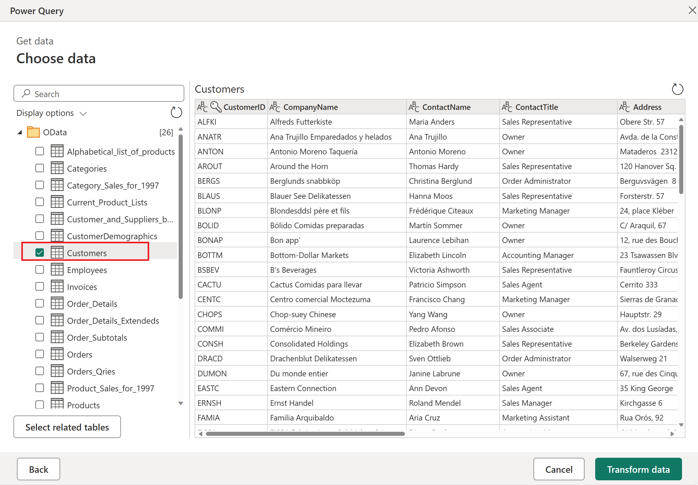
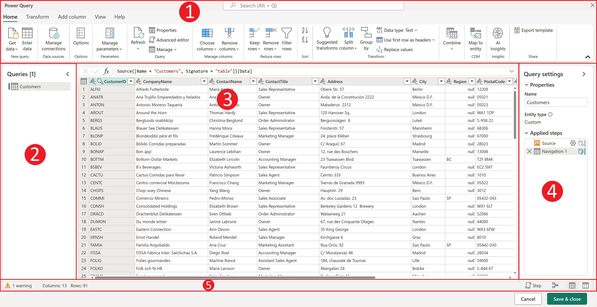
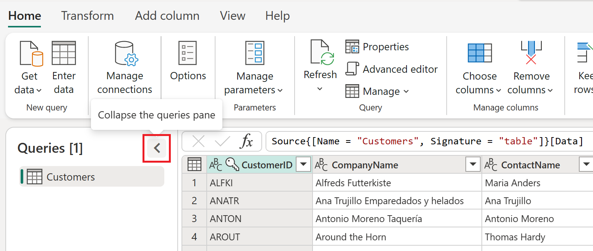
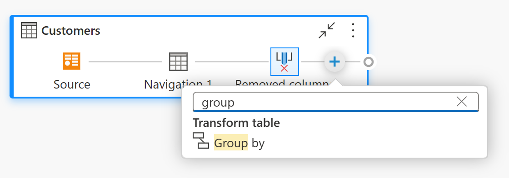
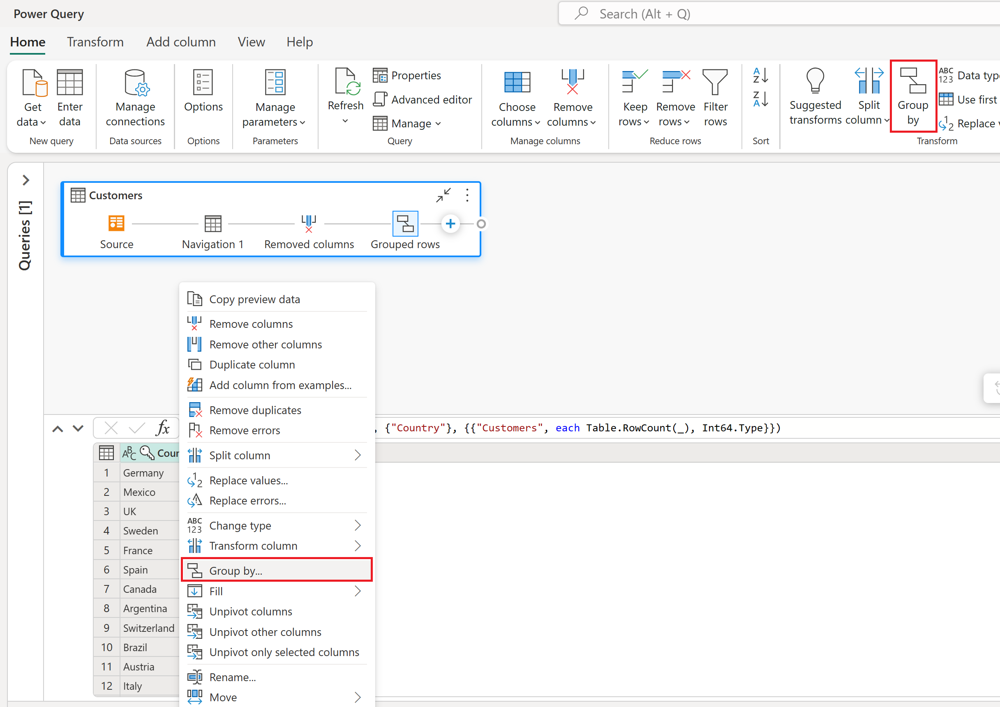
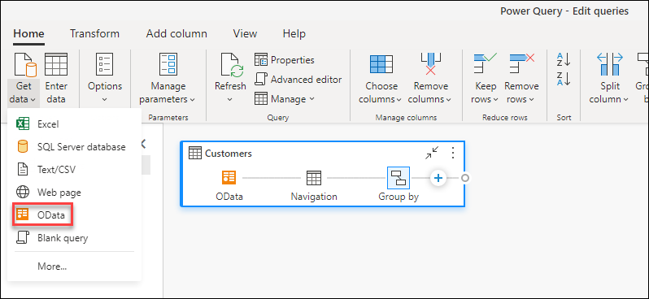
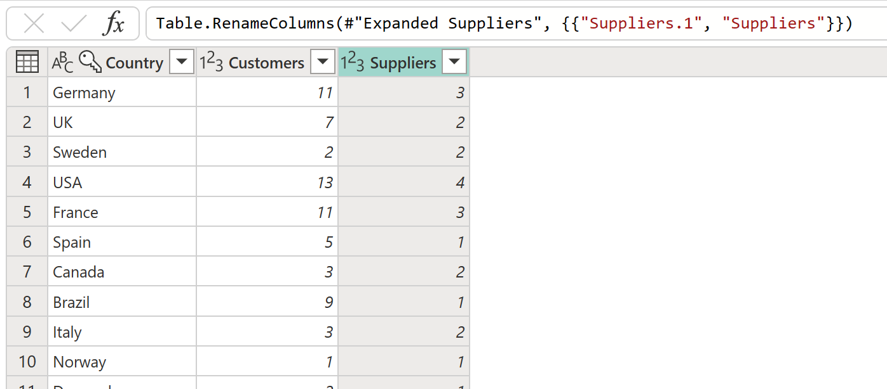
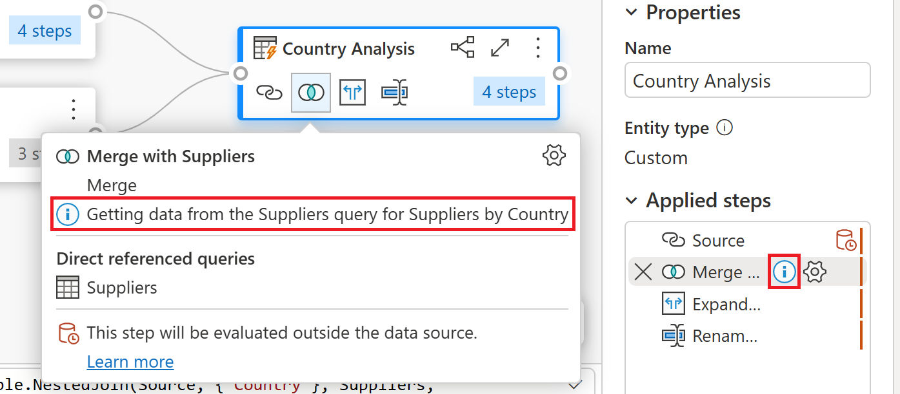

# The Power Query user interface

With Power Query, you can connect to many different data sources and transform the data into the shape you want.

In this article, you'll learn how to create queries with Power Query by learning:
- How the "Get Data" experience works in Power Query,
- How to use and take advantage of the Power Query user interface, and,
- How to perform common transformations like grouping and merging data.

If you're new to Power Query, you can [sign up for a free trial of Power BI](https://app.powerbi.com/signupredirect?pbi_source=web) before you begin. This will allow you to use Power BI dataflows to try the Power Query Online experiences described in this article.

You can also [download Power BI Desktop for free](https://go.microsoft.com/fwlink/?LinkId=521662). 

Examples in this article will connect to and use the [Northwind OData feed](https://services.odata.org/V4/Northwind/Northwind.svc/). 

```
https://services.odata.org/V4/Northwind/Northwind.svc/
```

## Connect to an OData feed

To start, locate the **OData** feed connector from the "Get Data" experience. You can simply this by looking at the categories at the top and selecting the **Other** category, or by searching for **OData** in the search bar in the top right corner. 


Once you select this connector, the screen will display the connection settings and credentials.
- For **URL**, enter the URL to the Northwind OData feed from the previous section.
- For **On-premises data gateway**, leave as none.
- For **Authenticaion kind**, leave as anonymous. 

Select the next button.


You will then see the **Navigator** experience where you can select the tables you want to connect to from the data source. Select the **Customers** table to load a preview of the data, and select **Transform data**. 



This will load the data from the Customers table into the Power Query editor. 

The above experience of connecting to your data, specifying the authentication method, and selecting the specific object or table to connect to is called the **Get data** experience and is documented with further detail in the [Get Data](get-data-experience.md) article.

> [!NOTE]
> You can learn more about the OData feed connector from its documentation [article](Connectors/ODataFeed.md).

## The Power Query editor user experience

The Power Query editor represents the Power Query user interface where you can add or modify queries, manage queries by grouping or adding descriptions to query steps, or visualize your queries and their structure with different views. The Power Query user interface has five distinct components.



1. **Ribbon**: the ribbon navigation experience with multiple tabs to add transforms, select options for your query, and access different ribbon buttons for to complete various tasks. 
2. **Queries pane**: a view of all your available queries.
3. **Current view**: your main working view which by default, displays a preview of data for your query. You can also select to use [diagram view](diagram-view.md) to view a visual representation of your schema. 
4. **Query settings**: a view of the current selected query with relevant information such as query name, query steps, and various indicators.
5. **Status bar**: a bar displaying relevant important information about your query such as execution time, total columns and rows, and processing status. This bar also contains buttons to change your current view. 

> [!NOTE]
> Note that the schema and diagram view are currently only available in Power Query Online experiences. 

## Using the Power Query editor

In this section, you will begin transforming your data using Power Query. First, collapse the queries pane and switch to the schema view by selecting the rightmost button in the status bar.



The schema view offers you a quick and straightforward way to only interact with the components of the schema for your table, such as the column names and data types. The schema view is the recommended view when you want to do schema-related actions such as removing columns, renaming columns, changing column data types, reordering columns or duplicating columns. 

> [!NOTE]
> You can learn more about schema view from its documentation [article](schema-view.md).

Within schema view, select the **Orders** and **CustomerDemographics** columns by selecting the checkmark next to them, and from the ribbon select the **Remove columns** action. This will apply a transformation to remove these columns from your data.


You can now switch back to the data preview view and enable diagram view to see a more visual perpsective of your data and query.


The goal of diagram view is to help you visualize how your query is structured and how it might interact with other queries within your project. Each step in your query has a distinct icon to help you recognize the transform that was used. There are also lines which connect steps to illustrate dependencies. Since both data preview view and diagram view is enabled, the diagram view will display on top of the data preview. 


> [!NOTE]
> You can learn more about diagram view from its documentation [article](diagram-view.md).

With diagram view enabled, select the plus sign and you can search for a new transform to add to your query. Search for **Group by** and select the transform.



The **Group by** dialog will then appear. We can set the **Group by** operation to group by the country and count the number of customer rows per country. 
- Keep the **Basic** radio button selected.
- Select **Country** to group by.
- Select **Customers** and **Count rows** as the column name and operation respectively.


Select **OK** to perform the operation. Your data preview should refresh to show the total number of customers by country. An alternative way to launch the **Group by** dialog could be to use the **Group by** button in the ribbon or by right-clicking the **Country** column.



For convenience, transforms in Power Query can often be accessed from multiple places so users can opt to use the experience they prefer. 

## Adding a new query

Now that you have a query which provides the number of customers per country, you can add context to this data by finding the total number of suppliers for each territory.

First, you'll need to add the **Suppliers** data. Select **Get Data** and from the drop-down menu, select **OData**. 



The OData connection experience will reappear. Enter the connection settings as described above in this article to connect to the Northwind OData feed. In the **Navigator** experience, search for and select the **Suppliers** table.


Select **Create** to add the new query to the Power Query editor. The queries pane should now display both the **Customers** and the **Suppliers** query.


Open the **Group by** dialog again, this time by selecting the **Group by** button on the ribbon under the **Transform** tab.


In the **Group by** dialog, set the **Group by** operation to group by the country and count the number of supplier rows per country. 
- Keep the **Basic** radio button selected.
- Select **Country** to group by.
- Select **Suppliers** and **Count rows** as the column name and operation respectively.


> [!NOTE]
> You can learn more about the **Group by** transform in Power Query in its documentation [article](group-by.md).

## Referencing queries

Now that you have a query for customers and a query for suppliers, your next objective is to combine these queries into one. There are many ways to accomplish this, including using the **Merge** option in the **Customers** table, duplicating a query, or referencing a query. For this example, you will create a reference by right-clicking the **Customers** table and selecting **Reference**, which will effectively create a new query that references the **Customers** query. 


After creating this new query, change the name of the query to **Country Analysis** and disable the load of the **Customers** table by unmarking the **Enable load** option from the **Suppliers** query. 


## Merging queries

A **merge queries** operation joins two existing tables together based on matching values from one or multiple columns. In this example, the goal is to join both the **Customers** and **Suppliers** tables into one table only for the countries that have both **Customers** and **Suppliers**.

Inside the **Country Analysis** query, select the **Merge queries** option from the Home tab in the ribbon.


A new dialog for the **Merge** operation will appear where you can select the query to merge with your current query. Select the **Suppliers** query and select the **Country** field from both queries. Finally, select the **Inner** join kind as you only want the countries where you have **Customers** and **Suppliers** for this analysis.


After selecting the **OK** button, a new column will be added to your **Country Analysis** query which contains the data from the **Suppliers** query. Select the icon next to the **Suppliers** field which will display a menu where you can select which fields you want to expand, and select only the **Suppliers** field before selecting the **OK** button.


The result of this **expand** operation is a table with only 12 rows. Rename the **Suppliers.Suppliers** field to just **Suppliers** by simply double-clicking the field name and entering the new name.



> [!NOTE]
> You can learn more about the **Merge queries** feature in its documentation [article](merge-queries-overview.md).

## Applied steps

Every transformation that is applied to your query is saved as a step in the **Applied steps** section of the query settings pane. If you ever need to check how your query is transformed from step-to-step, you can select a step and preview how your query resolves at that specific point.

You can also right-click a query and select the **Properties** option to change the name of the query or add a description for the query. For example, right-click the **Merge queries** step from the **Country Analysis** query and change the name of the query to be **Merge with Suppliers** and the description to be **Getting data from the Suppliers query for Suppliers by Country**.


This will add a new icon next to your step that you can hover over to read its description.



> [!NOTE]
> You can learn more about **Applied steps** from its documentation [article](applied-steps).

Before moving on to the next section, disable the **Diagram view** to only see the **Data preview**.

## Adding a new column

With the data for customers and suppliers in a single table, you can now calculate the ratio of customers-to-suppliers for each country. Select the last step of **Country Analysis** query and select both the **Customers** and **Suppliers** columns. In the **Add column tab** in the ribbon and inside the **From number** group, select **Standard**, and then  **Divide (Integer)** from the dropdown.


This will create a new column called **Integer-division** which you can rename to **Ratio**. This is the final step of your query as you can see the customer-to-supplier ratio for the countries where the data has customers and suppliers.

## Data profiling

Another Power Query feature that can help you better understand your data is **Data Profiling**.  By enabling the data profiling features, you will get feedback about the data inside your query fields such as value distribution, column quality and more. 

It is highly recommended to use this feature throughout the development of your queries, but you can always enable and disable the feature at your convenience. Below is an image with all the data profiling tools enabled for your **Country Analysis** query.


> [!NOTE]
> You can learn more about **Data profiling** in its documentation [article](data-profiling-tools.md).

## Summary

In this article, you created a series of queries with Power Query to provide a customer-to-supplier ratio analysis at the country level for the Northwind corporation. 

You learned the components of the Power Query User Interface, how to create new queries inside the Query Editor, reference queries, merge queries, understand the applied steps section, add new columns, and how to leverage the Data profiling tools to better understand your data.

Power Query is a powerful tool used to connect to many different data sources and transform the data into the shape you want. The scenarios outlined in this article are examples to show how users can leverage Power Query to transform raw data into important actionable business insights. 
