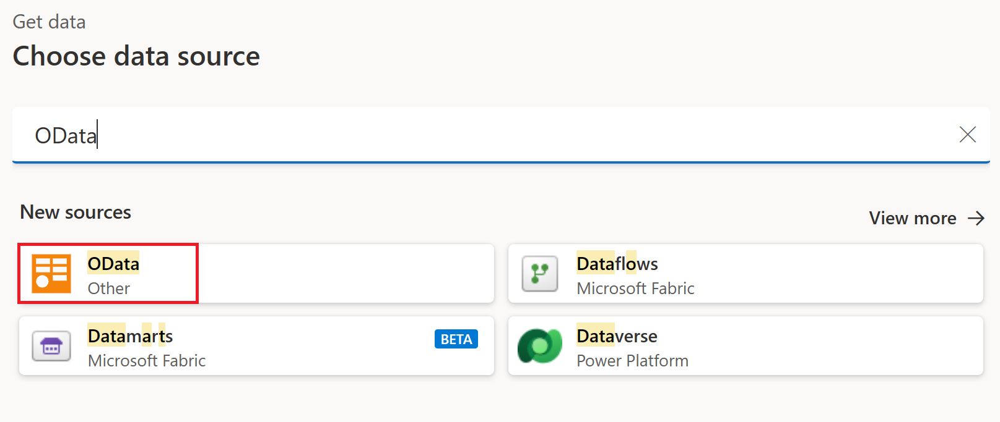
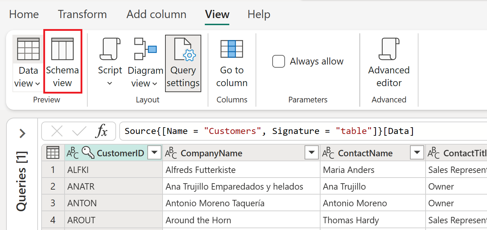
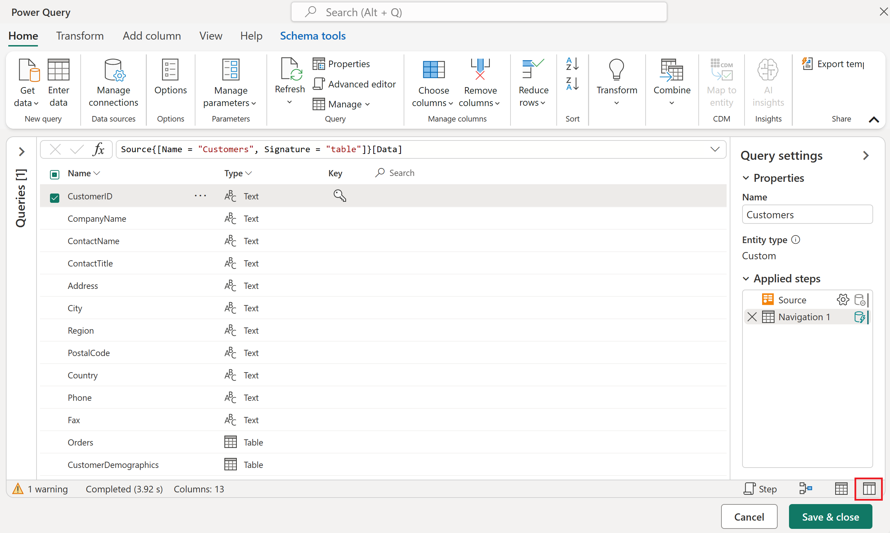
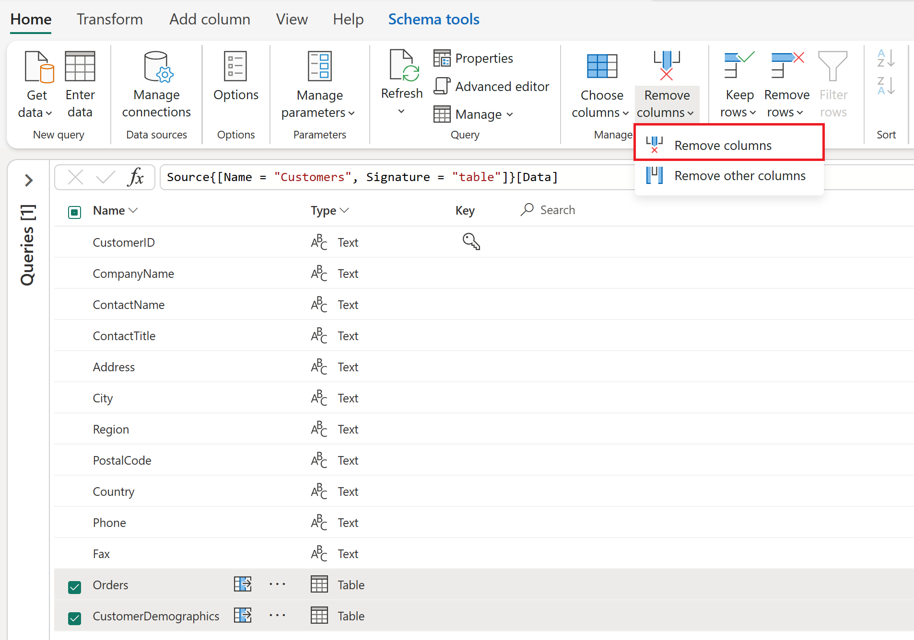
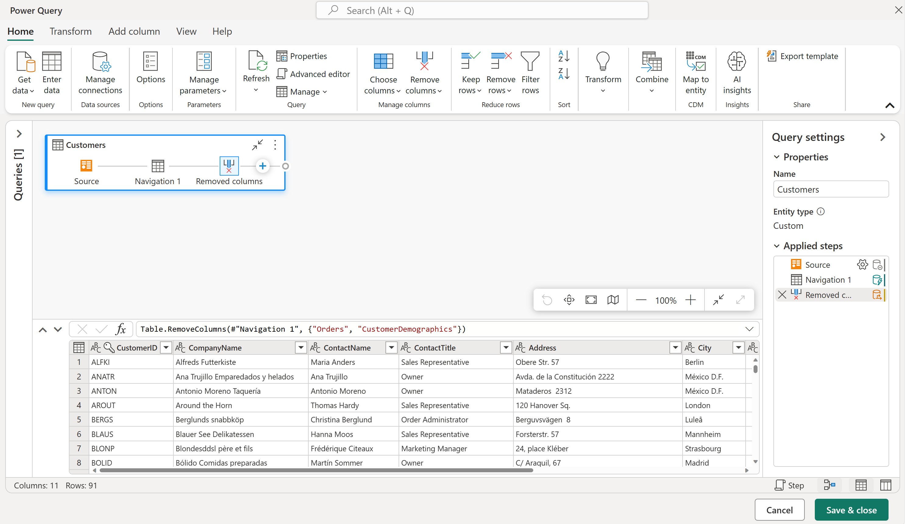
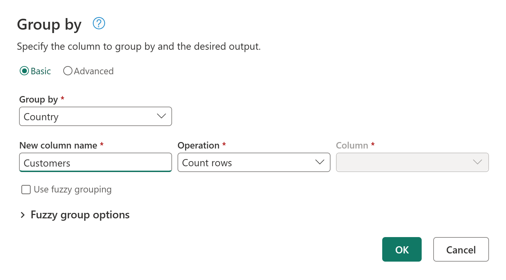
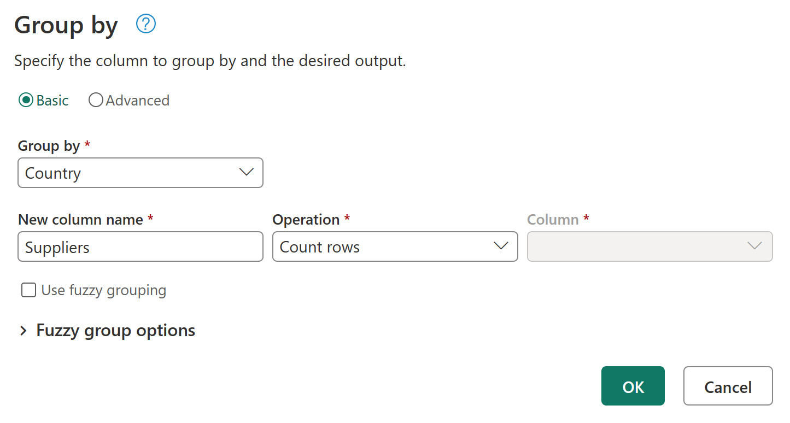
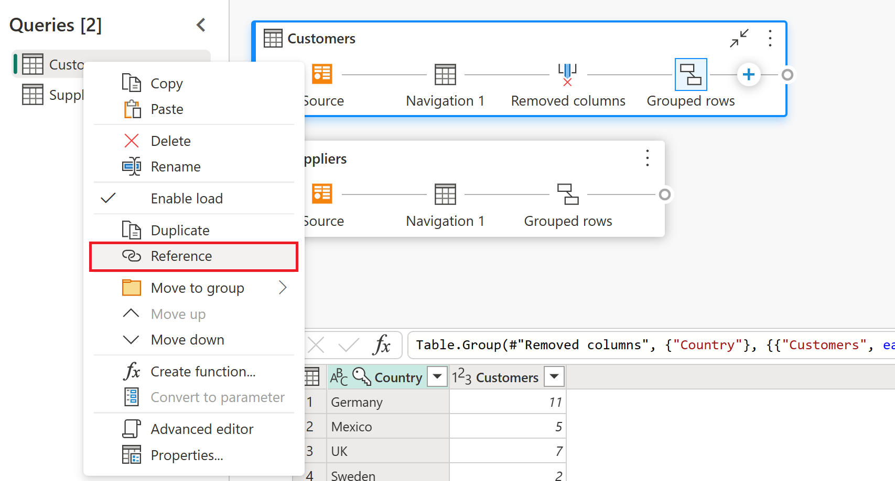
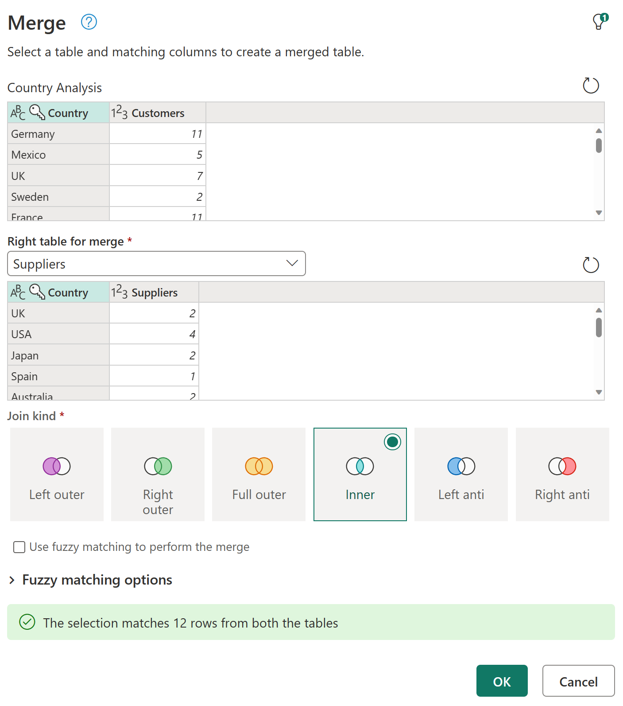

# The Power Query user interface

With Power Query, you can connect to many different data sources and transform the data into the shape you want.

In this article, you'll learn how to create queries with Power Query by discovering:

- How the "Get Data" experience works in Power Query.
- How to use and take advantage of the Power Query user interface.
- How to perform common transformations like grouping and merging data.

If you're new to Power Query, you can [sign up for a free trial of Power BI](https://app.powerbi.com/signupredirect?pbi_source=web) before you begin. You can use Power BI dataflows to try out the Power Query Online experiences described in this article.

You can also [download Power BI Desktop for free](https://go.microsoft.com/fwlink/?LinkId=521662). 

Examples in this article connect to and use the [Northwind OData feed](https://services.odata.org/V4/Northwind/Northwind.svc/). 

```
https://services.odata.org/V4/Northwind/Northwind.svc/
```

## Connect to an OData feed

To start, locate the **OData** feed connector from the "Get Data" experience. You can select the **Other** category from the top, or search for **OData** in the search bar in the top-right corner. 



Once you select this connector, the screen displays the connection settings and credentials.
- For **URL**, enter the URL to the Northwind OData feed shown in the previous section.
- For **On-premises data gateway**, leave as none.
- For **Authentication kind**, leave as anonymous. 

Select the **Next** button.


The **Navigator** now opens, where you select the tables you want to connect to from the data source. Select the **Customers** table to load a preview of the data, and then select **Transform data**.


The dialog then loads the data from the Customers table into the Power Query editor.

The above experience of connecting to your data, specifying the authentication method, and selecting the specific object or table to connect to is called the **Get data** experience and is documented with further detail in the [Getting data](get-data-experience.md) article.

> [!NOTE]
> To learn more about the OData feed connector, see [OData feed](Connectors/ODataFeed.md).

## The Power Query editor user experience

The Power Query editor represents the Power Query user interface, where you can add or modify queries, manage queries by grouping or adding descriptions to query steps, or visualize your queries and their structure with different views. The Power Query user interface has five distinct components.

[  ](media/power-query-ui/pqui-user-interface.png#lightbox)

1. **Ribbon**: the ribbon navigation experience, which provides multiple tabs to add transforms, select options for your query, and access different ribbon buttons to complete various tasks.
2. **Queries pane**: a view of all your available queries.
3. **Current view**: your main working view, that by default, displays a preview of the data for your query. You can also enable the [diagram view](diagram-view.md) along with the data preview view. You can also switch between the [schema view](schema-view.md) and the data preview view while maintaining the diagram view.
4. **Query settings**: a view of the currently selected query with relevant information, such as query name, query steps, and various indicators.
5. **Status bar**: a bar displaying relevant important information about your query, such as execution time, total columns and rows, and processing status. This bar also contains buttons to change your current view.

> [!NOTE]
> The schema and diagram view are currently only available in Power Query Online.

## Using the Power Query editor

In this section, you'll begin transforming your data using Power Query. But before you start working on transforming the data, we'll discuss some of the UI panes that can be expanded or collapsed depending on their context. Selecting the appropriate panes lets you focus on the view that matters the most to you. We'll also discuss the different views that are available in the Power Query UI.

### The ribbon

The ribbon is the component where you'll find most of the transforms and actions that you can do in the Power Query editor. It has multiple tabs depending on the product integration and each of the tabs provides specific buttons and options, some of which might be redundant across the whole Power Query experience to provide you with easy access to the transforms and actions that you may need in just a few clicks.

[  ](media/power-query-ui/standard-ribbon.png#lightbox)

The Power Query interface is responsive and will try to adjust your screen resolution to show you the best experience. In scenarios where you'd like to see a compact version of the ribbon there is also a collapse button at the bottom-right corner for the ribbon to help you switch to the compact ribbon. 

[  ](media/power-query-ui/compact-ribbon.png#lightbox)

You can switch back to the standard ribbon view by simply clicking on the expand icon at the bottom-right corner of the ribbon

### Expand and collapse panes

You'll notice that throughout the Power Query user interface there are icons that help you collapse or expand certain views or sections. For example, there's an icon on the top right-hand corner of the Queries pane that collapses the queries pane when selected, and expands the pane when selected again.


### Switch between views

Apart from being able to collapse certain panes and sections in the Power Query user interface, you can also switch what views are displayed. To switch views, go to the **View** tab in the ribbon and you'll find the **Preview** and **Layout** groups, which control how the Power Query user interface will look.

You're encouraged to try all of these options to find the view and layout that you feel most comfortable working with. As an example, select **Schema view** from the ribbon.



The right side of the status bar also contains icons for the diagram, data, and schema views. You can use these icons to change between views. You can also use these icons to enable or disable the view of your choice.

[  ](media/power-query-ui/pqui-current-view-schema.png#lightbox)

### What is schema view

The schema view offers you a quick and straightforward way to interact only with the components of the schema for your table, such as the column names and data types. We recommend the schema view when you want to do schema-related actions, such as removing columns, renaming columns, changing column data types, reordering columns, or duplicating columns.

> [!NOTE]
> To learn more about schema view, see [Using Schema view](schema-view.md).

For example, in schema view, select the check mark next to the **Orders** and **CustomerDemographics** columns, and from the ribbon select the **Remove columns** action. This selection applies a transformation to remove these columns from your data.



### What is diagram view

You can now switch back to the data preview view and enable diagram view to see a more visual perspective of your data and query.


The diagram view helps you visualize how your query is structured and how it might interact with other queries in your project. Each step in your query has a distinct icon to help you recognize the transform that was used. There are also lines that connect steps to illustrate dependencies. Since both data preview view and diagram view are enabled, the diagram view displays on top of the data preview.

[  ](media/power-query-ui/pqui-data-preview-diagram-view.png#lightbox)

> [!NOTE]
> To learn more about diagram view, see [Diagram view](diagram-view.md).

### Begin transforming your data

With diagram view enabled, select the plus sign. You can search for a new transform to add to your query. Search for **Group by** and select the transform.


The **Group by** dialog then appears. You can set the **Group by** operation to group by the country and count the number of customer rows per country.

1. Keep the **Basic** radio button selected.
2. Select **Country** to group by.
3. Select **Customers** and **Count rows** as the column name and operation respectively.



Select **OK** to perform the operation. Your data preview refreshes to show the total number of customers by country.

An alternative way to launch the **Group by** dialog would be to use the **Group by** button in the ribbon or by right-clicking the **Country** column.

[  ](media/power-query-ui/pqui-group-by-alt.png#lightbox)

For convenience, transforms in Power Query can often be accessed from multiple places, so users can opt to use the experience they prefer.

## Adding a new query

Now that you have a query that provides the number of customers per country, you can add context to this data by finding the total number of suppliers for each territory.

First, you'll need to add the **Suppliers** data. Select **Get Data** and from the drop-down menu, and then select **OData**. 


The OData connection experience reappears. Enter the connection settings as described in [Connect to an OData feed](#connect-to-an-odata-feed) to connect to the Northwind OData feed. In the **Navigator** experience, search for and select the **Suppliers** table.

[  ](media/power-query-ui/pqui-connect-to-odata-suppliers.png#lightbox)

Select **Create** to add the new query to the Power Query editor. The queries pane should now display both the **Customers** and the **Suppliers** query.

[  ](media/power-query-ui/pqui-customers-and-suppliers-query.png#lightbox)

Open the **Group by** dialog again, this time by selecting the **Group by** button on the ribbon under the **Transform** tab.


In the **Group by** dialog, set the **Group by** operation to group by the country and count the number of supplier rows per country.

1. Keep the **Basic** radio button selected.
2. Select **Country** to group by.
3. Select **Suppliers** and **Count rows** as the column name and operation respectively.



> [!NOTE]
> To learn more about the **Group by** transform, see [Grouping or summarizing rows](group-by.md).

## Referencing queries

Now that you have a query for customers and a query for suppliers, your next goal is to combine these queries into one. There are many ways to accomplish this, including using the **Merge** option in the **Customers** table, duplicating a query, or referencing a query. For this example, you'll create a reference by right-clicking the **Customers** table and selecting **Reference**, which effectively creates a new query that references the **Customers** query. 



After creating this new query, change the name of the query to **Country Analysis** and disable the load of the **Customers** table by unmarking the **Enable load** option from the **Suppliers** query. 

[  ](media/power-query-ui/pqui-disable-load.png#lightbox)

## Merging queries

A **merge queries** operation joins two existing tables together based on matching values from one or multiple columns. In this example, the goal is to join both the **Customers** and **Suppliers** tables into one table only for the countries that have both **Customers** and **Suppliers**.

Inside the **Country Analysis** query, select the **Merge queries** option from the **Home** tab in the ribbon.


A new dialog for the **Merge** operation appears. You can then select the query to merge with your current query. Select the **Suppliers** query and select the **Country** field from both queries. Finally, select the **Inner** join kind, as you only want the countries where you have **Customers** and **Suppliers** for this analysis.



After selecting the **OK** button, a new column is added to your **Country Analysis** query that contains the data from the **Suppliers** query. Select the icon next to the **Suppliers** field, which displays a menu where you can select which fields you want to expand. Select only the **Suppliers** field, and then select the **OK** button.


The result of this **expand** operation is a table with only 12 rows. Rename the **Suppliers.Suppliers** field to just **Suppliers** by double-clicking the field name and entering the new name.


> [!NOTE]
> To learn more about the **Merge queries** feature, see [Merge queries overview](merge-queries-overview.md).

## Applied steps

Every transformation that is applied to your query is saved as a step in the **Applied steps** section of the query settings pane. If you ever need to check how your query is transformed from step to step, you can select a step and preview how your query resolves at that specific point.

You can also right-click a query and select the **Properties** option to change the name of the query or add a description for the query. For example, right-click the **Merge queries** step from the **Country Analysis** query and change the name of the query to be **Merge with Suppliers** and the description to be **Getting data from the Suppliers query for Suppliers by Country**.


This change adds a new icon next to your step that you can hover over to read its description.


> [!NOTE]
> To learn more about **Applied steps**, see [Using the Applied Steps list](applied-steps.md).

Before moving on to the next section, disable the **Diagram view** to only see the **Data preview**.

## Adding a new column

With the data for customers and suppliers in a single table, you can now calculate the ratio of customers-to-suppliers for each country. Select the last step of the **Country Analysis** query, and then select both the **Customers** and **Suppliers** columns. In the **Add column tab** in the ribbon and inside the **From number** group, select **Standard**, and then  **Divide (Integer)** from the dropdown.


This change creates a new column called **Integer-division** that you can rename to **Ratio**. This change is the final step of your query as you can see the customer-to-supplier ratio for the countries where the data has customers and suppliers.

## Data profiling

Another Power Query feature that can help you better understand your data is **Data Profiling**.  By enabling the data profiling features, you'll get feedback about the data inside your query fields, such as value distribution, column quality, and more.

We recommended that you use this feature throughout the development of your queries, but you can always enable and disable the feature at your convenience. The following image shows all the data profiling tools enabled for your **Country Analysis** query.


> [!NOTE]
> To learn more about **Data profiling**, see [Using the data profiling tools](data-profiling-tools.md).

## Summary

In this article, you created a series of queries with Power Query that provides a customer-to-supplier ratio analysis at the country level for the Northwind corporation. 

You learned the components of the Power Query user interface, how to create new queries inside the query editor, reference queries, merge queries, understand the applied steps section, add new columns, and how to use the data profiling tools to better understand your data.

Power Query is a powerful tool used to connect to many different data sources and transform the data into the shape you want. The scenarios outlined in this article are examples to show how users can use Power Query to transform raw data into important actionable business insights.
