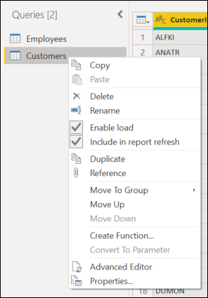
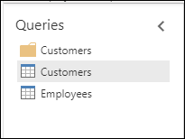
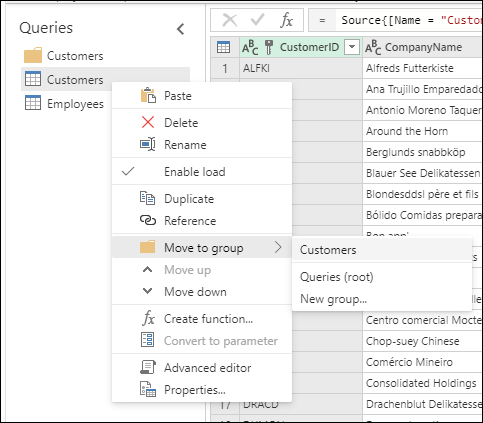

# Using the Queries pane

In Power Query, you'll be creating many different queries. Whether it be from getting data from many tables or from duplicating the original query, the number of queries will increase.

You'll be using the **Queries** pane to navigate through the queries.

## Navigating with the Queries pane

The most basic usage of the **Queries** pane is to navigate to all of the queries.
The navigation is similar to a file explorer. To switch between the queries, just select the query you want to go to.

>[!Note]
> Some actions in the Power Query Online editor may be different than actions in the Power Query Desktop editor. These differences will be noted in this article.

## Basic actions in the Query pane

Similar to features throughout the ribbon and the editor, the context menu of a query lets you make transformations directly onto the query.

To reach these actions, open the context menu (the right-click menu) in the **Query** pane.

Differences between online and desktop:

- Power Query Online

  

- Power Query Desktop

  

To be more comprehensive, we'll be touching on all of the context menu actions that are relevant for either.

### Rename a query
To directly change the name of the query, double-select on the name of the query. This action will allow you to immediately change the name.

Other options to rename the query are:
- Go to the context menu and select **Rename**.

  

- Go to **Query Settings** and enter in a different name in the **Name** input field.
 
  

### Delete a query
To delete a query, open the context pane on the query and select **Delete**.
There will be an additional pop-up confirming the deletion. To complete the deletion, select the **Delete** button.

### Duplicating a query
Duplicating a query will create a copy of the query you're selecting. 

To duplicate your query, open the context pane on the query and select **Duplicate**. A new duplicate query will pop up on the side of the query pane.

### Referencing a query
Referencing a query will create a new query. The new query uses the steps of a previous query without having to duplicate the query. Additionally, any changes on the original query will transfer down to the referenced query.

To reference your query, open the context pane on the query and select **Reference**. A new referenced query will pop up on the side of the query pane.

### Copy and paste
Copy and paste can be used when you have a copied query to place in the Power Query editor.

>[!NOTE]
> To learn more about how to copy and paste queries in Power Query, see [Sharing a query](share-query.md).

## Context pane options in the Queries pane

There are some additional context pane options in the **Queries** pane that you can use. These options are **New query**, **Merge queries**, **New parameter**, and **New group**.

To reach these options, open the context menu (the right-click menu) in the Queries pane.

Differences between online and desktop:

- Power Query Online

  

- Power Query Desktop

  

For the sake of being more comprehensive, we'll once again describe all of the context menu actions that are relevant for either.

### New query
You can import data into the Power Query editor as an option from the context menu.

This option functions the same as the **Get Data** feature.  

> [!NOTE]
> To learn about how to get data into Power Query, see [Getting data](get-data-experience.md)

### Merge queries
When you select the **Merge queries** option from the context menu, the **Merge queries** input screen opens. 

This option functions the same as the **Merge queries** feature located on the ribbon and in other areas of the editor. 

>[!NOTE]
>To learn more about how to use the **Merge queries** feature, see [Merge queries overview](merge-queries-overview.md).

### New parameter
When you select the **New parameter** option from the context menu, the **New parameter** input screen opens. 

This option functions the same as the **New parameter** feature located on the ribbon.

> [!NOTE]
> To learn more about **Parameters** in Power Query, see [Using parameters](power-query-query-parameters.md).

### New group
You can make folders and move the queries into and out of the folders for organizational purposes. These folders are called *groups*.

To move the query into a group, open the context menu on the specific query. 

In the menu, select **Move to group**. 

Then, select the group you want to put the query in.

The move will look like the following image. Using the same steps as above, you can also move the query out of the group by selecting **Queries (root)** or another group. 

In desktop versions of Power Query, you can also drag and drop the queries into the folders.
