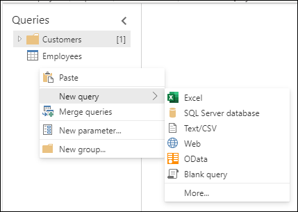

# Understanding the queries pane

In Power Query, you'll be creating many different queries. Whether it be from getting data from many tables or from duplicating the original query, the number of queries will increase.

You'll be using the **Queries Pane** to navigate through the queries.

## Navigating with the queries pane

The most basic usage of the **Queries Pane** is to navigate to all of the queries.
The navigation is similar to a file explorer. To switch between the queries, just select the query that you want to go to.

## Actions in the query pane

There are some key actions that you can do in the queries pane given what is necessary for you. These actions are *New query*, *Merge queries*, *New parameter*, *New group*, and *Paste*. 

To reach these actions, open the context menu (the right-click menu) on the query pane box.

### Paste
Paste can be used when you have a copied query to place into the Power Query editor.

### New query
You can import data into the Power Query editor as an option from the context menu.

This option functions the same as the **Get Data** feature located on the Ribbon.  

>[!NOTE]
>If you would like to learn more about **Get Data** and importing data into Power Query, 
[look here.](https://docs.microsoft.com/power-query/get-data-experience)

### Merge queries
You can open the *Merge queries* input screen when you select the **Merge queries** option from the context menu. 

This option functions the same as the **Merge queries** feature located on the Ribbon and in other areas of the editor. 

>[!NOTE]
>If you would like to learn more about merging queries, [look here.](https://docs.microsoft.com/power-query/merge-queries-overview)

### New parameter
You can open the *New parameter* input screen when you select the **New parameter** option from the context menu. 
This option functions the same as the **New parameter** feature located on the Ribbon.

### New group
You can make folders and move the queries into and out of the folders for organizational purposes. These folders are called *groups*.

To move the query into a group, open the context menu on the specific query. 

In the menu, select **Move to group**. 

Then, select the group you want to put the query in.

The move will look like below. Using the same steps as above, you can also move the query out of the group by selecting **Queries (root)** or another group. 

## Actions on the queries

Similar to features throughout the Ribbon and the editor, the context menu on a query can allow you to make transformations directly onto the query.

The options in the menu below are more functional rather than for prepping the data.

