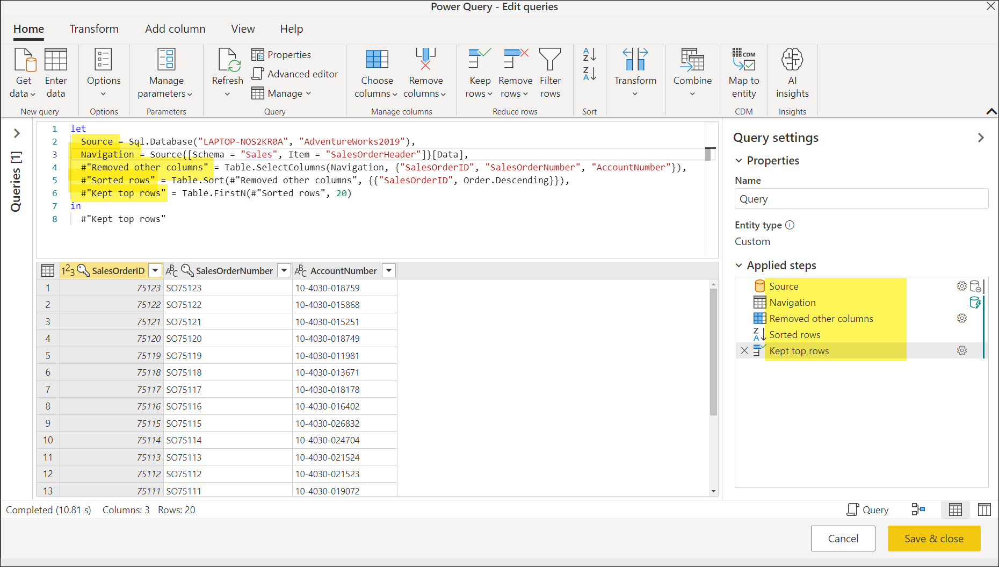
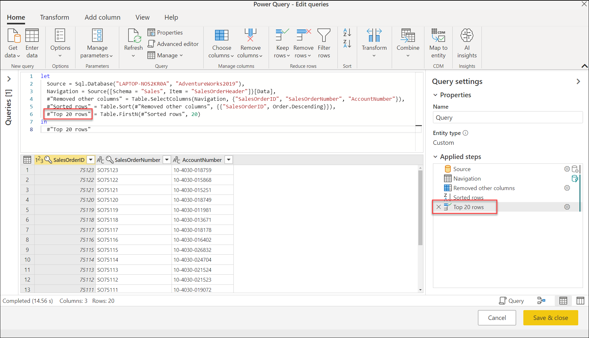

# Overview of query evaluation and query folding in Power Query

This article provides a basic overview of how M queries are processed and turned into data source requests.

## Power Query M script

Any query, whether created by Power Query, manually written by you in the advanced editor, or entered using a blank document, consists of functions and syntax from the [Power Query M formula language](/powerquery-m/). This query gets interpreted and evaluated by the Power Query engine to output its results. The M script serves as the set of instructions needed to evaluate the query.

>[!TIP]
>You can think of the M script as a recipe that describes how to prepare your data.

The most common way to create an M script is by using the Power Query editor. For example, when you connect to a data source, such as a SQL Server database, you'll notice on the right-hand side of your screen that there's a section called [applied steps](applied-steps.md). This section displays all the steps or transforms used in your query. In this sense, the Power Query editor serves as an interface to help you create the appropriate M script for the transforms that you're after, and ensures that the code you use is valid.

>[!NOTE]
> The M script is used in the Power Query editor to:
>
> - Display the query as a series of steps and allow the creation or modification of new steps.
> - Display a diagram view.

The previous image emphasizes the applied steps section, which contains the following steps:

- **Source**: Makes the connection to the data source. In this case, it's a connection to a SQL Server database.
- **Navigation**: Navigates to a specific table in the database.
- **Removed other columns**: Selects which columns from the table to keep.
- **Sorted rows**: Sorts the table using one or more columns.
- **Kept top rows**: Filters the table to only keep a certain number of rows from the top of the table.

This set of step names is a friendly way to view the M script that Power Query has created for you. There are several ways to view the full M script. In Power Query, you can select **Advanced Editor** in the **View** tab. You can also select **Advanced Editor** from the **Query** group in the **Home** tab. In some versions of Power Query, you can also change the view of the formula bar to show the query script by going into the **View** tab and from the **Layout** group, select **Script view** > **Query script**.

Most of the names found in the **Applied steps** pane are also being used as is in the M script. Steps of a query are named using something called *identifiers* in the M language. Sometimes extra characters are wrapped around step names in M, but these characters aren’t shown in the applied steps. An example is `#"Kept top rows"`, which is categorized as a *quoted identifier* because of these extra characters. A quoted identifier can be used to allow any sequence of zero or more Unicode characters to be used as an identifier, including keywords, whitespace, comments, operators, and punctuators. To learn more about *identifiers* in the M language, go to [lexical structure](/powerquery-m/m-spec-lexical-structure#identifiers).

Any changes that you make to your query through the Power Query editor will automatically update the M script for your query. For example, using the previous image as the starting point, if you change the **Kept top rows** step name to be **Top 20 rows**, this change will automatically be updated in the script view.

While we recommend that you use the Power Query editor to create all or most of the M script for you, you can manually add or modify pieces of your M script. To learn more about the M language, go to the [official docs site for the M language](/powerquery-m/).

>[!NOTE]
> M script, also referred to as M code, is a term used for any code that uses the M language. In the context of this article, M script also refers to the code found inside a Power Query query and accessible through the advanced editor window or through the script view in the formula bar.

## Query evaluation in Power Query

The following diagram explores the process that occurs when a query is evaluated in Power Query.

1. The M script, found inside the advanced editor, is submitted to the Power Query engine. Other important information is also included, such as credentials and data source privacy levels.
2. Power Query determines what data needs to be extracted from the data source and submits a request to the data source.
3. The data source responds to the request from Power Query by transferring the requested data to Power Query.
4. Power Query receives the incoming data from the data source and does any transformations using the Power Query engine if necessary.
5. The results derived from the previous point are loaded to a destination.

>[!NOTE]
>While this example showcases a query with a SQL Database as a data source, the concept applies to queries with or without a data source.

When Power Query reads your M script, it runs the script through an optimization process to more efficiently evaluate your query. In this process, it determines which steps (transforms) from your query can be offloaded to your data source. It also determines which other steps need to be evaluated using the Power Query engine.
This optimization process is called *query folding*, where Power Query tries to push as much of the possible execution to the data source to optimize your query's execution.

>[!IMPORTANT]
>All rules from the [Power Query M formula language (also known as the M language)](/powerquery-m/) are followed. Most notably, *lazy evaluation* plays an important role during the optimization process. In this process, Power Query understands what specific transforms from your query need to be evaluated. Power Query also understands what other transforms don't need to be evaluated because they're not needed in the output of your query.
>
>Furthermore, when multiple sources are involved, the data privacy level of each data source is taken into consideration when evaluating the query. More information: [Behind the scenes of the Data Privacy Firewall](dataprivacyfirewall.md)

The following diagram demonstrates the steps that take place in this optimization process.

1. The M script, found inside the advanced editor, is submitted to the Power Query engine. Other important information is also supplied, such as credentials and data source privacy levels.
2. The Query folding mechanism submits metadata requests to the data source to determine the capabilities of the data source, table schemas, relationships between different entities at the data source, and more.
3. Based on the metadata received, the query folding mechanism determines what information to extract from the data source and what set of transformations need to happen inside the Power Query engine. It sends the instructions to two other components that take care of retrieving the data from the data source and transforming the incoming data in the Power Query engine if necessary.
4. Once the instructions have been received by the internal components of Power Query, Power Query sends a request to the data source using a data source query.
5. The data source receives the request from Power Query and transfers the data to the Power Query engine.
6. Once the data is inside Power Query, the transformation engine inside Power Query (also known as mashup engine) does the transformations that couldn't be folded back or offloaded to the data source.
7. The results derived from the previous point are loaded to a destination.

>[!NOTE]
>Depending on the transformations and data source used in the M script, Power Query determines if it will stream or buffer the incoming data.

## Query folding overview

The goal of query folding is to offload or push as much of the evaluation of a query to a data source that can compute the transformations of your query.

The query folding mechanism accomplishes this goal by translating your M script to a language that can be interpreted and executed by your data source. It then pushes the evaluation to your data source and sends the result of that evaluation to Power Query.

This operation often provides a much faster query execution than extracting all the required data from your data source and running all transforms required in the Power Query engine.

When you use the [get data experience](get-data-experience.md), Power Query guides you through the process that ultimately lets you connect to your data source. When doing so, Power Query uses a series of functions in the M language categorized as [accessing data functions](/powerquery-m/accessing-data-functions). These specific functions use mechanisms and protocols to connect to your data source using a language that your data source can understand.

However, the steps that follow in your query are the steps or transforms that the query folding mechanism attempts to optimize. It then checks if they can be offloaded to your data source instead of being processed using the Power Query engine.

>[!IMPORTANT]
> All data source functions, commonly shown as the **Source** step of a query, queries the data at the data source in its native language. The query folding mechanism is utilized on all transforms applied to your query after your data source function so they can be translated and combined into a single data source query or as many transforms that can be offloaded to the data source.

Depending on how the query is structured, there could be three possible outcomes to the query folding mechanism:

- **Full query folding**: When all of your query transformations get pushed back to the data source and minimal processing occurs at the Power Query engine.
- **Partial query folding**: When only a few transformations in your query, and not all, can be pushed back to the data source. In this case, only a subset of your transformations is done at your data source and the rest of your query transformations occur in the Power Query engine.
- **No query folding**:  When the query contains transformations that can't be translated to the native query language of your data source, either because the transformations aren't supported or the connector doesn't support query folding. For this case, Power Query gets the raw data from your data source and uses the Power Query engine to achieve the output you want by processing the required transforms at the Power Query engine level.

>[!NOTE]
>The query folding mechanism is primarily available in connectors for structured data sources such as, but not limited to, [Microsoft SQL Server](Connectors/sqlserver.md) and [OData Feed](Connectors/odatafeed.md). During the optimization phase, the engine might sometimes reorder steps in the query.
>
>Leveraging a data source that has more processing resources and has query folding capabilities can expedite your query loading times as the processing occurs at the data source and not at the Power Query engine.

## Next steps

For detailed examples of the three possible outcomes of the query folding mechanism, go to [Query folding examples](query-folding-examples.md).

For information about query folding indicators found in the **Applied Steps** pane, go to [Query folding indicators](step-folding-indicators.md)
