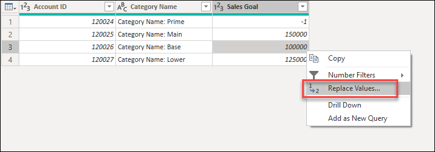
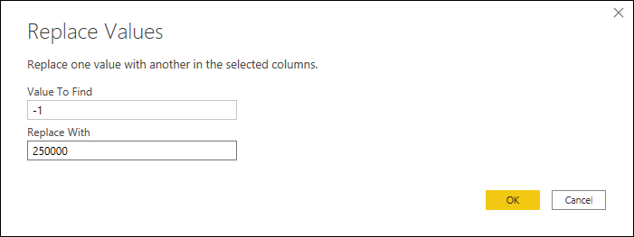

# Replace values and errors

With Power Query, you can replace one value with another value in a selected column. These functions can be found by:

- **Right-click on a cell**&mdash;this action will display a contextual menu with the option to replace the selected value in the column with another value. 

   

- **Right-click on a column**&mdash;this action displays a contextual menu for operations available in the selected column.

   

- **Home tab**&mdash;**Replace values** can be found inside the **Transform** group in the **Home** tab.

   

- **Transform tab**&mdash;**Replace values** can be found inside the **Any Column** group in the **Transform** tab.

   

## Replace values modes

The replace values operation has two modes:

- **Replace instances of a text string**&mdash;this mode is the default behavior for text columns, where Power Query will search for a specific text string inside all rows of a column and replace as many instances of the text string that it finds on all rows.
- **Replace entire cell content**&mdash;for non-text columns this mode is the default behavior, but for text columns this mode is enabled by going through the **Advanced options** and selecting the **Match entire cell contents** option. Selecting this option will effectively make the replace values operation work exactly as it does with non-text columns, where it only searches and replaces the full contents of a cell. 

Advanced options are only available in columns of the text data type. Within that set of options is the **Replace using special characters** option.

### Replace entire cell content

Imagine a table like the following where you have a field for **Account ID**, **Category Name**, and **Sales Goal**.

The -1 value in **Sales Goal** is an error in the source and needs to be replaced with a standard sales goal defined by the business for these instances, which is 250,000. To do that, right-click on the -1 value and select the option to replace values. This action will bring up the **Replace Values** window with **Value To Find** prepopulated with the -1 value. All you need to do is define the **Replace With** value, which has to be set at 250,000.

The outcome of that operation will give you the result that you're looking for.

> [!Note]
> The replace values operation in columns that are not of the text data type only look for exact matches for the contents of a cell. To enable this behavior in text columns, select **Match entire cell contents** from the advanced options in the **Replace Values** window.

### Replace instances of a text string

Continuing with the previous table, let's say you want to replace the text string "Category Name: " from the **Category Name** column. To do that, select the replace values option from the **Transform** group in the **Home** tab. Inside the **Replace Values** window, enter the text string "Category Name: " in the **Value To Find** text box and leave the **Replace With** text box empty.

The result of that operation gives you the table in the following image.

