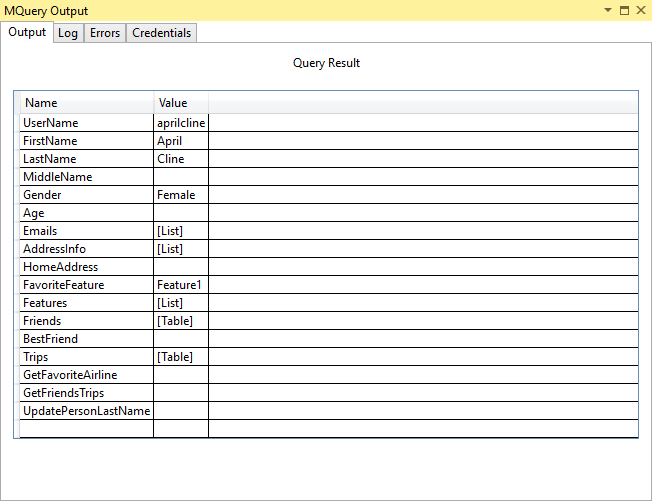
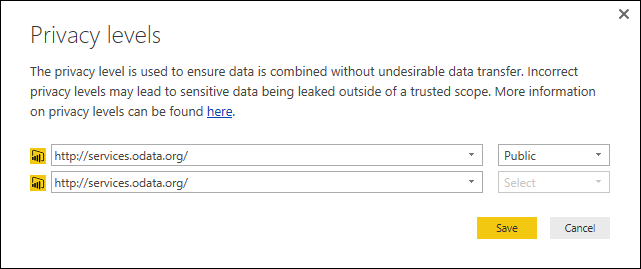
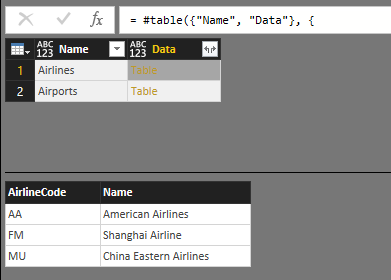

# TripPin Part 2 - Data Connector for a REST Service
This multi-part tutorial covers the creation of a new data source extension for Power Query. The tutorial is meant to be done sequentially&mdash;each lesson builds on the connector created in previous lessons, incrementally adding new capabilities to your connector. 

In this lesson, you will:

> [!div class="checklist"]
> * Create a base function that calls out to a REST API using [Web.Contents](/powerquery-m/web-contents)
> * Learn how to set request headers and process a JSON response
> * Use Power BI Desktop to wrangle the response into a user friendly format

This lesson converts the OData based connector for the [TripPin service](https://services.odata.org/v4/TripPinService/) (created in the [previous lesson](../1-OData/README.md)) to a connector that resembles something you'd create for any RESTful API. OData is a RESTful API, but one with a fixed set of conventions. The advantage of OData is that it provides a schema, data retrieval protocol, and standard query language. Taking away the use of [OData.Feed](/powerquery-m/odata-feed) will require us to build these capabilities into the connector ourselves. 

## Recap of the OData Connector
Before you remove the OData functions from your connector, let's do a quick review of what it currently does (mostly behind the scenes) to retrieve data from the service.

Open the TripPin connector project from [Part 1](../1-OData/README.md) in Visual Studio. Open the Query file and paste in the following query:

```
TripPin.Feed("https://services.odata.org/v4/TripPinService/Me")
```

Open Fiddler and then select the Start button in Visual Studio. 

In Fiddler, you'll see three requests to the server:


* `/Me`&mdash;the actual URL you are requesting.
* `/$metadata`&mdash;a call automatically made by the `OData.Feed` function to determine schema and type information about the response.
* `/Me/BestFriend`&mdash;one of the fields that was (eagerly) pulled when you listed the /Me singleton. In this case the call resulted in a `204 No Content` status.

M evaluation is mostly lazy. In most cases, data values are only retrieved/pulled when they are needed. There are scenarios (like the /Me/BestFriend case) where a value is pulled eagerly. This tends to occur when type information is needed for a member, and the engine has no other way to determine the type than to retrieve the value and inspect it. Making things lazy (that is, avoiding eager pulls) is one of the key aspects to making an M connector performant. 

Note the request headers that were sent along with the requests and the JSON format of the response of the /Me request. 

```json
{
  "@odata.context": "https://services.odata.org/v4/TripPinService/$metadata#Me",
  "UserName": "aprilcline",
  "FirstName": "April",
  "LastName": "Cline",
  "MiddleName": null,
  "Gender": "Female",
  "Age": null,
  "Emails": [ "April@example.com", "April@contoso.com" ],
  "FavoriteFeature": "Feature1",
  "Features": [ ],
  "AddressInfo": [
    {
      "Address": "P.O. Box 555",
      "City": {
        "Name": "Lander",
        "CountryRegion": "United States",
        "Region": "WY"
      }
    }
  ],
  "HomeAddress": null
}
```

When the query finishes evaluating, the M Query Output window should show the Record value for the Me singleton. 



If you compare the fields in the output window with the fields returned in the raw JSON response, you'll notice a mismatch. The query result has additional fields (`Friends`, `Trips`, `GetFriendsTrips`) that don't appear anywhere in the JSON response. The [OData.Feed](/powerquery-m/odata-feed) function automatically appended these fields to the record based on the schema returned by $metadata. This is a good example of how a connector might augment and/or reformat the response from the service to provide a better user experience. 

## Creating a Basic REST Connector
You'll now be adding a new exported function to your connector that calls [Web.Contents](/powerquery-m/web-contents).

To be able to make successful web requests to the OData service, however, you'll have to set some [standard OData headers](https://docs.oasis-open.org/odata/odata/v4.0/os/part1-protocol/odata-v4.0-os-part1-protocol.html#_Toc372793609). You'll do this by defining a common set of headers as a new variable in your connector:

```
DefaultRequestHeaders = [
    #"Accept" = "application/json;odata.metadata=minimal",  // column name and values only
    #"OData-MaxVersion" = "4.0"                             // we only support v4
];
```

You'll change your implementation of your `TripPin.Feed` function so that rather than using `OData.Feed`, it uses [Web.Contents](/powerquery-m/web-contents) to make a web request, and parses the result as a JSON document.

```
TripPinImpl = (url as text) =>
    let
        source = Web.Contents(url, [ Headers = DefaultRequestHeaders ]),
        json = Json.Document(source)
    in
        json;
```

You can now test this out in Visual Studio using the query file.
The result of the /Me record now resembles the raw JSON that you saw in the Fiddler request.

If you watch Fiddler when running the new function, you'll also notice that the evaluation now makes a single web request, rather than three. 
Congratulations&mdash;you've achieved a 300% performance increase!
Of course, you've now lost all the type and schema information, but there's no need to focus on that part just yet. 

Update your query to access some of the TripPin Entities/Tables, such as:

* `https://services.odata.org/v4/TripPinService/Airlines`
* `https://services.odata.org/v4/TripPinService/Airports`
* `https://services.odata.org/v4/TripPinService/Me/Trips`

You'll notice that the paths that used to return nicely formatted tables now return a top level "value" field with an embedded [List].
You'll need to do some transformations on the result to make it usable for Power BI scenarios.


## Authoring Transformations in Power Query
While it is certainly possible to author your M transformations by hand, most people prefer to use Power Query to shape their data.
You'll open your extension in Power BI Desktop and use it to design queries to turn the output into a more user friendly format.
Rebuild your solution, copy the new extension file to your Custom Data Connectors directory, and relaunch Power BI Desktop.

Start a new Blank Query, and paste the following into the formula bar: 

`= TripPin.Feed("https://services.odata.org/v4/TripPinService/Airlines")`

Be sure to include the = sign.

Manipulate the output until it looks like the original OData feed&mdash;a table with two columns: AirlineCode and Name.


The resulting query should look something like this:

```
let
    Source = TripPin.Feed("https://services.odata.org/v4/TripPinService/Airlines"),
    value = Source[value],
    toTable = Table.FromList(value, Splitter.SplitByNothing(), null, null, ExtraValues.Error),
    expand = Table.ExpandRecordColumn(toTable, "Column1", {"AirlineCode", "Name"}, {"AirlineCode", "Name"})
in
    expand
```

Give the query a name ("Airlines"). 

Create a new Blank Query. This time, use the `TripPin.Feed` function to access the /Airports entity. Apply transforms until you get something similar to the share shown below. The matching query can also be found below&mdash;give this query a name ("Airports") as well.


```
let
    Source = TripPin.Feed("https://services.odata.org/v4/TripPinService/Airports"),
    value = Source[value],
    #"Converted to Table" = Table.FromList(value, Splitter.SplitByNothing(), null, null, ExtraValues.Error),
    #"Expanded Column1" = Table.ExpandRecordColumn(#"Converted to Table", "Column1", {"Name", "IcaoCode", "IataCode", "Location"}, {"Name", "IcaoCode", "IataCode", "Location"}),
    #"Expanded Location" = Table.ExpandRecordColumn(#"Expanded Column1", "Location", {"Address", "Loc", "City"}, {"Address", "Loc", "City"}),
    #"Expanded City" = Table.ExpandRecordColumn(#"Expanded Location", "City", {"Name", "CountryRegion", "Region"}, {"Name.1", "CountryRegion", "Region"}),
    #"Renamed Columns" = Table.RenameColumns(#"Expanded City",{{"Name.1", "City"}}),
    #"Expanded Loc" = Table.ExpandRecordColumn(#"Renamed Columns", "Loc", {"coordinates"}, {"coordinates"}),
    #"Added Custom" = Table.AddColumn(#"Expanded Loc", "Latitude", each [coordinates]{1}),
    #"Added Custom1" = Table.AddColumn(#"Added Custom", "Longitude", each [coordinates]{0}),
    #"Removed Columns" = Table.RemoveColumns(#"Added Custom1",{"coordinates"}),
    #"Changed Type" = Table.TransformColumnTypes(#"Removed Columns",{{"Name", type text}, {"IcaoCode", type text}, {"IataCode", type text}, {"Address", type text}, {"City", type text}, {"CountryRegion", type text}, {"Region", type text}, {"Latitude", type number}, {"Longitude", type number}})
in
    #"Changed Type"
```

You can repeat this process for additional paths under the service. Once you're ready, move onto the next step of creating a (mock) navigation table.

## Simulating a Navigation Table
Now you are going to build a table (using M code) that presents your nicely formatted TripPin entities. 

Start a new Blank Query and bring up the Advanced Editor. 

Paste in the following query:

```
let
    source = #table({"Name", "Data"}, {
        { "Airlines", Airlines },
        { "Airports", Airports }
    })
in
    source
```

If you have not set your Privacy Levels setting to "Always ignore Privacy level settings" (also known as "Fast Combine") you'll see a privacy prompt. 


Privacy prompts appear when you're combining data from multiple sources and have not yet specified a privacy level for the source(s). Select the **Continue** button and set the privacy level of the top source to **Public**.



Select **Save** and your table will appear. While this isn't a navigation table yet, it provides the basic functionality you need to turn it into one in a subsequent lesson.



Data combination checks do not occur when accessing multiple data sources from within an extension. Since all data source calls made from within the extension inherit the same authorization context, it is assumed they are "safe" to combine. Your extension will always be treated as a single data source when it comes to data combination rules. Users would still receive the regular privacy prompts when combining your source with other M sources. 

If you run Fiddler and click the **Refresh Preview** button in the Query Editor, you'll notice separate web requests for each item in your navigation table. This indicates that an eager evaluation is occurring, which isn't ideal when building navigation tables with a lot of elements. Subsequent lessons will show how to build a proper navigation table that supports lazy evaluation. 

## Conclusion
This lesson showed you how to build a simple connector for a REST service. In this case, you turned an existing OData extension into a standard REST extension (using [Web.Contents](/powerquery-m/web-contents)), but the same concepts apply if you were creating a new extension from scratch. 

In the next lesson, you'll take the queries created in this lesson using Power BI Desktop and turn them into a true navigation table within the extension.

## Next steps

[TripPin Part 3 - Navigation Tables](../3-NavTables/README.md)