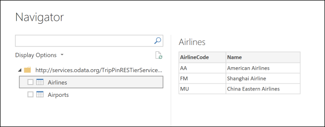
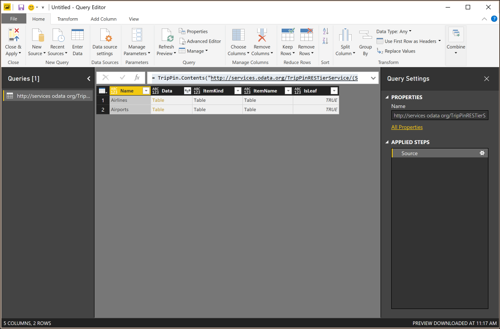

# TripPin Part 3 - Navigation Tables

This multi-part tutorial covers the creation of a new data source extension for Power Query. The tutorial is meant to be done sequentially – each lesson builds on the connector created in previous lessons, incrementally adding new capabilities to your connector. 

In this lesson, you will:

* Create a navigation table for a fixed set of queries
* Test the navigation table in Power BI Desktop
 
This lesson adds a navigation table to the TripPin connector created in the [previous lesson](../2-Rest/README.md). When our connector used the OData.Feed function ([Part 1](../1-OData/README.md)), we received the navigation table “for free”, as derived from the OData service’s $metadata document. When we moved to the Web.Contents function ([Part 2](../2-Rest/README.md)), we lost the built-in navigation table. In this lesson, we will take a set of fixed queries we created in Power BI Desktop and add the appropriate metadata for Power Query to popup the Navigator dialog for our data source function.

Please see the [Navigation Table documentation](../../../HandlingNavigationTables.md) for more information about using nav tables. 

## Defining Fixed Queries in the Connector
A simple connector for a REST API can be thought of as a fixed set of queries, each returning a table. These tables are made discoverable through the connector’s navigation table. Essentially, each item in the navigator is associated with a specific URL and set of transformations. 

We will start by copying the queries we wrote in Power BI Desktop (in the previous lesson) into our connector file. Open the TripPin visual studio project, and paste the Airlines and Airports queries into the TripPin.pq file. We can then turn those queries into functions that take a single text parameter:

```
GetAirlinesTable = (url as text) as table =>
    let
        source = TripPin.Feed(url & "Airlines"),
        value = source[value],
        toTable = Table.FromList(value, Splitter.SplitByNothing(), null, null, ExtraValues.Error),
        expand = Table.ExpandRecordColumn(toTable, "Column1", {"AirlineCode", "Name"}, {"AirlineCode", "Name"})
    in
        expand;

GetAirportsTable = (url as text) as table =>
    let
        source = TripPin.Feed(url & "Airports"),
        value = source[value],
        #"Converted to Table" = Table.FromList(value, Splitter.SplitByNothing(), null, null, ExtraValues.Error),
        #"Expanded Column1" = Table.ExpandRecordColumn(#"Converted to Table", "Column1", {"Name", "IcaoCode", "IataCode", "Location"}, {"Name", "IcaoCode", "IataCode", "Location"}),
        #"Expanded Location" = Table.ExpandRecordColumn(#"Expanded Column1", "Location", {"Address", "Loc", "City"}, {"Address", "Loc", "City"}),
        #"Expanded City" = Table.ExpandRecordColumn(#"Expanded Location", "City", {"Name", "CountryRegion", "Region"}, {"Name.1", "CountryRegion", "Region"}),
        #"Renamed Columns" = Table.RenameColumns(#"Expanded City",{{"Name.1", "City"}}),
        #"Expanded Loc" = Table.ExpandRecordColumn(#"Renamed Columns", "Loc", {"coordinates"}, {"coordinates"}),
        #"Added Custom" = Table.AddColumn(#"Expanded Loc", "Latitude", each [coordinates]{1}),
        #"Added Custom1" = Table.AddColumn(#"Added Custom", "Longitude", each [coordinates]{0}),
        #"Removed Columns" = Table.RemoveColumns(#"Added Custom1",{"coordinates"}),
        #"Changed Type" = Table.TransformColumnTypes(#"Removed Columns",{{"Name", type text}, {"IcaoCode", type text}, {"IataCode", type text}, {"Address", type text}, {"City", type text}, {"CountryRegion", type text}, {"Region", type text}, {"Latitude", type number}, {"Longitude", type number}})
    in
        #"Changed Type";
```

Next we will import the mock navigation table query we wrote that creates a fixed table linking to these data set queries. Let's call it `TripPinNavTable`:

```
TripPinNavTable = (url as text) as table =>
    let
        source = #table({"Name", "Data"}, {
            { "Airlines", GetAirlinesTable(url) },
            { "Airports", GetAirportsTable(url) }
        })
    in
        source;
```

Finally we declare a new shared function, `TripPin.Contents`, that will be used as our main data source function. We'll also remove the `Publish` value from `TripPin.Feed` so that it no longer shows up in the Get Data dialog.

```
[DataSource.Kind="TripPin"]
shared TripPin.Feed = Value.ReplaceType(TripPinImpl, type function (url as Uri.Type) as any);

[DataSource.Kind="TripPin", Publish="TripPin.Publish"]
shared TripPin.Contents =  Value.ReplaceType(TripPinNavTable, type function (url as Uri.Type) as any);
```

> **Note:** Your extension can mark multiple functions as `shared`, with or without associating them with a `DataSource.Kind`. However, when you associate a function with a specific DataSource.Kind, each function **must** have the same set of *required* parameters, with the same name and type. This is because the data source function parameters are combined to make a 'key' used for looking up cached credentials. 

We can test our `TripPin.Contents` function using our TripPin.query.pq file. Running the following test query will give us a credential prompt, and a simple table output.

```
TripPin.Contents("http://services.odata.org/v4/TripPinService/")
```


## Creating a Navigation Table
We will use the handy [Table.ToNavigationTable](../../../HandlingNavigationTables.md#tabletonavigationtable) function to format our static table into something that Power Query will recognize as a Navigation Table. 

```
Table.ToNavigationTable = (
    table as table,
    keyColumns as list,
    nameColumn as text,
    dataColumn as text,
    itemKindColumn as text,
    itemNameColumn as text,
    isLeafColumn as text
) as table =>
    let
        tableType = Value.Type(table),
        newTableType = Type.AddTableKey(tableType, keyColumns, true) meta 
        [
            NavigationTable.NameColumn = nameColumn, 
            NavigationTable.DataColumn = dataColumn,
            NavigationTable.ItemKindColumn = itemKindColumn, 
            Preview.DelayColumn = itemNameColumn, 
            NavigationTable.IsLeafColumn = isLeafColumn
        ],
        navigationTable = Value.ReplaceType(table, newTableType)
    in
        navigationTable;
```

After copying this into our extension file, we will update our `TripPinNavTable` function to add the navigation table fields.

```
TripPinNavTable = (url as text) as table =>
    let
        source = #table({"Name", "Data", "ItemKind", "ItemName", "IsLeaf"}, {
            { "Airlines", GetAirlinesTable(url), "Table", "Table", true },
            { "Airports", GetAirportsTable(url), "Table", "Table", true }
        }),
        navTable = Table.ToNavigationTable(source, {"Name"}, "Name", "Data", "ItemKind", "ItemName", "IsLeaf")
    in
        navTable;
```
Running our test query again will give us a similar result as last time - with a few more columns added.


> **Note:** You will not see the Navigator window appear in Visual Studio. The `M Query Output` window will always display the underlying table. 

If we copy our extension over to our Power BI Desktop custom connector and invoke the new function from the Get Data dialog, we will see our navigator appear.



If you right click on the root of the navigation tree and click **Edit**, you will see the same table as you did within Visual Studio.



## Conclusion
In this tutorial, we added a [Navigation Table](../../../HandlingNavigationTables.md) to our extension. Navigation Tables are a key feature that make connectors easier to use. In this example our navigation table only has a single level, but the Power Query UI supports displaying navigation tables that have multiple dimensions (even when they are ragged). 
