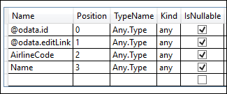
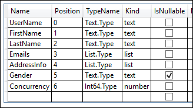
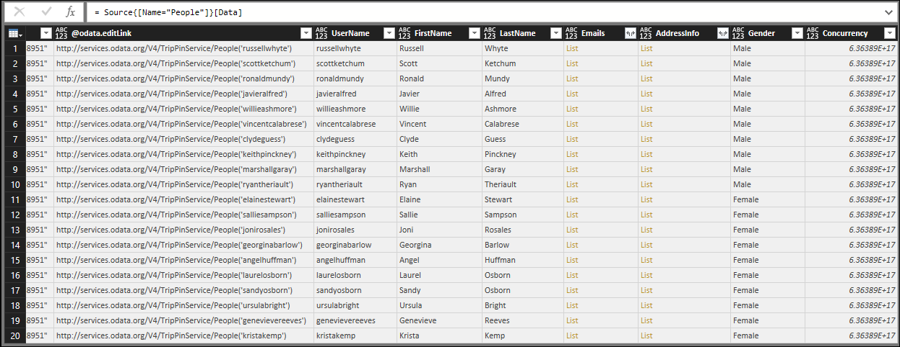
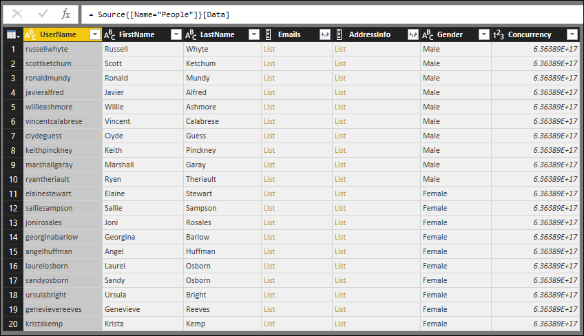

# TripPin Part 6 - Schema
This multi-part tutorial covers the creation of a new data source extension for Power Query. The tutorial is meant to be done sequentially&mdash;each lesson builds on the connector created in previous lessons, incrementally adding new capabilities to your connector. 

In this lesson, you will:

> [!div class="checklist"]
> * Define a fixed schema for a REST API
> * Dynamically set data types for columns
> * Enforce a table structure to avoid transformation errors due to missing columns
> * Hide columns from the result set

One of the big advantages of an OData service over a standard REST API is its [$metadata definition](https://docs.oasis-open.org/odata/odata/v4.0/odata-v4.0-part3-csdl.html).
The $metadata document describes the data found on this service, including the schema for all of its Entities (Tables) and Fields (Columns). 
The `OData.Feed` function uses this schema definition to automatically set data type information&mdash;so instead of getting all text and number fields (like you would from `Json.Document`), end users will get dates, whole numbers, times, and so on, providing a better overall user experience. 

Many REST APIs don't have a way to programmatically determine their schema.
In these cases, you'll need to include schema definitions within your connector.
In this lesson you'll define a simple, hardcoded schema for each of your tables, and enforce the schema on the data you read from the service. 

>[!Note]
> The approach described here should work for many REST services. [Future lessons](../7-AdvancedSchema/README.md) will build upon this approach by recursively enforcing schemas on structured columns (record, list, table), and provide sample implementations that can programmatically generate a schema table from CSDL or [JSON Schema](https://json-schema.org/) documents.

Overall, enforcing a schema on the data returned by your connector has multiple benefits, such as:
* Setting the correct data types
* Removing columns that don't need to be shown to end users (such as internal IDs or state information)
* Ensuring that each page of data has the same shape by adding any columns that might be missing from a response (a common way for REST APIs to indicate a field should be null)

## Viewing the Existing Schema with Table.Schema
The connector created in the [previous lesson](../5-Paging/README.md) displays three tables from the TripPin service&mdash;`Airlines`, `Airports`, and `People`. 
Run the following query to view the `Airlines` table:

```
let
    source = TripPin.Contents(),
    data = source{[Name="Airlines"]}[Data]
in
    data
```

In the results you'll see four columns returned:
* @odata.id
* @odata.editLink
* AirlineCode
* Name


The "@odata.*" columns are part of OData protocol, and not something you'd want or need to show to the end users of your connector.
`AirlineCode` and `Name` are the two columns you'll want to keep.
If you look at the schema of the table (using the handy [Table.Schema](/powerquery-m/table-schema) function), you can see that all of the columns in the table have a data type of `Any.Type`.

```
let
    source = TripPin.Contents(),
    data = source{[Name="Airlines"]}[Data]
in
    Table.Schema(data)
```


[Table.Schema](/powerquery-m/table-schema) returns a lot of metadata about the columns in a table, including names, positions, type information, and many advanced properties, such as Precision, Scale, and MaxLength.
Future lessons will provide design patterns for setting these advanced properties, but for now you need only concern yourself with the ascribed type (`TypeName`), primitive type (`Kind`), and whether the column value might be null (`IsNullable`).

## Defining a Simple Schema Table
Your schema table will be composed of two columns:

|Column|Details|
|------|-------|
|Name  |The name of the column. This must match the name in the results returned by the service.|
|Type  |The M data type you're going to set. This can be a primitive type (`text`, `number`, `datetime`, and so on), or an ascribed type (`Int64.Type`, `Currency.Type`, and so on).|

The hardcoded schema table for the `Airlines` table will set its `AirlineCode` and `Name` columns to `text`, and looks like this:

```
Airlines = #table({"Name", "Type"}, {
        {"AirlineCode", type text},
        {"Name", type text}
    });
```

The `Airports` table has four fields you'll want to keep (including one of type `record`):

```
Airports = #table({"Name", "Type"}, {
        {"IcaoCode", type text},
        {"Name", type text},
        {"IataCode", type text},
        {"Location", type record}
    });
```

Finally, the `People` table has seven fields, including lists (`Emails`, `AddressInfo`), a *nullable* column (`Gender`), and a column with an *ascribed type* (`Concurrency`).

```
People = #table({"Name", "Type"}, {
        {"UserName", type text},
        {"FirstName", type text},
        {"LastName", type text},
        {"Emails", type list},
        {"AddressInfo", type list},
        {"Gender", type nullable text},
        {"Concurrency", Int64.Type}
    })
```

## The SchemaTransformTable Helper Function
The `SchemaTransformTable` helper function described below will be used to enforce schemas on your data. It takes the following parameters:

|Parameter    |Type  |Description|
|:------------|:-----|:----------|
|table        |table |The table of data you'll want to enforce your schema on.|
|schema       |table |The schema table to read column information from, with the following type: `type table [Name = text, Type = type]`.|
|enforceSchema|number|(*optional*) An enum that controls behavior of the function.<br>The default value (`EnforceSchema.Strict = 1`) ensures that the output table will match the schema table that was provided by adding any missing columns, and removing extra columns. <br>The `EnforceSchema.IgnoreExtraColumns = 2` option can be used to preserve extra columns in the result. <br>When `EnforceSchema.IgnoreMissingColumns = 3` is used, both missing columns and extra columns will be ignored.|

The logic for this function looks something like this:
1. Determine if there are any missing columns from the source table.
2. Determine if there are any extra columns.
3. Ignore structured columns (of type `list`, `record`, and `table`), and columns set to `type any`.
4. Use [Table.TransformColumnTypes](/powerquery-m/table-transformcolumntypes) to set each column type.
5. Reorder columns based on the order they appear in the schema table.
6. Set the type on the table itself using [Value.ReplaceType](/powerquery-m/value-replacetype).

>[!Note]
> The last step to set the table type will remove the need for the Power Query UI to infer type information when viewing the results in the query editor. This removes the double request issue you saw at the [end of the previous tutorial](../5-Paging/README.md#putting-it-all-together).

The following helper code can be copy and pasted into your extension:

```
EnforceSchema.Strict = 1;               // Add any missing columns, remove extra columns, set table type
EnforceSchema.IgnoreExtraColumns = 2;   // Add missing columns, do not remove extra columns
EnforceSchema.IgnoreMissingColumns = 3; // Do not add or remove columns

SchemaTransformTable = (table as table, schema as table, optional enforceSchema as number) as table =>
    let
        // Default to EnforceSchema.Strict
        _enforceSchema = if (enforceSchema <> null) then enforceSchema else EnforceSchema.Strict,

        // Applies type transforms to a given table
        EnforceTypes = (table as table, schema as table) as table =>
            let
                map = (t) => if Type.Is(t, type list) or Type.Is(t, type record) or t = type any then null else t,
                mapped = Table.TransformColumns(schema, {"Type", map}),
                omitted = Table.SelectRows(mapped, each [Type] <> null),
                existingColumns = Table.ColumnNames(table),
                removeMissing = Table.SelectRows(omitted, each List.Contains(existingColumns, [Name])),
                primativeTransforms = Table.ToRows(removeMissing),
                changedPrimatives = Table.TransformColumnTypes(table, primativeTransforms)
            in
                changedPrimatives,

        // Returns the table type for a given schema
        SchemaToTableType = (schema as table) as type =>
            let
                toList = List.Transform(schema[Type], (t) => [Type=t, Optional=false]),
                toRecord = Record.FromList(toList, schema[Name]),
                toType = Type.ForRecord(toRecord, false)
            in
                type table (toType),

        // Determine if we have extra/missing columns.
        // The enforceSchema parameter determines what we do about them.
        schemaNames = schema[Name],
        foundNames = Table.ColumnNames(table),
        addNames = List.RemoveItems(schemaNames, foundNames),
        extraNames = List.RemoveItems(foundNames, schemaNames),
        tmp = Text.NewGuid(),
        added = Table.AddColumn(table, tmp, each []),
        expanded = Table.ExpandRecordColumn(added, tmp, addNames),
        result = if List.IsEmpty(addNames) then table else expanded,
        fullList =
            if (_enforceSchema = EnforceSchema.Strict) then
                schemaNames
            else if (_enforceSchema = EnforceSchema.IgnoreMissingColumns) then
                foundNames
            else
                schemaNames & extraNames,

        // Select the final list of columns.
        // These will be ordered according to the schema table.
        reordered = Table.SelectColumns(result, fullList, MissingField.Ignore),
        enforcedTypes = EnforceTypes(reordered, schema),
        withType = if (_enforceSchema = EnforceSchema.Strict) then Value.ReplaceType(enforcedTypes, SchemaToTableType(schema)) else enforcedTypes
    in
        withType;
```

## Updating the TripPin Connector
You'll now make the following changes to your connector to make use of the new schema enforcement code.

1. Define a master schema table (`SchemaTable`) that holds all of your schema definitions.
2. Update the `TripPin.Feed`, `GetPage`, and `GetAllPagesByNextLink` to accept a `schema` parameter.
3. Enforce your schema in `GetPage`.
4. Update your navigation table code to wrap each table with a call to a new function (`GetEntity`)&mdash;this will give you more flexibility to manipulate the table definitions in the future.

### Master schema table
You'll now consolidate your schema definitions into a single table, and add a helper function (`GetSchemaForEntity`) that lets you look up the definition based on an entity name (for example, `GetSchemaForEntity("Airlines")`)

```
SchemaTable = #table({"Entity", "SchemaTable"}, {
    {"Airlines", #table({"Name", "Type"}, {
        {"AirlineCode", type text},
        {"Name", type text}
    })},    
    
    {"Airports", #table({"Name", "Type"}, {
        {"IcaoCode", type text},
        {"Name", type text},
        {"IataCode", type text},
        {"Location", type record}
    })},

    {"People", #table({"Name", "Type"}, {
        {"UserName", type text},
        {"FirstName", type text},
        {"LastName", type text},
        {"Emails", type list},
        {"AddressInfo", type list},
        {"Gender", type nullable text},
        {"Concurrency", Int64.Type}
    })}
});

GetSchemaForEntity = (entity as text) as table => try SchemaTable{[Entity=entity]}[SchemaTable] otherwise error "Couldn't find entity: '" & entity &"'";
```

### Adding schema support to data functions
You'll now add an optional `schema` parameter to the `TripPin.Feed`, `GetPage`, and `GetAllPagesByNextLink` functions.
This will allow you to pass down the schema (when you want to) to the paging functions, where it will be applied to the results you get back from the service.

```
TripPin.Feed = (url as text, optional schema as table) as table => ...
GetPage = (url as text, optional schema as table) as table => ...
GetAllPagesByNextLink = (url as text, optional schema as table) as table => ...
```

You'll also update all of the calls to these functions to make sure that you pass the schema through correctly.

### Enforcing the schema
The actual schema enforcement will be done in your `GetPage` function.

```
GetPage = (url as text, optional schema as table) as table =>
    let
        response = Web.Contents(url, [ Headers = DefaultRequestHeaders ]),        
        body = Json.Document(response),
        nextLink = GetNextLink(body),
        data = Table.FromRecords(body[value]),
        // enforce the schema
        withSchema = if (schema <> null) then SchemaTransformTable(data, schema) else data
    in
        withSchema meta [NextLink = nextLink];
```

>[Note]
> This `GetPage` implementation uses [Table.FromRecords](/powerquery-m/table-fromrecords) to convert the list of records in the JSON response to a table.
> A major downside to using [Table.FromRecords](/powerquery-m/table-fromrecords) is that it assumes all records in the list have the same set of fields.
> This works for the TripPin service, since the OData records are guarenteed to contain the same fields, but this might not be the case for all REST APIs. 
> A more robust implementation would use a combination of [Table.FromList](/powerquery-m/table-fromlist) and [Table.ExpandRecordColumn](/powerquery-m/table-expandrecordcolumn).
> Later tutorials will change the implementation to get the column list from the schema table, ensuring that no columns are lost or missing during the JSON to M translation. 

### Adding the GetEntity function
The `GetEntity` function will wrap your call to TripPin.Feed.
It will look up a schema definition based on the entity name, and build the full request URL.

```
GetEntity = (url as text, entity as text) as table => 
    let
        fullUrl = Uri.Combine(url, entity),
        schemaTable = GetSchemaForEntity(entity),
        result = TripPin.Feed(fullUrl, schemaTable)
    in
        result;
```

You'll then update your `TripPinNavTable` function to call `GetEntity`, rather than making all of the calls inline.
The main advantage to this is that it will let you continue modifying your entity building code, without having to touch your nav table logic.

```
TripPinNavTable = (url as text) as table =>
    let
        entitiesAsTable = Table.FromList(RootEntities, Splitter.SplitByNothing()),
        rename = Table.RenameColumns(entitiesAsTable, {{"Column1", "Name"}}),
        // Add Data as a calculated column
        withData = Table.AddColumn(rename, "Data", each GetEntity(url, [Name]), type table),
        // Add ItemKind and ItemName as fixed text values
        withItemKind = Table.AddColumn(withData, "ItemKind", each "Table", type text),
        withItemName = Table.AddColumn(withItemKind, "ItemName", each "Table", type text),
        // Indicate that the node should not be expandable
        withIsLeaf = Table.AddColumn(withItemName, "IsLeaf", each true, type logical),
        // Generate the nav table
        navTable = Table.ToNavigationTable(withIsLeaf, {"Name"}, "Name", "Data", "ItemKind", "ItemName", "IsLeaf")
    in
        navTable;
```

## Putting it all Together
Once all of the code changes are made, compile and re-run the test query that calls `Table.Schema` for the Airlines table. 

```
let
    source = TripPin.Contents(),
    data = source{[Name="Airlines"]}[Data]
in
    Table.Schema(data)
```

You now see that your Airlines table only has the two columns you defined in its schema:


If you run the same code against the People table...

```
let
    source = TripPin.Contents(),
    data = source{[Name="People"]}[Data]
in
    Table.Schema(data)
```

You'll see that the ascribed type you used (`Int64.Type`) was also set correctly.



An important thing to note is that this implementation of `SchemaTransformTable` doesn't modify the types of `list` and `record` columns,
but the `Emails` and `AddressInfo` columns are still typed as `list`. 
This is because `Json.Document` will correctly map JSON arrays to M lists, and JSON objects to M records. 
If you were to expand the list or record column in Power Query, you'd see that all of the expanded columns will be of type any. 
Future tutorials will improve the implementation to recursively set type information for nested complex types. 

## Conclusion
This tutorial provided a sample implementation for enforcing a schema on JSON data returned from a REST service.
While this sample uses a simple hardcoded schema table format, the approach could be expanded upon by dynamically
building a schema table definition from another source, such as a JSON schema file, or metadata service/endpoint exposed by the data source.

In addition to modifying column types (and values), your code is also setting the correct type information on the table itself.
Setting this type information benefits performance when running inside of Power Query, as the user experience always attempts to infer type information 
to display the right UI queues to the end user, and the inference calls can end up triggering additional calls to the underlying data APIs. 

If you view the People table using the [TripPin connector from the previous lesson](../5-Paging/README.md), you'll see that all of the columns have a 'type any' icon (even the columns that contain lists):



Running the same query with the TripPin connector from this lesson, you'll now see that the type information is displayed correctly. 




