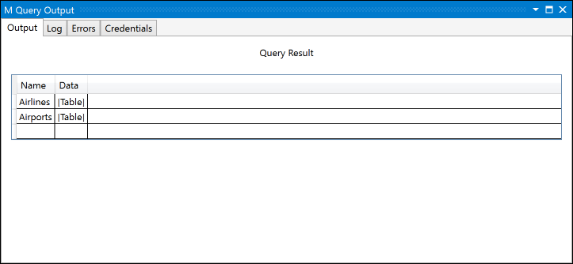
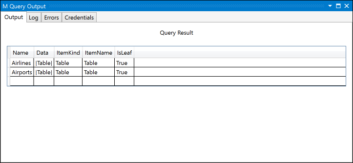

# TripPin part 3 - Navigation tables

This multi-part tutorial covers the creation of a new data source extension for Power Query. The tutorial is meant to be done sequentially&mdash;each lesson builds on the connector created in previous lessons, incrementally adding new capabilities to your connector.

In this lesson, you will:

> [!div class="checklist"]
> * Create a navigation table for a fixed set of queries
> * Test the navigation table in Power BI Desktop

This lesson adds a navigation table to the TripPin connector created in the [previous lesson](../2-rest/readme.md). When your connector used the `OData.Feed` function ([Part 1](../1-odata/readme.md)), you received the navigation table “for free”, as derived from the OData service’s $metadata document. When you moved to the `Web.Contents` function ([Part 2](../2-rest/readme.md)), you lost the built-in navigation table. In this lesson, you'll take a set of fixed queries you created in Power BI Desktop and add the appropriate metadata for Power Query to popup the **Navigator** dialog for your data source function.

See the [Navigation Table documentation](../../../handling-navigation-tables.md) for more information about using navigation tables.

## Defining fixed queries in the connector

A simple connector for a REST API can be thought of as a fixed set of queries, each returning a table. These tables are made discoverable through the connector’s navigation table. Essentially, each item in the navigator is associated with a specific URL and set of transformations.

You'll start by copying the queries you wrote in Power BI Desktop (in the previous lesson) into your connector file. Open the TripPin Visual Studio project, and paste the Airlines and Airports queries into the TripPin.pq file. You can then turn those queries into functions that take a single text parameter:

```powerquery-m
GetAirlinesTable = (url as text) as table =>
    let
        source = TripPin.Feed(url & "Airlines"),
        value = source[value],
        toTable = Table.FromList(value, Splitter.SplitByNothing(), null, null, ExtraValues.Error),
        expand = Table.ExpandRecordColumn(toTable, "Column1", {"AirlineCode", "Name"}, {"AirlineCode", "Name"})
    in
        expand;

GetAirportsTable = (url as text) as table =>
    let
        source = TripPin.Feed(url & "Airports"),
        value = source[value],
        #"Converted to Table" = Table.FromList(value, Splitter.SplitByNothing(), null, null, ExtraValues.Error),
        #"Expanded Column1" = Table.ExpandRecordColumn(#"Converted to Table", "Column1", {"Name", "IcaoCode", "IataCode", "Location"}, {"Name", "IcaoCode", "IataCode", "Location"}),
        #"Expanded Location" = Table.ExpandRecordColumn(#"Expanded Column1", "Location", {"Address", "Loc", "City"}, {"Address", "Loc", "City"}),
        #"Expanded City" = Table.ExpandRecordColumn(#"Expanded Location", "City", {"Name", "CountryRegion", "Region"}, {"Name.1", "CountryRegion", "Region"}),
        #"Renamed Columns" = Table.RenameColumns(#"Expanded City",{{"Name.1", "City"}}),
        #"Expanded Loc" = Table.ExpandRecordColumn(#"Renamed Columns", "Loc", {"coordinates"}, {"coordinates"}),
        #"Added Custom" = Table.AddColumn(#"Expanded Loc", "Latitude", each [coordinates]{1}),
        #"Added Custom1" = Table.AddColumn(#"Added Custom", "Longitude", each [coordinates]{0}),
        #"Removed Columns" = Table.RemoveColumns(#"Added Custom1",{"coordinates"}),
        #"Changed Type" = Table.TransformColumnTypes(#"Removed Columns",{{"Name", type text}, {"IcaoCode", type text}, {"IataCode", type text}, {"Address", type text}, {"City", type text}, {"CountryRegion", type text}, {"Region", type text}, {"Latitude", type number}, {"Longitude", type number}})
    in
        #"Changed Type";
```

Next you'll import the mock navigation table query you wrote that creates a fixed table linking to these data set queries. Call it `TripPinNavTable`:

```powerquery-m
TripPinNavTable = (url as text) as table =>
    let
        source = #table({"Name", "Data"}, {
            { "Airlines", GetAirlinesTable(url) },
            { "Airports", GetAirportsTable(url) }
        })
    in
        source;
```

Finally you'll declare a new shared function, `TripPin.Contents`, that will be used as your main data source function. You'll also remove the `Publish` value from `TripPin.Feed` so that it no longer shows up in the **Get Data** dialog.

```powerquery-m
[DataSource.Kind="TripPin"]
shared TripPin.Feed = Value.ReplaceType(TripPinImpl, type function (url as Uri.Type) as any);

[DataSource.Kind="TripPin", Publish="TripPin.Publish"]
shared TripPin.Contents =  Value.ReplaceType(TripPinNavTable, type function (url as Uri.Type) as any);
```

> [!NOTE]
> Your extension can mark multiple functions as `shared`, with or without associating them with a `DataSource.Kind`. However, when you associate a function with a specific `DataSource.Kind`, each function **must** have the same set of *required* parameters, with the same name and type. This is because the data source function parameters are combined to make a 'key' used for looking up cached credentials.

You can test your `TripPin.Contents` function using your TripPin.query.pq file. Running the following test query will give you a credential prompt, and a simple table output.

```powerquery-m
TripPin.Contents("https://services.odata.org/v4/TripPinService/")
```



## Creating a navigation table

You'll use the handy [Table.ToNavigationTable](../../../helper-functions.md#tabletonavigationtable) function to format your static table into something that Power Query will recognize as a navigation table. Since this function is not part of Power Query's standard library, you'll need to copy its source code into your .pq file.

With this helper function in place, next update your `TripPinNavTable` function to add the navigation table fields.

```powerquery-m
TripPinNavTable = (url as text) as table =>
    let
        source = #table({"Name", "Data", "ItemKind", "ItemName", "IsLeaf"}, {
            { "Airlines", GetAirlinesTable(url), "Table", "Table", true },
            { "Airports", GetAirportsTable(url), "Table", "Table", true }
        }),
        navTable = Table.ToNavigationTable(source, {"Name"}, "Name", "Data", "ItemKind", "ItemName", "IsLeaf")
    in
        navTable;
```

Running your test query again will give you a similar result as last time&mdash;with a few more columns added.


> [!NOTE]
> You will not see the **Navigator** window appear in Visual Studio. The **M Query Output** window always displays the underlying table.

If you copy your extension over to your Power BI Desktop custom connector and invoke the new function from the **Get Data** dialog, you'll see your navigator appear.


If you right click on the root of the navigation tree and select **Edit**, you'll see the same table as you did within Visual Studio.


## Conclusion

In this tutorial, you added a [Navigation Table](../../../handlingnavigationtables.md) to your extension. Navigation Tables are a key feature that make connectors easier to use. In this example your navigation table only has a single level, but the Power Query UI supports displaying navigation tables that have multiple dimensions (even when they are ragged).

## Next steps

[TripPin Part 4 - Data Source Paths](../4-paths/readme.md)
