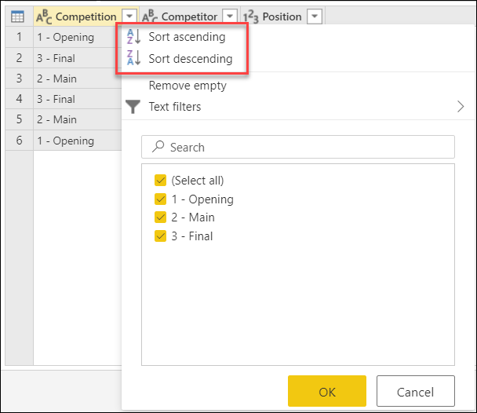

# Sort columns

You can sort a table in Power Query by either one or multiple columns. For example, take the following table with the fields Competition, Competitor and Position:

Our goal is to sort this table by the Competition and Position fields in ascending order as shown in the next image:

## To sort a table

To sort the table, first select the column to be sorted. Once the column has been selected, you can select the sort operation from 2 places:

- **Home tab** - you'll find a group called Sort where you'll see the icons to sort your column by either ascending or descending order.

- **Field dropdown** - next to the name of the field you'll see a dropdown icon.  When you click on the dropdown icon, you'll see the option to sort your column.

In our case, we need to first do the sort on the Competition field and in this case we've chosen to do the operation through the Sort group inside the Home tab. Notice how this action creates a new step on the Applied Steps section called Sorted Rows:

A visual indicator, displayed as an arrow, gets added to the Field dropdown to display how the column is being sorted.

Now you can sort by the Position field in ascending order as well, but this time we'll do it using the Field dropdown menu:

Notice how this action doesn't create a new step, but it modifies the existing one to do both sort operations in just one step. When you sort based upon multiple columns, the order or hierarchy of the sorting is based on the order that the columns were selected. A visual indicator prior to the Field dropdown is displayed which provides a number that represents the order of this order or hierarchy.   

