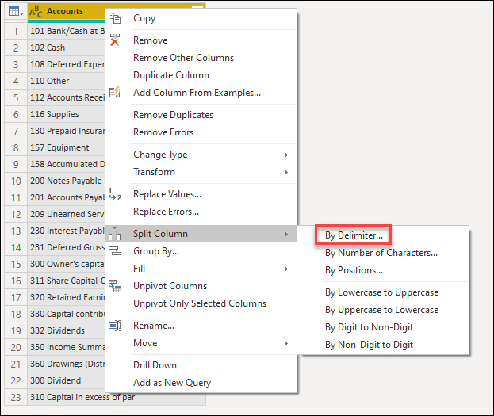
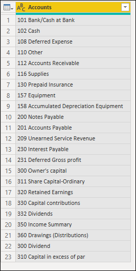
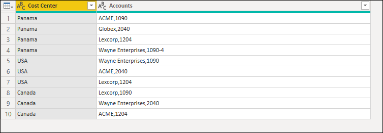

# Split columns: by delimiter
In Power Query, you can split a column through different methods.
In this case, the column(s) selected can be split by a delimiter.

## Where to find the Split columns: by delimiter
We can find the Split columns: by delimiter option in 3 places:
1. **Home tab** - under the Split column dropdown menu inside the Transform group 

2. **Transform tab** - under the Split column dropdown menu inside the Text column group

3. **Right click a column** - inside the split columns option

## Split columns by delimiter into columns
Our initial table will be the one below with only one column for "Accounts". 

This column holds two values:
* Account number
* Account name 

We want to split this column into 2 columns as the values are delimited by a space: the first space from left to right. 
To do this, we simply select the column and select the option to split the column by a delimiter. Inside the 'Split column' window, we apply the following configuration:

* **Select or enter delimiter**: Space
* **Split at**: Left-most delimiter

The result of that operation will give us a table with the two columns that we are expecting:

>[!Note]
>Power Query will split the column into as many columns as needed. The name of the new columns will contain the same name of the original column and a suffix, a dot and a number that represents the splitted section of the column, will be appended to the name of the new columns. 

## Split columns by delimiter into rows
Our initial table will be the one below with the columns 'Cost Center' and 'Accounts'. 

The 'Accounts' column has values in pairs separated by a comma, and the pairs are separated by a semicolon. Our goal is to split this column into new rows by using the semicolon as the delimiter.
To do that, we select the 'Accounts' column and select the option to split the column by a delimiter. Inside the 'Split column' window, we apply the following configuratiton:

* **Select or enter delimiter**: Semicolon
* **Split at**: Each occurrence of the delimiter
* **Split into**: Rows

The result of that operation will give us a table with the same amount of columns, but many more rows as the values inside the cells are now in their own cells as shown below:

### Final Split

Our table still requires one last split column operation. We need to split the 'Accounts' column by the first comma that it finds. This will create a column for the Account Name and another one for the Account Number.

To do that, we select the 'Accounts' column and apply the Split column by delimiter operation. Insidee the 'Split column' window, we apply the following configuration:

* **Select or enter delimiter**: Comma
* **Split at**: Each occurrence of the delimiter

The result of that operation will give us a table with the three columns that we are expecting. We then rename the columns as follows:

Previous Name | New Name 
--------------|----------
Accounts.1 | Account Name
Accounts.2 | Account Number

Our final table looks as follows:

