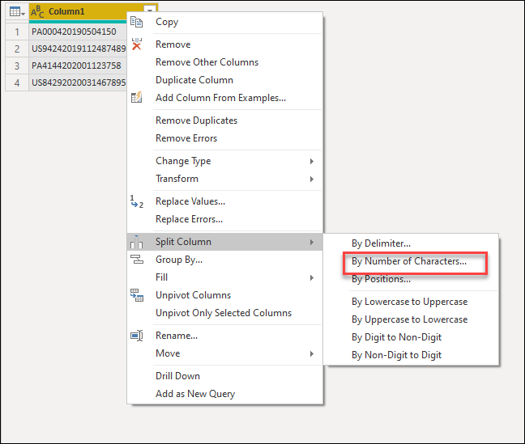
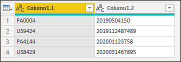
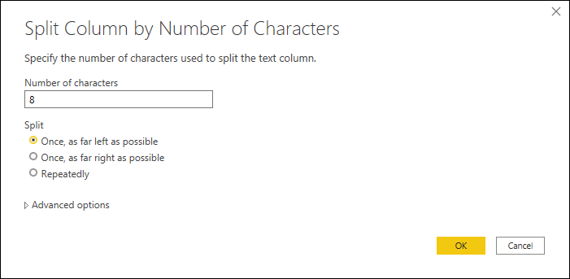
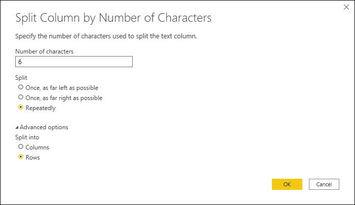

# Split columns by number of characters

In Power Query, you can split a column through different methods.
In this case, the column(s) selected can be split by the number of characters.

## Where to find Split Columns > By Number of Characters

You can find the **Split Columns > By Number of Characters** option in three places:

* **Home tab**&mdash;under the **Split Column** dropdown menu inside the **Transform** group.

   

* **Transform tab**&mdash;under the **Split Column** dropdown menu inside the **Text Column** group.

   

* **Right-click a column**&mdash;inside the **Split Column** option.

   

## Split columns by number of characters into columns
The initial table for this example will be the one below, with only one column for **Column1**. 

This column holds three values:

* **Account Name**&mdash;in the first six characters
* **Date**&mdash;in the following eight characters with the format yyyymmdd
* **Units**&mdash;the remaining characters

In this example, you want to split this column into three columns containing the values described in the list above. 

To do this split, select the column and then select the option to split the column by the number of characters. In **Split column by Number of Characters**, apply the following configuration:

* **Number of characters**: 6
* **Split**: Once, as far left as possible

The result of that operation will give you a table with two columns. One for the account name and the other one that contains the combined values for the date and units.

>[!Note]
>Power Query will split the column into only two columns. The name of the new columns will contain the same name as the original column. A suffix containing a dot and a number that represents the split section of the column will be appended to the names of the new columns. 

Now continue to do the same operation over the new Column1.2 column, but with the following configuration:

* **Number of characters**: 8
* **Split**: Once, as far left as possible

The result of that operation will yield a table with three columns. Notice the new names of the two columns on the far right. **Column1.2.1** and **Column1.2.2** were automatically created by the split column operation.

You can now change the name of the columns and also define the data types of each column as follows:

Original Column Name | New Column name | Data type
---------------------|-----------------|---------- 
Column1.1|Account Name|Text
Column1.2.1|Date|Date
Column1.2.2|Units|Whole Number

Your final table will look like the one in the following image.

## Split columns by number of characters into rows
The initial table for this example will be the one below, with the columns **Group** and **Account**. 

The **Account** column can hold multiple values in the same cell. Each value has the same length in characters, with a total of six characters. In this example, you want to split these values so you can have each account value in its own row.

To do that, select the **Account** column and then select the option to split the column by the number of characters. In **Split column by Number of Characters**, apply the following configuration:

* **Number of characters**: 6
* **Split**: Repeatedly
* **Split into**: Rows

The result of that operation will give you a table with the same number of columns, but many more rows because the fragments inside the original cell values in the **Account** column are now split into multiple rows.

