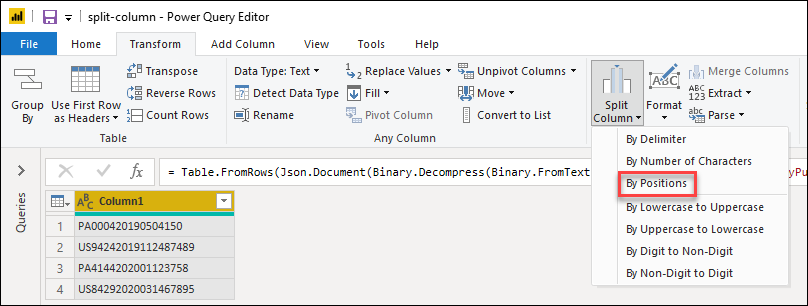
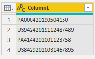
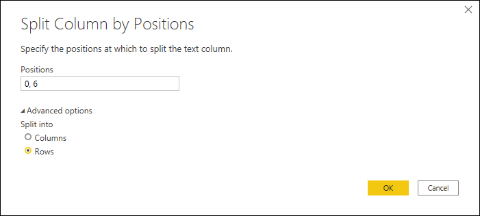

# Split columns by positions

In Power Query, you can split a column through different methods.
In this case, the column(s) selected can be split by positions.

## Where to find Split Columns > By Positions

You can find the **Split Columns > By Positions** option in three places:

* **Home tab**&mdash;under the **Split Column** dropdown menu inside the **Transform** group.

   

* **Transform tab**&mdash;under the **Split Column** dropdown menu inside the **Text Column** group.

   

* **Right-click a column**&mdash;inside the **Split Column** option.

   

## Split columns by positions into columns
The initial table for this example will be the one shown in the image below, with only one column for **Column1**. 

This column holds three values:
* **Account Name**&mdash;in the first six characters
* **Date**&mdash;in the next eight characters with the format yyyymmdd
* **Units**&mdash;the rest of the characters 

In this example, you want to split this column into the three columns made from the values in the list above. To do this split, select the column and then select the option to split the column by positions. In **Split Column by Positions**, apply the following configuration:

* **Positions**: 0,6,14

>[!Note]
>This operation will first start creating a column from position 0 to position 6, then from position 7 to position 14. From position 15 onwards there'll be another column should there be that number of existing positions.

The result of that operation will give you a table with three columns. 

>[!Note]
>Power Query will split the column into only two columns. The name of the new columns will contain the same name as the original column. A suffix created by a dot and a number that represents the split section of the column will be appended to the name of the new columns. 

You can now change the name of the columns, and also define the data types of each column as follows:

Original Column Name | New Column name | Data type
---------------------|-----------------|---------- 
Column1.1|Account Name|Text
Column1.2|Date|Date
Column1.3|Units|Whole Number

Your final table will look the one in the following image.

## Split columns by positions into rows
The initial table for this example will be like the one in the image below, with the columns **Group** and **Account**. 

The **Account** column can only hold two values in the same cell. Each value has the same length in characters, with a total of six characters. In this example, you want to split these values so you can have each account value in its own row.
To do that, select the **Account** column and then select the option to split the column by positions. In **Split Column by Positions**, apply the following configuration:

* **Positions**: 0,6
* **Split into**: Rows

>[!Note]
>This operation will first start creating a column from position 0 to position 6. From position 7 onwards, there'll be another column should there be that number of existing positions.

The result of that operation will give you a table with the same number of columns, but many more rows because the values inside the cells are now in their own cells.

