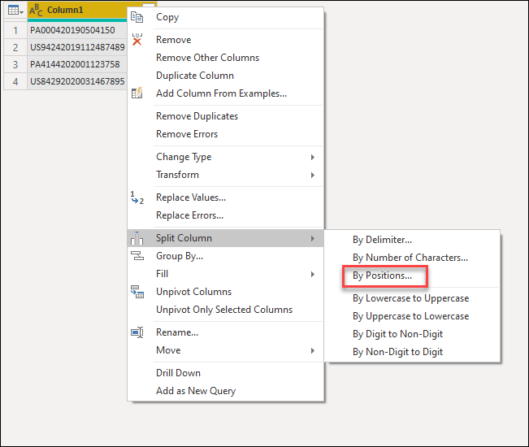
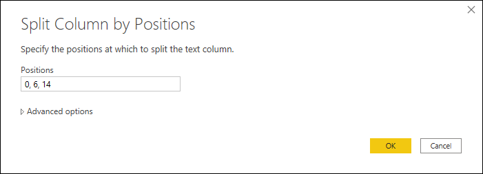

# Split Columns: By Positions

In Power Query, you can split a column through different methods.
In this case, the column(s) selected can be split by positions.

## Where to find the Split columns: by positions
We can find the Split columns: by positions option in 3 places:
1. **Home tab** - under the Split column dropdown menu inside the Transform group 

2. **Transform tab** - under the Split column dropdown menu inside the Text column group

3. **Right click a column** - inside the split columns option

## Split columns by positions into columns
Our initial table will be the one below with only one column for "Column1". 

This column holds 3 values:
1. **Account Name** - in the first 6 characters
2. **Date** - in the subsequent 8 characters with the format yyyymmdd
3. **Units** - the remainder of the characters 

We want to split this column into the 3 columns described before. 
To do this, we simply select the column and select the option to split the column by positions. Inside the 'Split Column by Positions' window, we apply the following configuration:

* **Positions**: 0,6,14

>[!Note]
>This operation will first start creating a column from the position 0 until the position 6, then from position 7 until position 14, and from position 15 onwards there'll be another column should there be that number of position.

The result of that operation will give us a table with three columns. 

>[!Note]
>Power Query will split the column into only two columns. The name of the new columns will contain the same name of the original column and a suffix created by a dot and a number that represents the splitted section of the column which will be appended to the name of the new columns. 

We can now change the name of the columns as well as define the data types of each column as follows:

Original Column Name | New Column name | Data type
---------------------|-----------------|---------- 
Column1.1|Account Name|Text
Column1.2|Date|Date
Column1.3|Units|Whole Number

Our final table will look like this:

## Split columns by positions into rows
Our initial table will be the one below with the columns 'Group' and 'Account'. 

The 'Account' column can only hold two values in the same cell. Each value has the same lenght in characters with a total of 6 characters. We want to split these values so we can have each Account value in its own row.
To do that, we select the 'Account' column and select the option to split the column by positions. Inside the 'Split Column by Positions' window, we apply the following configuratiton:

* **Positions**: 0,6
* **Split into**: Rows

>[!Note]
>This operation will first start creating a column from the position 0 until the position 6 and from position 7 onwards there'll be another column should there be that number of position.

The result of that operation will give us a table with the same amount of columns, but many more rows as the values inside the cells are now in their own cells as shown below:

