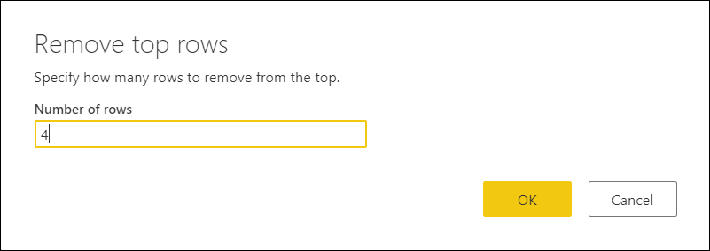
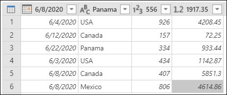

# Promote or demote column headers

When creating a new query from unstructured data sources such as text files, Power Query will try to analyze the contents of the file and promote the first row of data to become the column headers of your table, should it deem necessary. In some cases, this suggestion by Power Query will be correct. In some other cases, it might not be correct because of the structure of the file.

With Power Query, there are transformations to promote the rows to column headers as well as demote the column headers to rows.

## To promote rows to column headers

In this example, Power Query wasn't able to determine the headers of the table because the table contains a set of heading rows for the first three rows. The actual headers of the table begin on row 5.

Before you can promote the headers, you need to remove the first four rows of the table. To make that happen, use the contextual table menu on the top-left corner of the preview window and select the option to **Remove top rows**.

The **Remove top rows** window will appear. In this window, enter the number **4** to the number of rows that you want to remove from the top.

> [!Note] 
> To learn more about **Remove top rows** and other table operations, see [the following article](url).

The result of that operation will leave your headers as the first row of your table.

### Locations of the promote headers operation

From here, you have a number of places where you can select the promote headers operation:

* **Home tab**&mdash;inside the **Transform** group.

   

* **Transform tab**&mdash;inside the **Table** group.

   

* **Contextual table menu**&mdash;the first option from the dropdown menu.

   

After you perform the promote headers operation, your table will look like the following image.

## To demote column headers to rows

In the following example, the table headers are incorrect and are, in fact, part of the table's data. You need to demote the headers to be part of the rows of the table.

### Locations of the demote headers operation

* **Home tab**&mdash;as an option from the drop-down menu of **Use first row as headers** in the **Transform** group.

   

* **Transform tab**&mdash;as an option from the drop-down menu of **Use first row as headers** in the **Table** group.

   

After you perform this operation, your table will look like the one in the following image.

As a last step, rename the columns by double-clicking on each column and typing a new name for each of the columns. The end result will look like the following image.

