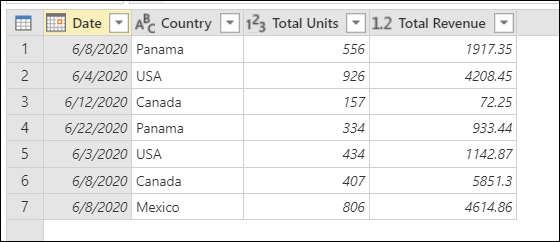

# Promote or Demote a row to column headers

When creating a new query from unstructured data sources such as text files, Power Query will try to analyze the contents of the file and promote the first row of data to become the column headers of our table should it deem necessary. In some cases, this suggestion by Power Query will be correct and in some others it might not because of the structure of the file.

With Power Query we have the transformations to promote the rows to column headers as well as demote the column headers to rows.

## To promote rows to column headers

In this example, Power Query  wasn't able to determine the headers of the table because we got a set of header rows for the first 3 rows and on row 5 we have the actual headers of the table:

Before we can promote the headers, we need to remove the first 4 rows of the table. To make that happen, we can use the contextual table menu on the top left corner of the preview window and select the option to 'Remove top rows':

The 'Remove top rows' window will appear and in here you can enter the number 4 to the number of rows that we want to remove from the top:

> !Note 
>
> You can read more about the Remove Top rows and other table operations from the following article (url).

The result of that operation will leave our headers as the first row of our table as shown in the next image:

### Locations of the Promote Headers button

From here, we have a number of places where we can select the promote headers operation:

1. **Home tab** - inside the Transform group 

2. **Transform tab** - inside the Table group

3. **Contextual table menu** - the first option from the dropdown menu

After we perform this operation, our table and end result will look like this:

## To demote column headers to rows

In the following example, the headers of table are incorrect and are in fact part of the table's data. We need to demote the headers to be part of the rows of the table:

### Locations of the Promote Headers button

1. **Home tab** - as an option from the drop down menu of the 'Use first row as headers' button in the Transform group
2. **Transform tab** - as an option from the drop down menu of the 'Use first row as headers' button in the Table group 

After we perform this operation, our table will look like this:

As a last step, we can rename the columns just by double clicking on each of them and typing a new name for each of them. The end result will look like this:

