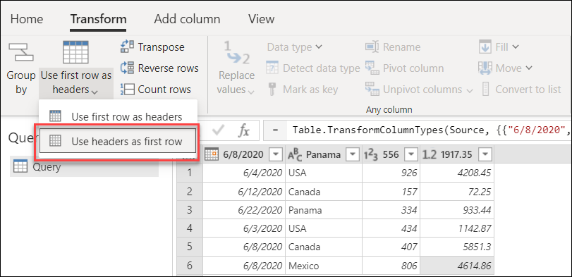

# Promote or demote column headers
<!--The Writing Style Guide wants us to use "column headings" instead of "column headers," and reserve "header" for "header row." I see that the UI doesn't follow this, so I will leave it (except when we're talking about an individual column heading). Maybe the UI can be changed someday?-->
When creating a new query from unstructured data sources such as text files, Power Query analyzes the contents of the file. If Power Query identifies a different pattern for the first row, it will try to promote the first row of data to be the column headings for your table. However, Power Query might not identify the pattern correctly 100&nbsp;percent of the time, so this article explains how you can manually promote or demote column headers from rows.

## To promote rows to column headers

In the following example, Power Query wasn't able to determine the column headers for the table because the table contains a set of header rows for the first three rows. The actual column headers for the table are contained in<!--Edit okay?--> row 5.

Before you can promote the headers, you need to remove the first four rows of the table. To make that happen, select the table menu in the upper-left corner of the preview window, and then select **Remove top rows**.

In the **Remove top rows** window, enter **4** in the **Number of rows** box.

<!--We don't want to devote a note to a cross-reference for more information. We just use a subtle line, generally at the end of a paragraph, that says "More information: <link>" I'm not sure where to suggest putting this, however. This does highlight the redundancy between this article and filter-row-position.md (which see).-->
> [!NOTE] 
> To learn more about **Remove top rows** and other table operations, see [Filter by row position](filter-row-position.md).

The result of that operation will leave the headers as the first row of your table.

### Locations of the promote headers operation

From here, you have a number of places where you can select the promote headers operation:

* On the **Home** tab, in the **Transform** group.

   

* On the **Transform** tab, in the **Table** group.

   

* On the table menu.

   

After you do the promote headers operation, your table will look like the following image.

>[!NOTE]
> Table column names must be unique. If the row you want to promote to a header row<!--Edit okay? I assume this would only apply to one row at any particular time.--> contains multiple instances of the same text string, Power Query will disambiguate the column headings by adding a numeric suffix preceded by a dot to every text string that isn't unique.

## To demote column headers to rows

In the following example, the column headers are incorrect: they're actually part of the table's data. You need to demote the headers to be part of the rows of the table.

### Locations of the demote headers operation

You have a number of places where you can select the demote headers operation:

* On the **Home** tab, in the **Transform** group.

   

* On the **Transform** tab, in the **Table** group.

   

After you do this operation, your table will look like the following image.

As a last step, select each column and type a new name for it. The end result will resemble<!--Suggested, since you didn't tell them what to name the columns.--> the following image.

### See also

[Filter by row position](filter-row-position.md)
