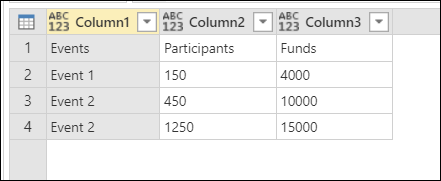
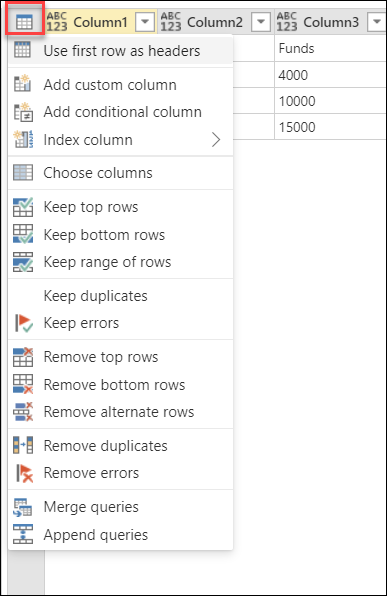

# Tranpose table

The tranpose table operation in Power Query rotates your table 90 degrees by making your rows become columns and your columns become rows.

## To Tranpose a table

Imagine a table like the following with 3 rows and 4 columns:

The goal is to transpose that table so we end up with 4 rows and 3 columns as shown in the next image:

The first step to make this happen is to go to the Transform tab in the ribbon and select the option to Transpose inside the Table group as shown in the next image:

The result of that operation will look like this:

> [!Note]
> When doing the transpose operation, the column headers of the initial table will be lost. Only the contents of the table will be transposed during the operation and the new columns will have the name of "Column" followed by a sequential number.

## Post Transpose cleaning

The headers that we need are in the first row of the table.  We can promote them to be the headers of our table by selecting the table contextual icon inside the Data Preview section and selecting the option to **Use first row as headers** as shown in the next image:

The result of that operation will give us the output that we're looking for:

