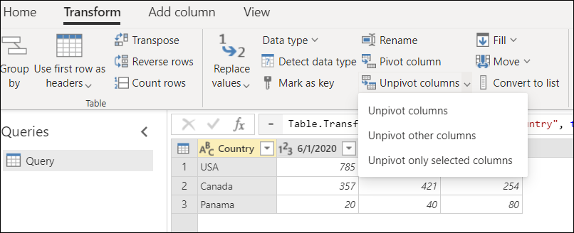
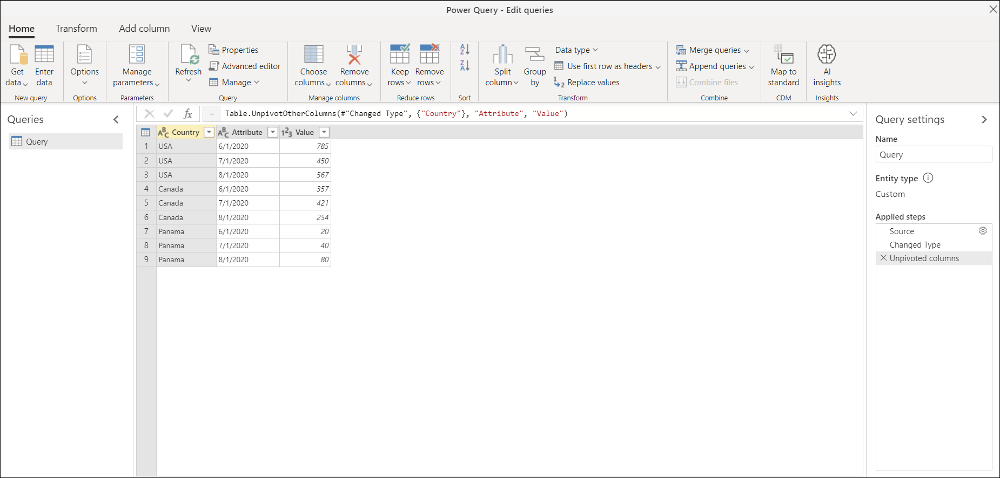

# Unpivot columns

In Power Query, you can transform columns into attribute-value pairs where columns become rows. You use Power Query's query editor to unpivot columns.

For example, imagine a table like the one in the following image.

This table has a value by country and by date as a matrix. You may need to transform that table into the following one with unpivoted columns.

The key in this transformation is that you have a set of dates in the table that should all be part of a single column. The respective value for each date and country should be in a different column, effectively creating a value-pair.

Power Query will always create the value-pair with two columns:

- **Attribute**&mdash;The name of the column headers that were unpivoted.
- **Value**&mdash;The values that were underneath each of the unpivoted columns.

There are multiple places in the user interface where you can find **Unpivot columns**. You can right-click on the columns that you want to unpivot, or you can select the icon from the **Transform** tab in the ribbon.

There are three ways that you can unpivot columns from a table:

* **Unpivot columns**
* **Unpivot other columns**
* **Unpivot only selected columns**

## Unpivot columns

For the scenario described above, you first need to select the columns that you want to unpivot. You can hold the **Ctrl** key and select as many columns as you need. For this scenario, you want to select all the columns except the one with the header **Country**. After selecting the columns, you can right-click on any of the selected columns and then select **Unpivot columns**.

The result of that operation will yield the result shown in the following image. 

### Special considerations

After creating our query from the steps above, imagine that your initial table gets updated to look like the following screenshot.

Notice that you've added a new column for the date 9/1/2020 (September 1, 2020) and two new rows for the countries UK and Mexico.

If you refresh your query, you’ll notice that the operation will be done on the updated column, but won't affect the column that wasn't originally selected (**Country** in this example). This means any new column that's added to the source table will be unpivoted as well.

The following image shows what your query will look like after the refresh with the new updated source table.

## Unpivot other columns

>[!Note]
> Both **Unpivot other columns** and **Unpivot columns** provide the same result and behave the same.

It's also possible to only select the columns that you don't want to unpivot and only unpivot the rest of the columns in the table. This is where **Unpivot other columns** comes into play.

The result of that operation will yield exactly the same result as the one that you got from **Unpivot Columns**.

>[!NOTE]
> This transformation is crucial for queries with an unknown number of columns. The operation will unpivot all columns from your table except the ones that you've selected. This is a ideal solution if the data source of your scenario had new date columns in a refresh, as those will get picked up and unpivoted. 

### Special considerations

Similar to how it happens with the **Unpivot columns** operation, if your query refreshes and more data is picked up from the data source, all of the columns will be unpivoted except the ones that were previously selected.

This means that with a new table like the one in the following image.

You can select the **Country** column and do an Unpivot other column**, which will yield the following result.

## Unpivot only selected columns

The purpose of this last option is to only unpivot specific columns from your table. This is important for scenarios where you're dealing with an unknown number of columns from your data source and you only want to unpivot the selected columns.

To perform this operation, select the columns to unpivot, which are all the columns except the **Country** column. Then select the option to **Unpivot Only Selected Columns** by right-clicking on any of the selected columns.

Notice how this operation will yield the same output as the previous examples.

### Special considerations

After doing a refresh, if our source table changes to have a new **9/1/2020** column and new rows for UK and Mexico, the output of the query will be different from the previous examples. If our source table, after a refresh, changes to the following one:

The output of our query will look like the following image.

It looks like this because the unpivot operation is happening only on the **6/1/2020**, **7/1/2020**, and **8/1/2020** columns, so the column with the header **9/1/2020** remains unchanged.
