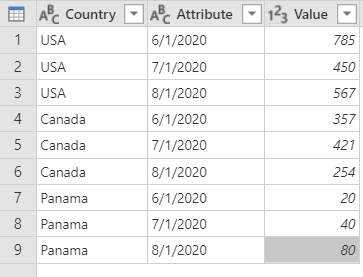
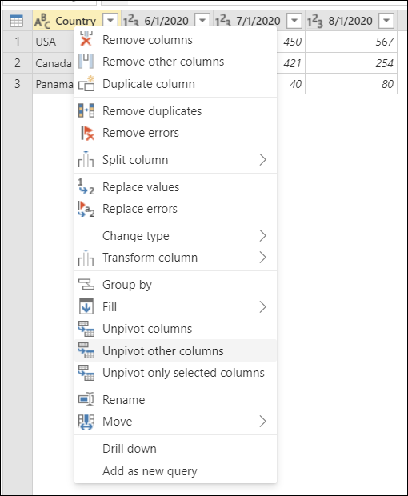
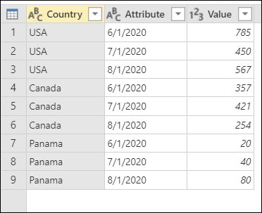
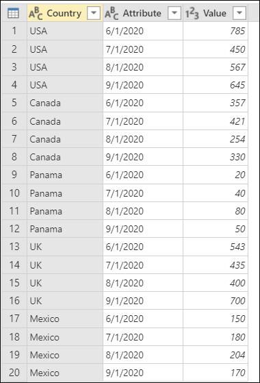

# Unpivot column

In Power Query, you can transform columns into attribute-value pairs where columns become rows. You use Power Query's Query Editor to unpivot columns.

For example, imagine a table like the following:

That has a value by Country and by date as a matrix. We need to transform that table into the following one with unpivoted columns:

The key in this transformation is that we have a set of dates on the table that should all be part of a column. The respective value for each date and Country should be in a different column, effectively creating a value-pair.

Power Query will always create the value-pair with two columns:

1. **Attribute** - Has the name of the column headers that were unpivoted.
2. **Value** - Has the values that were underneath each of the unpivoted columns.

There are multiple places in the user interface where you can find the **Unpivot Columns** button by either right clicking on the columns that you wish to unpivot or by selecting the icon from the Transform menu in the ribbon.

There are three ways that we can unpivot columns from a table:

1. Unpivot Columns
2. Unpivot Other Columns
3. Unpivot Only Selected Columns

## Unpivot Columns

For the scenario described above, we first need to select the columns that we want to unpivot. You can hold the Ctrl key to select as many columns as you need. For our scenario, we want to select all the columns except the one with the header **Country**. After selecting the columns, you can right click on any of the selected columns and then left click on the Unpivot Columns button.

The result of that operation will yield the following result: 

### Special considerations

After creating our query from the steps above, Imagine that our initial table gets updated to look like the following:

Notice that we've added a new column for the date 9/1/2020 (September 1st, 2020) and 2 new rows for the countries UK and Mexico.

If we try to refresh our query, you'll notice that the operation will not be done only on the columns that we previously selected, but on all of the columns except the one that we originally didn't select: Country. This means that any new column that gets added to our source table will be unpivoted as part of this query.

This is how our query will look like after the refresh with the new updated source table:

## Unpivot Other Columns

[!NOTE] Both Unpivot Other Columns and Unpivot Columns provide the same result and behave the same.

It is also possible to only select the columns that we do not want to unpivot and only unpivot the rest of the columns from the table. This is where **Unpivot Other Columns** comes into play.

The result of that operation will yield exactly the same result as the one that we got from **Unpivot Columns**.

[!NOTE] This transformation is crucial for queries with unknown number of columns. The operation will unpivot all columns from our table except the ones that we've selected. This is a ideal solution if the data source of our scenario had new date columns in a refresh as those will get picked up and unpivoted. 

### Special considerations

Similar to how it happens with the **Unpivot Columns** operation, if our query refreshes and more data is picked up from the data source, all of the columns will be unpivoted except the ones that were previously selected.

This means that with a new table like the following:

We can select the Country column and do an **Unpivot other columns** which will yield the following result:

## Unpivot Only Selected Columns

The purpose of this last option is to only unpivot specific columns from our table. This is quite important for scenarios where we're dealing with an unknown number of columns from our data source and we only want to unpivot the selected columns.

To perform this operation we select the columns to unpivot which are all of the columns except the **Country** column, and select the option to **Unpivot Only Selected Columns** by doing a right click on any of the selected columns.

Notice how this will yield the same output as the previous examples:

### Special considerations

After doing a refreshed and our source table changes to have the 9/1/2020 column and the rows for UK and Mexico, the output of the query will be different from the previous examples. If our source table, after a refresh, changes to the following one:

The output of our query will look like this:

This is because the unpivot operation is only specifically happening on the columns 6/1/2020, 7/1/2020 and 8/1/2020, so the column with the header 9/1/2020 remains unchanged
