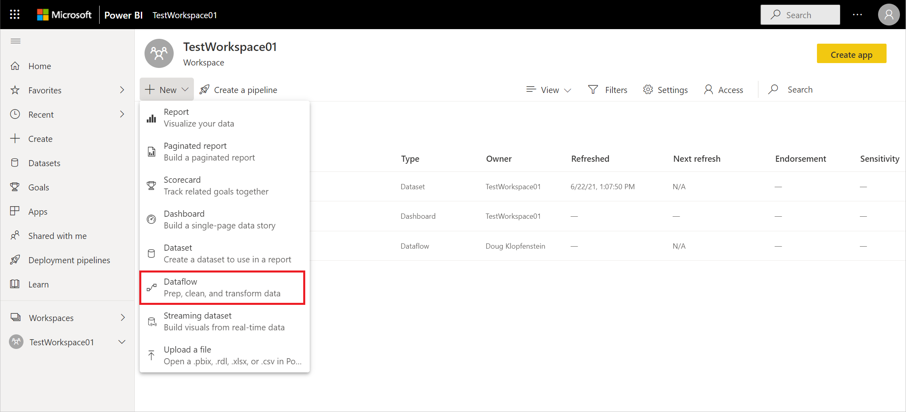
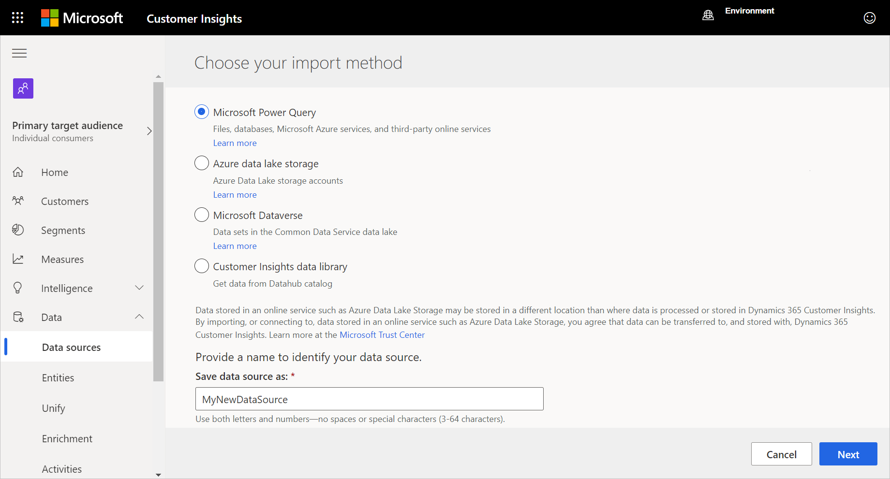

# Where to get data

Getting data from available data sources is usually the first encounter you have with Power Query. This article provides basic steps for getting data from each of the products that include Power Query.

## Get data in Power BI Desktop

The procedures for where to start getting data in Power BI Desktop are described in [Data sources in Power BI Desktop](/power-bi/connect-data/desktop-data-sources).

In Power BI Desktop, you can also select an Excel worksheet, a Power BI dataset, a SQL server database, or Dataverse data without using the **Get data** option. You can also enter data directly in a table, or select from a data source that was recently used.

## Get data in Excel

To get data in Excel:

1. From the **Data** ribbon, select **Get Data**.

2. Scroll through the category selections in the get data context menu, and select the connector you want to use.

   

You'll then be asked to fill out information that's required for you to access the data. Go to the [individual connector articles](connectors/index.md) for more information about this required information.

In Excel, you can also select Text/CVS, Web, and Excel worksheet data without using the **Get Data** option. You can also select from a data source that was recently used and from existing connections or tables.

## Get data from Power BI service

To get data in Power BI service:

1. On the left side of Power BI service, select **Workspaces** (but not **My Workspace**)

2. From the Workspace context menu, select the workspace you want to use.

3. From the workspace (in this example, TestWorkspace01), select the context menu next to **+New**.

4. From the **New** context menu, select **Dataflow**.

    

5. From **Define new tables**, select **Add new tables**.

6. Select the connector from the list of data sources.

You'll then be asked to fill out information that's required for you to access the data. Go to the [individual connector articles](connectors/index.md) for more information about this required information.

## Get data from Power Apps

There are a couple of places in Power Apps where you can get data, either by creating a new table or by creating a dataflow.

To get data in Power Apps when creating a table:

1. On the left side of Power Apps, select **Dataverse** > **Tables**.

2. In the **Tables** pane, at the top left, select **Data** > **Get data**.

   

   You can also choose to get data from an Excel worksheet without using the **Get data** option.

   

3. Select the connector from the list of data sources.

To get data in Power Apps when creating a dataflow:

1. On the left side of Power Apps, select **Dataverse** > **Dataflows**.

2. If a dataflow already exists:

   1. Double-click on the dataflow.
   1. From the Power Query editor, select **Get data**.
   1. Select the connector from the list of data sources.

3. If no dataflow exists and you want to create a new dataflow:

   1. Select **New dataflow**.
   1. In the **New dataflow** dialog box, enter a name for your new dataflow.

      

   1. Select **Create**.
   1. Select the connector from the list of data sources.

You'll then be asked to fill out information that's required for you to access the data. Go to the [individual connector articles](connectors/index.md) for more information about this required information.

## Get data from Dynamics 365 Customer Insights

To get data in Customer Insights:

1. On the left side of Customer Insights, select **Data** > **Data sources**.

   

2. In the **Data sources** pane, select **Add data source**.

3. In **Choose your import method**, choose **Microsoft Power Query**.

4. In **Save data source as**, enter a name for your data source.

   

5. Select **Next**.

6. Select the connector from the list of data sources.

You'll then be asked to fill out information that's required for you to access the data. Go to the [individual connector articles](connectors/index.md) for more information about this required information.

## Get data from Analysis Services

With Analysis Services, a solution is developed in Visual Studio with the Analysis Services projects extension. The solution is then deployed to SQL Server Analysis Services, Azure Analysis Services, or a Power BI Premium workspace.

The Analysis Services documentation contains the following information that describes the process for getting data:

* To set up a Visual Studio solution with the Analysis Services projects extension: [Create a tabular model project](/analysis-services/tutorial-tabular-1400/as-lesson-1-create-a-new-tabular-model-project)

* To get data: [Get data](/analysis-services/tutorial-tabular-1400/as-lesson-2-get-data)
