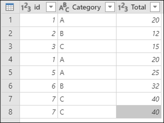
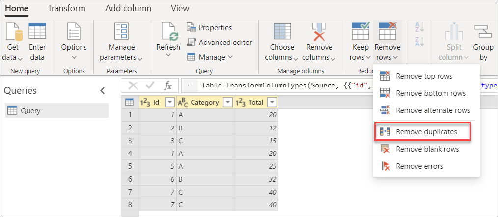
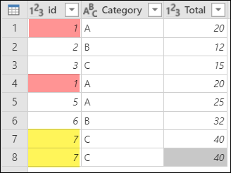
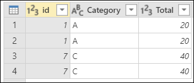

# Working with duplicate values
In Power Query, we can identify duplicates from one or multiple columns in a table. We can later apply transformations to either remove or keep those rows.

For this article, we will be using the following table with the columns id, Category and Total to demonstrate how to perform the Remove and Keep duplicates operations in Power Query:

## Remove duplicates
One of the operations that we can have Power Query do with duplicates, is to remove them from our table.

To remove duplicates:
1. Select the columns used to identify the duplicates
2. Go to the Home tab
3. In the 'Reduce rows' group, select the 'Remove rows' option
4. From the dropdown menu for 'Remove rows', select the option to 'Remove duplicates'

### From multiple columns
From our initial table, we want to identify and remove the duplicates by using all of the columns from our table. 

We can tell that we have 4 rows that are duplicates. Our goal is to remove those duplicate rows to only keep distinct rows in our table. We select all columns from our table and then hit the 'Remove duplicates' button. 

The result of that operation will give us the table that we're looking for:

### From a single column
From our initial table, we want to identify and remove the duplicates by using only the Category column from our table.

We have multiple duplicates and we want to remove those duplicates to only keep distinct values. To remove duplicates from the Category column, we first select the Category column and then apply the 'Remove duplicates' transformation.

The result of that operation will give us the table that we're looking for:

> [!WARNING]
> Power Query doesn't guarantee that it chooses the first instance of a set of duplicates when removing duplicates.

## Keep duplicates
One of the operations that we can have Power Query do with duplicates, is to keep only the duplicates found in our table.

To keep duplicates:
1. Select the columns used to identify the duplicates
2. Go to the Home tab
3. In the 'Reduce rows' group, select the 'Keep rows' option
4. From the dropdown menu for 'Keep rows', select the option to 'Keep duplicates'

### From multiple columns
From our initial table, we want to identify and keep the duplicates by using all of the columns from our table. 

We can tell that we have 4 rows that are duplicates. Our goal is to keep only the rows that are duplicate in our table. We select all columns from our table and then hit the 'Keep duplicates' button. 

The result of that operation will give us the table that we're looking for:

### From a single column
From our initial table, we want to identify and keep the duplicates by using only the id column from our table.

We have multiple duplicates and we want to keep only those duplicates from our table. To keep duplicates from the id column, we first select the id column and then apply the 'Keep duplicates' transformation.

The result of that operation will give us the table that we're looking for:

