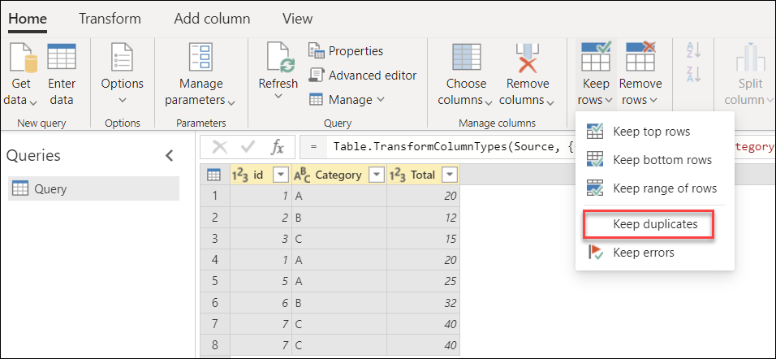

# Working with duplicate values

You can work with duplicate sets of values through transformations that can remove duplicates from your data or filter your data to show duplicates only, so you can focus on them.

> [!WARNING]
> Power Query is case-sensitive. When working with duplicate values, Power Query considers the case of the text, which might lead to undesired results. As a workaround, users can apply an uppercase or lowercase transform prior to removing duplicates. 

For this article, the examples use the following table with **id**, **Category**, and **Total** columns.

## Remove duplicates

One of the operations that you can perform is to remove duplicate values from your table.

1. Select the columns that contain duplicate values.
2. Go to the **Home** tab.
3. In the **Reduce rows** group, select **Remove rows**.
4. From the drop-down menu, select **Remove duplicates**.

   

> [!WARNING]
> There's no guarantee that the first instance in a set of duplicates will be chosen when duplicates are removed. Learn more about how to preserve sorting in the [Common issues](CommonIssues.md#preserving-sort) article.

### Remove duplicates from multiple columns

In this example, you want to identify and remove the duplicates by using all of the columns from your table. 

You have four rows that are duplicates. Your goal is to remove those duplicate rows so there are only unique rows in your table. Select all columns from your table, and then select **Remove duplicates**. 

The result of that operation will give you the table that you're looking for.

>[!NOTE]
>This operation can also be performed with a subset of columns. 

### Remove duplicates from a single column

In this example, you want to identify and remove the duplicates by using only the **Category** column from your table.

You want to remove those duplicates and only keep unique values. To remove duplicates from the **Category** column, select it, and then select **Remove duplicates**.

The result of that operation will give you the table that you're looking for.

## Keep duplicates

Another operation you can perform with duplicates is to keep only the duplicates found in your table.

1. Select the columns that contain duplicate values.
2. Go to the **Home** tab.
3. In the **Reduce rows** group, select **Keep rows**.
4. From the drop-down menu, select **Keep duplicates**.

   

### Keep duplicates from multiple columns

In this example, you want to identify and keep the duplicates by using all of the columns from your table. 

You have four rows that are duplicates. Your goal in this example is to keep only the rows that are duplicated in your table. Select all the columns in your table, and then select **Keep duplicates**. 

The result of that operation will give you the table that you're looking for.

### Keep duplicates from a single column

In this example, you want to identify and keep the duplicates by using only the **id** column from your table.

In this example, you have multiple duplicates and you want to keep only those duplicates from your table. To keep duplicates from the **id** column, select the **id** column, and then select **Keep duplicates**.

The result of that operation will give you the table that you're looking for.

### See also

[Data profiling tools](data-profiling-tools.md)
